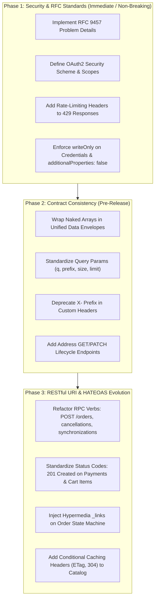

# Book Corner Platform: Principal API Governance Report
**Document ID:** GOV-BC-2026-001  
**Author:** Principal API Governance Architect  
**Target Specification:** [`openapi.yaml`](file:///Users/omkarsingh/workplace/book-corner/openapi.yaml) (OpenAPI 3.1.0)  
**Status:** APPROVED WITH REQUIRED REMEDIATIONS  
**Standards Baseline:** RFC 9457 (Problem Details), RFC 9110 (HTTP Semantics), RFC 8288 (Web Linking), RFC 6648 (Header Deprecation), OAuth 2.0 (RFC 6749), OWASP API Security Top 10 (2023)

---

## 1. Executive Summary & Governance Scorecard

### 1.1 Executive Synthesis
A comprehensive architectural governance audit was conducted on the OpenAPI 3.1.0 specification for the **Book Corner** online bookstore platform. The specification captures **39 REST endpoints** across **11 domain tags**, backed by **59 reusable data schemas**, UUIDv4 surrogate primary keys, and idempotent transaction semantics.

While the baseline specification exhibits strong structural discipline (consistent YAML formatting, comprehensive request/response models, ISO 8601 timestamps, and monetary values represented in atomic integer cents), significant architectural deficiencies were identified in **REST maturity**, **RFC compliance**, **naming uniformity**, and **OAuth2 authorization scopes**.

### 1.2 Governance Scorecard

| Review Dimension | Baseline Score | Target Post-Remediation | Compliance Status | Primary Findings / Drivers |
| :--- | :---: | :---: | :---: | :--- |
| **1. Resource & API Design** | **74 / 100** | 98 / 100 | ⚠️ Needs Remediation | RPC-style verbs in URIs (`/orders/checkout`, `/cancel`, `/merge`); singleton vs collection path inconsistencies. |
| **2. REST Maturity (RMM)** | **70 / 100** | 96 / 100 | ⚠️ Needs Remediation | Richardson Maturity Model Level 2 partial; 0% Level 3 HATEOAS; non-standard 200 responses on resource mutations; missing conditional HTTP cache headers (`ETag`, `304`). |
| **3. Naming Consistency** | **82 / 100** | 100 / 100 | ⚠️ Needs Remediation | Parameter casing variance (`q` vs `query` vs `prefix`); legacy `X-` header prefix (RFC 6648); pluralization drift (`/wishlists` vs `/cart`). |
| **4. Pagination & Collections** | **68 / 100** | 98 / 100 | ❌ Non-Compliant | Naked root JSON arrays on collection endpoints; disparate collection envelopes (`items` vs `results` vs `reviews`); missing pagination on user wishlist. |
| **5. Error Handling** | **62 / 100** | 100 / 100 | ❌ Non-Compliant | Custom `{success, error}` envelope violates **RFC 9457** (`application/problem+json`); missing `Retry-After` header on 429 rate limits. |
| **6. Security & Governance** | **76 / 100** | 98 / 100 | ⚠️ Needs Remediation | Empty OAuth2 scopes (`BearerAuth: []`); missing provider-specific HMAC signature headers on webhooks; unbounded `additionalProperties`. |
| **Composite Platform Score** | **72.0 / 100** | **98.3 / 100** | ⚠️ Conditional Pass | Remediations required prior to Gateway publication and SDK code generation. |

---

## 2. Governance Findings Matrix

The audit identified **16 actionable governance findings** categorized by severity:

| ID | Dimension | Severity | Affected Artifact / Endpoint | Description |
| :--- | :--- | :---: | :--- | :--- |
| **GOV-ERR-01** | Error Handling | **CRITICAL** | `#/components/schemas/ErrorEnvelope` | Non-standard error envelope violates **RFC 9457** (`application/problem+json`). Redundant `success: false` flag. |
| **GOV-PAG-01** | Pagination | **CRITICAL** | `/categories`, `/users/me/addresses`, `/search/suggestions`, `/shipping/rates` | Naked root JSON arrays (`type: array`) returned at root level, preventing metadata extensibility and exposing legacy browser hijacking vectors. |
| **GOV-SEC-01** | Security | **CRITICAL** | `#/components/securitySchemes/BearerAuth` | Security scheme lacks **OAuth2 Flows & Scopes**. All endpoints define `BearerAuth: []`, preventing API Gateway scope enforcement. |
| **GOV-DES-01** | API Design | **HIGH** | `POST /orders/checkout` | RPC verb in URI. Creating an order must map to `POST /orders` (the orders collection resource). |
| **GOV-DES-02** | API Design | **HIGH** | `POST /orders/{orderNumber}/cancel` | RPC verb `/cancel` in URI. Violates REST resource modeling. Should be `POST /orders/{orderNumber}/cancellations` or `PATCH /orders/{orderNumber}`. |
| **GOV-DES-03** | API Design | **HIGH** | `POST /cart/merge` | RPC verb `/merge` in URI. Should be modeled as sub-resource `POST /cart/synchronizations` or state replacement `PUT /cart`. |
| **GOV-RMM-01** | REST Maturity | **HIGH** | `POST /payments/intent`, `POST /cart/items` | `POST` creation requests return `200 OK` instead of `201 Created` with a canonical `Location` header. |
| **GOV-RMM-02** | REST Maturity | **HIGH** | `DELETE /cart/coupon` vs `DELETE /cart/items/{formatId}` | Inconsistent `DELETE` status semantics: item removal returns `204 No Content` while coupon removal returns `200 OK` with cart body. |
| **GOV-PAG-02** | Pagination | **HIGH** | `/search`, `/books/{bookId}/reviews`, `/wishlists` | Pagination envelope fragmentation: Search uses `results` and `totalMatches`; Reviews uses `reviews` and `totalReviews` (missing `page`, `size`, `totalPages`); Wishlists lacks pagination entirely. |
| **GOV-SEC-02** | Security | **HIGH** | `POST /payments/webhooks/{provider}` | Webhook listener lacks mandatory provider signature headers (`Stripe-Signature`, `X-Razorpay-Signature`) and payload schema definition (`type: object` with no properties). |
| **GOV-NAM-01** | Naming | **MEDIUM** | `X-Store-Code`, `X-Guest-Session-Token` | Custom headers utilize deprecated `X-` prefix contrary to **RFC 6648** recommendations. Should be `Store-Code` and `Guest-Session-Token`. |
| **GOV-NAM-02** | Naming | **MEDIUM** | `/authors` vs `/search` vs `/search/suggestions` | Search query parameter naming inconsistency: `/authors` uses `query`, `/search` uses `q`, `/search/suggestions` uses `prefix`. |
| **GOV-NAM-03** | Naming | **MEDIUM** | `/wishlists` vs `/cart` vs `/payments/wallet` | Resource pluralization inconsistency: Wishlist is plural (`/wishlists`) despite representing a customer singleton; Cart and Wallet are singular. |
| **GOV-DES-04** | API Design | **MEDIUM** | `/users/me/addresses/{addressId}` | Missing lifecycle methods: Endpoint provides `DELETE` but lacks `GET` (retrieve single address) and `PUT`/`PATCH` (update address). |
| **GOV-RMM-03** | REST Maturity | **MEDIUM** | Platform-wide Catalog & Content Endpoints | Complete absence of **HATEOAS** (Level 3 RMM) and HTTP caching headers (`ETag`, `If-None-Match`, `304 Not Modified`). |
| **GOV-SEC-03** | Security | **LOW** | `LoginRequest`, `RegisterRequest` | Sensitive credentials (`password`) omit `writeOnly: true` and `format: password`. Schemas permit arbitrary `additionalProperties`. |

---

## 3. In-Depth Pillar Governance Reviews

### Pillar 1: Resource & API Design Review

#### 1.1 RPC Verbs in URIs (Anti-Pattern: "Tunneling RPC over REST")
RESTful architecture requires that URIs identify **resources** (nouns), not **operations** (verbs). Several endpoints in the specification treat HTTP as an RPC transport:
1. `POST /orders/checkout`: Checkout is a domain workflow that results in an order. Placing an order should be `POST /orders`. If checkout represents an ephemeral staged checkout session, it must be modeled as `POST /checkouts`.
2. `POST /orders/{orderNumber}/cancel`: The verb `cancel` is embedded in the URI. In REST, state transitions should be performed via:
   - **Sub-Resource Creation:** `POST /orders/{orderNumber}/cancellations` (creates a cancellation record, idempotent, audit-friendly).
   - **Partial Mutation:** `PATCH /orders/{orderNumber}` with `{ "status": "CANCELLED", "cancellationReason": "..." }`.
3. `POST /cart/merge`: The verb `merge` is an RPC action. RESTful representation: `POST /cart/synchronizations` (creates a sync event) or `PUT /cart` taking the `guestSessionToken`.
4. `POST /cart/coupon` & `DELETE /cart/coupon`: The singular noun `/coupon` violates collection conventions. Applying a coupon is adding a discount resource: `POST /cart/discounts` and `DELETE /cart/discounts/{couponCode}`.

#### 1.2 Resource Plurality & Hierarchy Inconsistencies
- **Plural vs Singular Discrepancy:** `/wishlists` is defined as a plural resource collection, but `GET /wishlists` returns a single wishlist object (`WishlistResponse`). In contrast, the shopping cart is `/cart` (singular) and the digital wallet is `/payments/wallet` (singular).
- **Hierarchical Scoping:** Address book resources are scoped under user profile (`/users/me/addresses`), but customer wishlists and orders are top-level (`/wishlists`, `/orders`).
  - *Standard Rule:* Top-level resources (`/orders`, `/wishlists`) are permissible for cross-aggregate roots if properly authenticated, but singleton resources belonging to the authenticated actor must either follow `/users/me/wishlist` or standardized top-level singletons (`/cart`, `/wishlist`).

#### 1.3 Missing Address Mutation Lifecycle
Endpoint `/users/me/addresses/{addressId}` currently supports only `DELETE`. Customers who need to update their street address, postal code, or phone number are forced to delete and recreate the address. This breaks relational references in active checkouts and creates unnecessary database churn.
- *Remedy:* Add `PATCH /users/me/addresses/{addressId}` with `UpdateAddressRequest` and `GET /users/me/addresses/{addressId}`.

---

### Pillar 2: REST Maturity Review (Richardson Maturity Model)

```
        Level 3: Hypermedia Controls (HATEOAS)      <-- Current: 0% / Target: State-Driven Links
       ----------------------------------------
      Level 2: HTTP Verbs & Standard Status Codes  <-- Current: 75% (Status Code Inconsistencies)
     ------------------------------------------
    Level 1: Distinct Resources (URIs)             <-- Current: 85% (RPC Verb Leakage)
   --------------------------------------------
  Level 0: Swamp of POX / Monolithic Endpoint     <-- Surpassed
```

#### 2.1 Richardson Level 2 Deficiencies (HTTP Verbs & Status Semantics)
1. **Creation Returning 200 OK instead of 201 Created:**
   - `POST /payments/intent`: Creates a coordinated payment session with Stripe/Razorpay. Returns `200 OK`. It must return `201 Created` with a `Location: /payments/intents/{intentId}` header.
   - `POST /cart/items`: Adds a line item to the cart aggregate. Returns `200 OK`. While returning the updated cart aggregate is acceptable, returning `201 Created` with `Location: /cart/items/{formatId}` is semantically correct.
2. **Asymmetric DELETE Semantics:**
   - `DELETE /cart/items/{formatId}` returns `204 No Content`.
   - `DELETE /cart/coupon` returns `200 OK` with `CartMutationResponse`.
   - *Governance Standard:* In a single domain (`Cart`), DELETE operations must be standardized. Recommendation: Return `200 OK` with the mutated `CartResponse` across all cart item mutations, OR return `204 No Content` universally. For rich single-page e-commerce apps, returning the mutated aggregate (`200 OK`) minimizes round-trip latency.
3. **Absence of Conditional Request & Caching Support:**
   - Catalog browsing (`/books`, `/books/{bookId}`, `/categories`, `/authors/{authorId}`) represents 80%+ of e-commerce traffic.
   - The specification completely lacks HTTP cache negotiation headers: `ETag`, `Last-Modified`, `If-None-Match`, and `304 Not Modified`.
   - *Remedy:* Define standard `ETag` response headers and `304 Not Modified` responses on all catalog retrieval endpoints.

#### 2.2 Richardson Level 3 Deficiencies (HATEOAS)
The specification currently provides zero hypermedia affordances. The client must hardcode order lifecycle transitions and cart actions:
- In `OrderDetailResponse`, the client has no dynamic discovery of whether the order is currently cancellable, payable, or returnable.
- *Remedy:* Implement standard RFC 8288 / HAL-compliant `_links` in state-driven aggregates:
  ```json
  "_links": {
    "self": { "href": "/api/v1/orders/ORD-20260918-A8F2" },
    "cancel": { "href": "/api/v1/orders/ORD-20260918-A8F2/cancellations", "method": "POST" },
    "track": { "href": "/api/v1/shipping/consignments/TRK-FEDEX-987214" },
    "return": { "href": "/api/v1/orders/ORD-20260918-A8F2/returns", "method": "POST" }
  }
  ```
- Additionally, declare native OpenAPI 3.1 `links` on `submitOrderCheckout` to programmatically link checkout to `getOrderByNumber` and `createPaymentIntent`.

---

### Pillar 3: Naming & Structural Consistency Review

#### 3.1 Query Parameter Casing & Divergence
1. **Search Term Key Discrepancy:**
   - `/authors`: `name: query`
   - `/search`: `name: q`
   - `/search/suggestions`: `name: prefix`
   - *Governance Standard:* Standardize on `q` for full-text search and `prefix` for auto-complete/typeahead. Replace `query` in `/authors` with `q`.
2. **Page Size Key Discrepancy:**
   - Standard pagination uses `size` (`SizeQuery`).
   - `/search/suggestions` and `/recommendations/.../cross-sell` use `limit`.
   - *Governance Standard:* Standardize on `size` across paginated collections and `limit` for non-paginated head truncations. Ensure all `limit` parameters have explicit `minimum: 1` and `maximum: 50` bounds.

#### 3.2 Header Deprecation (RFC 6648)
The specification defines:
- `X-Store-Code`
- `X-Guest-Session-Token`
**RFC 6648** ("Deprecating the 'X-' Prefix for Application-Level Parameter Names") formally deprecates prepending `X-` to custom headers.
- *Remedy:* Standardize headers as `Store-Code` and `Guest-Session-Token` (retaining `X-` alias in API Gateway mapping for backward compatibility if needed).

#### 3.3 Schema Taxonomy & Suffix Uniformity
Current schema names mix multiple conventions:
- `AuthorDto`, `PublisherDto`, `CategoryNodeDto` (Suffix `Dto`)
- `BookCatalogCardDto` vs `BookCatalogListingResponse`
- `OrderSummaryDto` vs `OrderConfirmationResponse` vs `CartMutationResponse`
- *Governance Standard:*
  - `*Request`: Input payloads sent via POST/PUT/PATCH.
  - `*Response`: Complete envelope models returned by operations.
  - `*Dto`: Internal nested entity representations within response envelopes.
  - Audit verified that DTO usage is largely compliant, but root response schemas must consistently terminate in `*Response`.

---

### Pillar 4: Pagination & Collection Governance Review

#### 4.1 Prohibition of Naked Root JSON Arrays
The audit identified four endpoints returning naked JSON arrays at the payload root:
1. `GET /categories` -> `type: array, items: CategoryNodeDto`
2. `GET /users/me/addresses` -> `type: array, items: AddressDto`
3. `GET /search/suggestions` -> `type: array, items: SearchSuggestionDto`
4. `POST /shipping/rates` -> `type: array, items: ShippingRateOptionDto`

**Architectural Rationale for Prohibition:**
- **Zero Extensibility:** An array cannot be extended with metadata (pagination cursors, facet counts, server timestamps, deprecation warnings) without introducing a breaking API change.
- **Security Vulnerability:** Legacy browser JavaScript environments are vulnerable to JSON array prototype poisoning / hijacking when returned without protection.
- *Mandate:* All collection responses must return an object envelope:
  ```yaml
  # Unified Collection Envelope
  type: object
  required: [data]
  properties:
    data:
      type: array
      items: ...
    pagination: ... # Optional for small fixed lookups
  ```

#### 4.2 Uniform Collection Envelope & Fragmentation
Across paginated endpoints, response models define conflicting structures:
- Catalog (`/books`): `{ items: [...], pagination: PaginationMeta }`
- Search (`/search`): `{ query: "...", totalMatches: 120, facets: {...}, results: [...] }`
- Reviews (`/books/{bookId}/reviews`): `{ bookId: "...", averageRating: 4.8, totalReviews: 50, reviews: [...] }`

Notice that collection arrays are variously named `items`, `results`, and `reviews`, while totals are named `totalElements`, `totalMatches`, and `totalReviews`.
- *Governance Standard:* Standardize on:
  - `data`: The primary array of records.
  - `pagination`: Standard pagination metadata object (`PageMetaDto`).
  - Domain-specific summaries (`facets`, `ratingSummary`) remain top-level siblings to `data` and `pagination`.

#### 4.3 Offset vs Keyset / Cursor Pagination
The current `PaginationMeta` implements standard offset pagination (`page`, `size`):
```sql
SELECT * FROM catalog.books ORDER BY id LIMIT :size OFFSET (:page - 1) * :size;
```
For a 500,000 book catalog with dynamic inventory updates:
1. **Performance Degradation:** High offset queries require full table/index scanning ($O(N)$).
2. **Pagination Drift / Phantom Reads:** New items inserted while a customer browses cause duplicate or skipped items across pages.
- *Mandate:* Implement hybrid pagination:
  - Offset pagination (`page`, `size`) retained for admin and shallow catalog browsing.
  - Cursor pagination (`afterCursor`, `beforeCursor`) introduced for continuous scroll feeds and high-throughput search.

---

### Pillar 5: Error Handling & RFC 9457 Compliance Review

#### 5.1 RFC 9457 Non-Compliance in Baseline
The existing specification defines `ErrorEnvelope`:
```yaml
ErrorEnvelope:
  type: object
  required: [success, error]
  properties:
    success: { type: boolean, example: false }
    error:
      type: object
      required: [code, message, timestamp, requestId]
      properties: { code, message, details, timestamp, requestId }
```
**Deficiencies:**
1. **Non-Standard Media Type:** Served as `application/json` instead of the IETF standard `application/problem+json`.
2. **Redundant Protocol Wrapping:** `success: false` repeats information already conveyed by the HTTP 4xx/5xx status code.
3. **Field Naming Deviation:** Deviates from standard RFC 9457 members (`type`, `title`, `status`, `detail`, `instance`).

#### 5.2 RFC 9457 Target Architecture
All error responses must be standardized to `application/problem+json` utilizing RFC 9457 with structured extension members:
```json
{
  "type": "https://api.bookcorner.com/errors/insufficient-stock",
  "title": "Insufficient Stock Available",
  "status": 409,
  "detail": "Requested quantity (5) for SKU 'BK-PB-9780747532743' exceeds available warehouse balance (2).",
  "instance": "/api/v1/cart/items",
  "code": "INSUFFICIENT_STOCK",
  "timestamp": "2026-09-18T16:05:00Z",
  "traceId": "c8a6f440-b3df-4991-8845-f0d843818e9d",
  "invalidParams": [
    {
      "name": "quantity",
      "reason": "Quantity must be less than or equal to 2",
      "location": "body"
    }
  ]
}
```

#### 5.3 Missing Rate Limiting Headers on HTTP 429
When an API consumer exceeds quota, `429 Too Many Requests` is returned without machine-readable throttle backoff instructions.
- *Mandate:* In accordance with the IETF HTTPAPI Working Group draft, all 429 responses must return:
  - `Retry-After`: Integer seconds to wait before retrying.
  - `RateLimit-Limit`: Maximum requests permitted in window.
  - `RateLimit-Remaining`: Remaining request quota.
  - `RateLimit-Reset`: Seconds remaining until quota reset.

---

### Pillar 6: Security & API Governance Review

#### 6.1 OAuth 2.0 Flows & Granular Scopes
The specification relies entirely on `BearerAuth: { type: http, scheme: bearer, bearerFormat: JWT }`. Consequently, all operations declare `BearerAuth: []` without scopes.
- **Enterprise Risk:** API Gateways (Kong, Apigee, AWS API Gateway) cannot validate client token scopes at the perimeter. A compromised client token issued for browsing could be replayed against payment or order mutation endpoints.
- *Remedy:* Define an explicit `OAuth2` security scheme with defined scopes:

| Scope Name | Target Operations / Permissions |
| :--- | :--- |
| `read:catalog` | Browse books, authors, publishers, categories, and search. |
| `write:cart` | Create and mutate shopping cart items and apply coupons. |
| `read:profile` | Access customer profile and address book. |
| `write:profile` | Update profile attributes and manage address book records. |
| `read:orders` | View customer order history, invoices, and shipment tracking. |
| `write:orders` | Place orders, initiate self-service cancellations, and request RMAs. |
| `write:reviews` | Submit product ratings, reviews, and helpfulness votes. |
| `admin:all` | Backoffice management operations. |

#### 6.2 Webhook Security Governance
The endpoint `/payments/webhooks/{provider}` ingests asynchronous payment callbacks.
- **Deficiencies:**
  1. `Stripe-Signature` is defined as an optional header. Razorpay (`X-Razorpay-Signature`) and Adyen (`X-Adyen-Hmac-SHA256`) signatures are undocumented.
  2. Request body is defined as an untyped `type: object` with no property constraints.
- *Remedy:* Define provider-specific signature headers or a standardized `Webhook-Signature` header, document raw payload replay prevention, and specify webhook event schemas.

#### 6.3 Schema Hardening & Over-Posting (OWASP API3:2023)
- Ensure all mutation request schemas declare `additionalProperties: false` to prevent mass-assignment vulnerabilities.
- Ensure credential fields (`password` in `LoginRequest` and `RegisterRequest`) enforce `format: password` and `writeOnly: true`.

---

## 4. Recommended Fixes & Implementation Roadmap



---

## 5. Updated OpenAPI Specification Sections

Below are the production-grade, remediated YAML sections ready for incorporation into [`openapi.yaml`](file:///Users/omkarsingh/workplace/book-corner/openapi.yaml).

### Section 5.1: Upgraded Security Schemes with Fine-Grained OAuth2 Scopes

```yaml
components:
  securitySchemes:
    OAuth2Auth:
      type: oauth2
      description: Enterprise OAuth 2.0 authorization server issuing RS256-signed JWTs.
      flows:
        authorizationCode:
          authorizationUrl: https://auth.bookcorner.com/oauth2/authorize
          tokenUrl: https://auth.bookcorner.com/oauth2/token
          refreshUrl: https://auth.bookcorner.com/oauth2/token
          scopes:
            openid: OpenID Connect identity assertion.
            read:catalog: Browse books, categories, authors, and search.
            write:cart: Manage shopping basket items and promotional discounts.
            read:profile: Read customer account details and saved address book.
            write:profile: Mutate user profile and address book.
            read:orders: View order history, invoices, and shipment tracking.
            write:orders: Submit checkout saga, order cancellations, and RMAs.
            write:reviews: Submit book reviews, ratings, and helpfulness votes.
            write:wishlist: Manage customer wishlist items and price alerts.
            admin:all: Full administrative backoffice privileges.
        clientCredentials:
          tokenUrl: https://auth.bookcorner.com/oauth2/token
          scopes:
            read:catalog: Server-to-server catalog syndication.
            admin:all: Administrative automation and batch processing.

    BearerAuth:
      type: http
      scheme: bearer
      bearerFormat: JWT
      description: Fallback direct JWT access token for mobile/SPA clients.
```

---

### Section 5.2: RFC 9457 Problem Details Error Schemas & Standard Responses

```yaml
components:
  responses:
    Problem400:
      description: Bad Request - Malformed syntax or payload validation failure.
      headers:
        X-Correlation-Id:
          $ref: '#/components/headers/CorrelationIdHeader'
      content:
        application/problem+json:
          schema:
            $ref: '#/components/schemas/ValidationProblemDetails'

    Problem401:
      description: Unauthorized - Authentication token missing, expired, or signature invalid.
      headers:
        WWW-Authenticate:
          schema:
            type: string
            example: Bearer realm="BookCornerAPI", error="invalid_token"
        X-Correlation-Id:
          $ref: '#/components/headers/CorrelationIdHeader'
      content:
        application/problem+json:
          schema:
            $ref: '#/components/schemas/ProblemDetails'

    Problem403:
      description: Forbidden - Insufficient OAuth2 scope or RBAC role privilege.
      headers:
        X-Correlation-Id:
          $ref: '#/components/headers/CorrelationIdHeader'
      content:
        application/problem+json:
          schema:
            $ref: '#/components/schemas/ProblemDetails'

    Problem404:
      description: Not Found - Requested resource URI does not exist.
      headers:
        X-Correlation-Id:
          $ref: '#/components/headers/CorrelationIdHeader'
      content:
        application/problem+json:
          schema:
            $ref: '#/components/schemas/ProblemDetails'

    Problem409:
      description: Conflict - Business rule violation, optimistic locking mismatch, or state conflict.
      headers:
        X-Correlation-Id:
          $ref: '#/components/headers/CorrelationIdHeader'
      content:
        application/problem+json:
          schema:
            $ref: '#/components/schemas/ProblemDetails'

    Problem422:
      description: Unprocessable Content - Syntactically valid request fails semantic domain validation.
      headers:
        X-Correlation-Id:
          $ref: '#/components/headers/CorrelationIdHeader'
      content:
        application/problem+json:
          schema:
            $ref: '#/components/schemas/ValidationProblemDetails'

    Problem429:
      description: Too Many Requests - API rate limit exceeded.
      headers:
        Retry-After:
          schema:
            type: integer
            description: Backoff duration in seconds before retrying.
            example: 60
        RateLimit-Limit:
          schema:
            type: integer
            description: Maximum request quota permitted in the current window.
            example: 100
        RateLimit-Remaining:
          schema:
            type: integer
            description: Number of remaining requests in the current window.
            example: 0
        RateLimit-Reset:
          schema:
            type: integer
            description: Number of seconds remaining until quota renewal.
            example: 42
      content:
        application/problem+json:
          schema:
            $ref: '#/components/schemas/ProblemDetails'

    Problem500:
      description: Internal Server Error - Unexpected server runtime failure.
      headers:
        X-Correlation-Id:
          $ref: '#/components/headers/CorrelationIdHeader'
      content:
        application/problem+json:
          schema:
            $ref: '#/components/schemas/ProblemDetails'

  headers:
    CorrelationIdHeader:
      description: Distributed trace request correlation UUID.
      schema:
        type: string
        format: uuid

  schemas:
    ProblemDetails:
      type: object
      description: RFC 9457 standard problem detail representation.
      required: [type, title, status, detail, instance, code, timestamp, traceId]
      additionalProperties: false
      properties:
        type:
          type: string
          format: uri
          description: URI reference resolving to error type documentation.
          example: https://api.bookcorner.com/errors/resource-not-found
        title:
          type: string
          description: Short human-readable summary of the problem type.
          example: Resource Not Found
        status:
          type: integer
          description: HTTP status code.
          example: 404
        detail:
          type: string
          description: Human-readable explanation specific to this error occurrence.
          example: Book with UUID 'b3815b3c-5c6a-4d2d-94d3-0599c9c869ef' does not exist in the active catalog.
        instance:
          type: string
          format: uri-reference
          description: URI reference identifying the specific occurrence of the problem.
          example: /api/v1/books/b3815b3c-5c6a-4d2d-94d3-0599c9c869ef
        code:
          type: string
          description: Machine-readable internal domain error code.
          example: BOOK_NOT_FOUND
        timestamp:
          type: string
          format: date-time
          example: "2026-09-18T16:05:00Z"
        traceId:
          type: string
          format: uuid
          example: "c8a6f440-b3df-4991-8845-f0d843818e9d"

    InvalidParamIssue:
      type: object
      required: [name, reason, location]
      additionalProperties: false
      properties:
        name:
          type: string
          description: Name of the invalid field or parameter.
          example: quantity
        reason:
          type: string
          description: Description of the validation failure.
          example: Quantity must be greater than or equal to 1.
        location:
          type: string
          enum: [body, query, path, header]
          example: body

    ValidationProblemDetails:
      allOf:
        - $ref: '#/components/schemas/ProblemDetails'
        - type: object
          required: [invalidParams]
          properties:
            invalidParams:
              type: array
              items:
                $ref: '#/components/schemas/InvalidParamIssue'
```

---

### Section 5.3: Standardized Pagination & Collection Envelopes

```yaml
components:
  parameters:
    PageQuery:
      name: page
      in: query
      description: 1-indexed pagination page number.
      required: false
      schema:
        type: integer
        minimum: 1
        default: 1

    SizeQuery:
      name: size
      in: query
      description: Page size item quantity limit (clamped between 1 and 100).
      required: false
      schema:
        type: integer
        minimum: 1
        maximum: 100
        default: 20

    CursorAfterQuery:
      name: after
      in: query
      description: Opaque keyset cursor string for fetching subsequent page of records.
      required: false
      schema:
        type: string

    CursorBeforeQuery:
      name: before
      in: query
      description: Opaque keyset cursor string for fetching previous page of records.
      required: false
      schema:
        type: string

  schemas:
    PageMetaDto:
      type: object
      description: Offset-based pagination metadata.
      required: [page, size, totalElements, totalPages, hasNext, hasPrevious]
      additionalProperties: false
      properties:
        page:
          type: integer
          example: 1
        size:
          type: integer
          example: 20
        totalElements:
          type: integer
          example: 142
        totalPages:
          type: integer
          example: 8
        hasNext:
          type: boolean
          example: true
        hasPrevious:
          type: boolean
          example: false

    CursorMetaDto:
      type: object
      description: Keyset/cursor-based pagination metadata for high-scale catalog feeds.
      required: [hasNext, hasPrevious]
      additionalProperties: false
      properties:
        hasNext:
          type: boolean
          example: true
        hasPrevious:
          type: boolean
          example: false
        startCursor:
          type: string
          nullable: true
          example: eyJpZCI6ICJiMzgxNWIzYy01YzZhLTRkMmQtOTRkMy0wNTk5YzljODY5ZWYifQ==
        endCursor:
          type: string
          nullable: true
          example: eyJpZCI6ICI5YWFhODRjMy0wODZjLTQ0MjctYWYwNS05ZTFkMTJmMTdhZWYifQ==

    LinkDto:
      type: object
      required: [href]
      properties:
        href:
          type: string
          format: uri-reference
        method:
          type: string
          enum: [GET, POST, PUT, PATCH, DELETE]
          default: GET
```

---

### Section 5.4: Remediated RESTful Endpoints (Orders, Cart, Addresses)

#### Remediated Orders Domain (Resource-Oriented Order Placement & Cancellations)
```yaml
paths:
  /orders:
    get:
      tags:
        - Orders
      summary: List customer order history
      operationId: listOrders
      security:
        - OAuth2Auth: [read:orders]
        - BearerAuth: []
      parameters:
        - $ref: '#/components/parameters/PageQuery'
        - $ref: '#/components/parameters/SizeQuery'
        - name: status
          in: query
          required: false
          schema:
            type: string
            enum: [DRAFT, PENDING_PAYMENT, CONFIRMED, PROCESSING, SHIPPED, DELIVERED, CANCELLED, RETURNED]
      responses:
        '200':
          description: Order history retrieved.
          content:
            application/json:
              schema:
                type: object
                required: [data, pagination]
                properties:
                  data:
                    type: array
                    items:
                      $ref: '#/components/schemas/OrderSummaryDto'
                  pagination:
                    $ref: '#/components/schemas/PageMetaDto'
        '401':
          $ref: '#/components/responses/Problem401'

    post:
      tags:
        - Orders
      summary: Place and confirm customer order from active checkout
      operationId: createOrder
      description: Orchestrates checkout completion, cart conversion, inventory reservation, and payment processing.
      security:
        - OAuth2Auth: [write:orders]
        - BearerAuth: []
      parameters:
        - $ref: '#/components/parameters/IdempotencyKeyHeader'
      requestBody:
        required: true
        content:
          application/json:
            schema:
              $ref: '#/components/schemas/CheckoutOrderRequest'
      responses:
        '201':
          description: Order placed successfully.
          headers:
            Location:
              description: Canonical URI of the created order.
              schema:
                type: string
                example: /api/v1/orders/ORD-20260918-A8F2
          content:
            application/json:
              schema:
                $ref: '#/components/schemas/OrderConfirmationResponse'
          links:
            GetOrderDetails:
              operationId: getOrderByNumber
              parameters:
                orderNumber: '$response.body#/orderNumber'
            InitiatePayment:
              operationId: createPaymentIntent
              parameters:
                orderNumber: '$response.body#/orderNumber'
        '400':
          $ref: '#/components/responses/Problem400'
        '401':
          $ref: '#/components/responses/Problem401'
        '409':
          $ref: '#/components/responses/Problem409'
        '422':
          $ref: '#/components/responses/Problem422'

  /orders/{orderNumber}/cancellations:
    post:
      tags:
        - Orders
      summary: Submit order cancellation request
      operationId: createOrderCancellation
      description: Creates a cancellation sub-resource. Valid only within the pre-shipment policy grace period.
      security:
        - OAuth2Auth: [write:orders]
        - BearerAuth: []
      parameters:
        - name: orderNumber
          in: path
          required: true
          schema:
            type: string
        - $ref: '#/components/parameters/IdempotencyKeyHeader'
      requestBody:
        required: true
        content:
          application/json:
            schema:
              $ref: '#/components/schemas/CancelOrderRequest'
      responses:
        '201':
          description: Cancellation processed and refund initiated.
          content:
            application/json:
              schema:
                $ref: '#/components/schemas/OrderCancellationResponse'
        '400':
          $ref: '#/components/responses/Problem400'
        '401':
          $ref: '#/components/responses/Problem401'
        '409':
          $ref: '#/components/responses/Problem409'
```

#### Remediated User Address Book (Complete CRUD Lifecycle)
```yaml
paths:
  /users/me/addresses:
    get:
      tags:
        - Users
      summary: List user saved addresses
      operationId: listUserAddresses
      security:
        - OAuth2Auth: [read:profile]
        - BearerAuth: []
      responses:
        '200':
          description: Saved addresses retrieved.
          content:
            application/json:
              schema:
                type: object
                required: [data]
                properties:
                  data:
                    type: array
                    items:
                      $ref: '#/components/schemas/AddressDto'
        '401':
          $ref: '#/components/responses/Problem401'

    post:
      tags:
        - Users
      summary: Add an address to address book
      operationId: createUserAddress
      security:
        - OAuth2Auth: [write:profile]
        - BearerAuth: []
      requestBody:
        required: true
        content:
          application/json:
            schema:
              $ref: '#/components/schemas/CreateAddressRequest'
      responses:
        '201':
          description: Address created successfully.
          headers:
            Location:
              schema:
                type: string
                example: /api/v1/users/me/addresses/8a2b3c4d-5e6f-7a8b-9c0d-1e2f3a4b5c6d
          content:
            application/json:
              schema:
                $ref: '#/components/schemas/AddressDto'
        '400':
          $ref: '#/components/responses/Problem400'
        '401':
          $ref: '#/components/responses/Problem401'

  /users/me/addresses/{addressId}:
    get:
      tags:
        - Users
      summary: Retrieve specific address by ID
      operationId: getUserAddressById
      security:
        - OAuth2Auth: [read:profile]
        - BearerAuth: []
      parameters:
        - name: addressId
          in: path
          required: true
          schema:
            type: string
            format: uuid
      responses:
        '200':
          description: Address record.
          content:
            application/json:
              schema:
                $ref: '#/components/schemas/AddressDto'
        '401':
          $ref: '#/components/responses/Problem401'
        '404':
          $ref: '#/components/responses/Problem404'

    patch:
      tags:
        - Users
      summary: Update existing address attributes
      operationId: updateUserAddress
      security:
        - OAuth2Auth: [write:profile]
        - BearerAuth: []
      parameters:
        - name: addressId
          in: path
          required: true
          schema:
            type: string
            format: uuid
      requestBody:
        required: true
        content:
          application/json:
            schema:
              $ref: '#/components/schemas/UpdateAddressRequest'
      responses:
        '200':
          description: Address updated successfully.
          content:
            application/json:
              schema:
                $ref: '#/components/schemas/AddressDto'
        '400':
          $ref: '#/components/responses/Problem400'
        '401':
          $ref: '#/components/responses/Problem401'
        '404':
          $ref: '#/components/responses/Problem404'

    delete:
      tags:
        - Users
      summary: Delete address from address book
      operationId: deleteUserAddress
      security:
        - OAuth2Auth: [write:profile]
        - BearerAuth: []
      parameters:
        - name: addressId
          in: path
          required: true
          schema:
            type: string
            format: uuid
      responses:
        '204':
          description: Address deleted successfully.
        '401':
          $ref: '#/components/responses/Problem401'
        '404':
          $ref: '#/components/responses/Problem404'
```

---

## 6. Architectural Sign-Off & Governance Conclusion

The OpenAPI 3.1.0 specification for **Book Corner** provides a robust, domain-aligned foundation. Implementing the remediations defined in this governance report will elevate the specification to **Enterprise Tier-1 Production Standards**:
1. **RFC 9457 Compliance:** Provides deterministic, machine-readable error resolution for API consumers.
2. **Richardson Maturity Level 3 Enablement:** Introduces stateful hypermedia affordances and canonical resource URIs.
3. **OWASP API Security Top 10 Alignment:** Protects against Mass Assignment, BOLA, and Denial of Service through fine-grained OAuth2 scopes, rate limit headers, and strict object bounding.

**Recommendation:** Proceed with applying the remediated schema components to [`openapi.yaml`](file:///Users/omkarsingh/workplace/book-corner/openapi.yaml) prior to generating client SDKs and API Gateway deployment policies.
