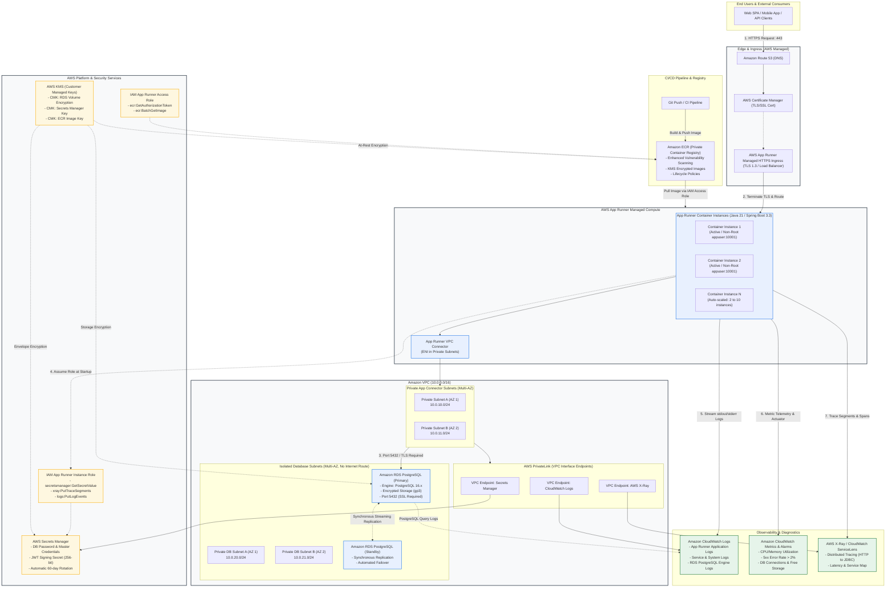
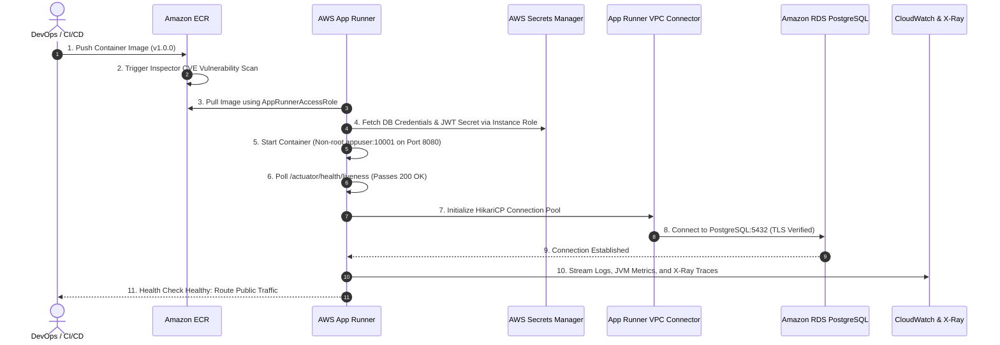

# AWS Cloud Deployment Architecture Specification
## Book Corner – Enterprise E-Commerce Platform

**Document ID:** ARCH-AWS-2026-001  
**Target Platform:** AWS Cloud (us-east-1 / Production & Staging)  
**Application:** Spring Boot 3.3.4 / Java 21 LTS (`book-corner`)  
**Status:** APPROVED ARCHITECTURAL BLUEPRINT  
**Companion Documents:** [`Dockerfile`](./Dockerfile), [`pom.xml`](./pom.xml), [`application.yml`](./src/main/resources/application.yml), [`spring_boot_architecture_spec.md`](./spring_boot_architecture_spec.md)

---

## 1. Executive Summary & Architecture Diagram

### 1.1 Architecture Overview
The **Book Corner** production architecture is deployed on **Amazon Web Services (AWS)** using a modern, serverless container paradigm centered on **AWS App Runner**, backed by **Amazon RDS for PostgreSQL (Multi-AZ)**, container images managed in **Amazon ECR**, configuration and credentials protected by **AWS Secrets Manager**, and comprehensive observability provided by **Amazon CloudWatch** and **AWS X-Ray**.

Key design principles implemented:
- **Serverless Compute Simplicity:** AWS App Runner eliminates the operational overhead of managing orchestrators (Kubernetes/EKS) or load balancers while providing native auto-scaling, managed TLS, and container-level health checks.
- **Private Network Isolation:** Application containers connect into an Amazon VPC via an **App Runner VPC Connector**, ensuring all traffic to Amazon RDS PostgreSQL and AWS Private Endpoints stays entirely within private subnets without public internet egress.
- **Zero-Trust Security & Secrets Management:** No database credentials or JWT keys are stored in code or container images. Secrets are stored in AWS Secrets Manager, encrypted with AWS KMS CMKs, and injected into the App Runner environment securely.
- **Deep Distributed Observability:** End-to-end tracing with AWS X-Ray / OpenTelemetry spans incoming HTTP requests down to SQL query execution in HikariCP, coupled with CloudWatch metrics, alarms, and container logs.

---

### 1.2 End-to-End AWS Architecture Diagram

---

## 2. AWS Resource Inventory & Specification

The following inventory details every cloud resource required to deploy the Book Corner platform across Production and Staging tiers.

### 2.1 Compute & Application Runtime (AWS App Runner)
| Resource Name | Type | Configuration / Sizing | Description & Responsibilities |
| :--- | :--- | :--- | :--- |
| `bookcorner-prod-apprunner-service` | `AWS::AppRunner::Service` | 2 vCPU / 4 GB RAM per instance | Fully managed containerized service executing the hardened Spring Boot 3.3 / Java 21 container. Handles HTTP request termination, dynamic traffic routing, and container health checking. |
| `bookcorner-prod-autoscaling-cfg` | `AWS::AppRunner::AutoScalingConfigurationList` | Min: 2 instances, Max: 10 instances, Concurrency Target: 100 | Horizontal auto-scaling policy. Guarantees Multi-AZ redundancy with 2 base instances during off-peak and dynamically scales up to 10 instances under peak shopping workloads. |
| `bookcorner-prod-observability-cfg` | `AWS::AppRunner::ObservabilityConfiguration` | `TraceConfiguration: AWSXRAY` | Enables automatic AWS X-Ray tracing integration for incoming HTTP requests and request routing metadata. |
| `bookcorner-prod-vpc-connector` | `AWS::AppRunner::VpcConnector` | Subnets: `subnet-app-a`, `subnet-app-b`; SG: `sg-apprunner-egress` | Establishes elastic network interfaces (ENIs) inside customer VPC private subnets, enabling seamless egress traffic to private RDS and VPC Endpoints without public routing. |

#### App Runner Health Check Configuration
- **Health Check Protocol:** `HTTP`
- **Health Check Path:** `/actuator/health/liveness` (Spring Boot Actuator Liveness state)
- **Interval:** 10 seconds
- **Timeout:** 5 seconds
- **Healthy Threshold:** 1 check
- **Unhealthy Threshold:** 3 consecutive failures
- **Port:** `8080`

---

### 2.2 Container Registry (Amazon ECR)
| Resource Name | Type | Configuration | Description |
| :--- | :--- | :--- | :--- |
| `book-corner/api` | `AWS::ECR::Repository` | Tag Immutability: `ENABLED`, Scan On Push: `ENHANCED` (Inspector), Encryption: `KMS` | Private registry housing multi-stage production Docker images built from [`Dockerfile`](./Dockerfile). Automatically scans dependencies and OS layers for CVEs on every commit push. |
| `bookcorner-ecr-lifecycle-policy` | `AWS::ECR::LifecyclePolicy` | Retain 30 latest tagged releases; expire untagged images after 7 days | Prevents registry storage bloat and minimizes storage costs while preserving previous versions for rollback. |

---

### 2.3 Relational Database (Amazon RDS for PostgreSQL)
| Resource Name | Type | Configuration | Description |
| :--- | :--- | :--- | :--- |
| `bookcorner-prod-postgres` | `AWS::RDS::DBInstance` | Multi-AZ: `true`, Engine: PostgreSQL 16.3+, Class: `db.m6g.large` (2 vCPU, 8 GB RAM, Graviton3), Storage: 100 GB `gp3` (3000 IOPS, 125 MB/s, auto-scale up to 500 GB) | Production transactional database hosting e-commerce schema (Users, Catalog, Orders, Payments, Shipping, Reviews, Coupons). Managed synchronous standby in secondary AZ ensures zero data loss (RPO = 0) and rapid automated failover (RTO < 60s). |
| `bookcorner-db-subnet-group` | `AWS::RDS::DBSubnetGroup` | Subnets: `subnet-db-a`, `subnet-db-b` (Spanning minimum 2 AZs) | Binds RDS instance strictly to isolated private database subnets without Internet Gateway or NAT gateway routes. |
| `bookcorner-pg16-param-group` | `AWS::RDS::DBParameterGroup` | `rds.force_ssl = 1`, `log_min_duration_statement = 1000` (ms), `shared_preload_libraries = 'pg_stat_statements'` | Enforces TLS/SSL encrypted client connections, logs long-running slow queries to CloudWatch, and tracks query performance statistics. |

---

### 2.4 Secrets & Cryptographic Management (AWS Secrets Manager & KMS)
| Resource Name | Type | Key Configuration | Description |
| :--- | :--- | :--- | :--- |
| `bookcorner/prod/rds` | `AWS::SecretsManager::Secret` | JSON: `{"engine":"postgres","host":"...","username":"dbadmin","password":"...","dbname":"bookcorner","port":5432}` | Master database credentials with automatic 60-day rotation via AWS-managed Lambda function. |
| `bookcorner/prod/jwt` | `AWS::SecretsManager::Secret` | SecretString (256-bit cryptographic HMAC key) | Cryptographic signing secret for signing and validating stateless JWT access tokens. |
| `bookcorner/prod/integration-keys` | `AWS::SecretsManager::Secret` | Key-value credentials for third-party payment gateways (Stripe) and shipping carriers (FedEx/UPS). | Isolates external credentials from codebase and container environment definitions. |
| `alias/bookcorner-kms-key` | `AWS::KMS::Key` | Customer Managed Key (CMK), Key rotation: `Enabled` (Annual) | Unified CMK providing envelope encryption for RDS storage volumes, Secrets Manager secrets, and ECR repository artifacts. |

---

### 2.5 Networking & Security Groups (VPC Infrastructure)
| Resource Name | Type | CIDR / Configuration | Description |
| :--- | :--- | :--- | :--- |
| `bookcorner-vpc` | `AWS::EC2::VPC` | `10.0.0.0/16`, DNS Hostnames: `Enabled`, DNS Resolution: `Enabled` | Dedicated, single-tenant virtual private network isolating all backend compute and persistence tiers. |
| `subnet-app-a` & `subnet-app-b` | `AWS::EC2::Subnet` | `10.0.10.0/24` (AZ 1), `10.0.11.0/24` (AZ 2) | Dedicated private subnets allocating ENIs for the App Runner VPC Connector. |
| `subnet-db-a` & `subnet-db-b` | `AWS::EC2::Subnet` | `10.0.20.0/24` (AZ 1), `10.0.21.0/24` (AZ 2) | Isolated persistence subnets with no public internet routes or NAT gateways. |
| `sg-apprunner-egress` | `AWS::EC2::SecurityGroup` | Egress: Port 5432 to `sg-rds-ingress`; Port 443 to `sg-vpce-ingress`. Ingress: None. | Strictly bounded egress group for App Runner instances. Denies all arbitrary internet egress. |
| `sg-rds-ingress` | `AWS::EC2::SecurityGroup` | Ingress: Port 5432 from `sg-apprunner-egress` only. Egress: None. | Firewall group guarding RDS. Eliminates brute force and network intrusion vectors by only accepting connections from App Runner instances. |
| `sg-vpce-ingress` | `AWS::EC2::SecurityGroup` | Ingress: Port 443 from `sg-apprunner-egress`. Egress: None. | Secures private interface endpoints for Secrets Manager, CloudWatch, and X-Ray. |
| Private VPC Endpoints | `AWS::EC2::VPCEndpoint` | Interface Endpoints for: `secretsmanager`, `logs`, `xray` | Keeps AWS API traffic within AWS private backbone without traversing public internet. |

---

### 2.6 Identity & Access Management (IAM Roles & Policies)
| IAM Role Name | Principal Service | Managed & Inline Policies | Scope of Authority |
| :--- | :--- | :--- | :--- |
| `BookCornerAppRunnerAccessRole` | `build.apprunner.amazonaws.com` | `AWSAppRunnerServicePolicyForECRAccess` | Grants App Runner authority to authenticate against Amazon ECR and pull container image layers. |
| `BookCornerAppRunnerInstanceRole` | `tasks.apprunner.amazonaws.com` | `AWSXRayDaemonWriteAccess`, Custom Inline Policy: `BookCornerAppSecretsPolicy` | Grants runtime container instances permission to write X-Ray traces, stream CloudWatch logs, and decrypt runtime secrets from Secrets Manager. |
| `BookCornerRDSMonitoringRole` | `monitoring.rds.amazonaws.com` | `AmazonRDSEnhancedMonitoringRole` | Permits Amazon RDS to stream sub-second OS and process metrics to CloudWatch Logs. |

---

### 2.7 Observability & Telemetry (CloudWatch & AWS X-Ray)
| Resource Name | Type | Specification | Description |
| :--- | :--- | :--- | :--- |
| `/aws/apprunner/bookcorner-prod/application` | `AWS::Logs::LogGroup` | Retention: 30 days | Collects container `STDOUT` and `STDERR` structured JSON logs formatted with trace IDs and correlation IDs. |
| `/aws/rds/instance/bookcorner-prod-postgres/postgresql` | `AWS::Logs::LogGroup` | Retention: 30 days | Captures PostgreSQL operational logs, connection attempts, error dumps, and slow query executions. |
| `BookCorner-High5xxRate-Alarm` | `AWS::CloudWatch::Alarm` | Metric: `5xxStatusCount` > 10 for two consecutive 1-minute periods | P1 incident trigger firing an SNS message to PagerDuty / Ops notification topic. |
| `BookCorner-HighCPU-Alarm` | `AWS::CloudWatch::Alarm` | Metric: `CPUUtilization` > 80% for 10 consecutive minutes | Alerts operations if containers are under-dimensioned or experiencing thread starvation. |
| `BookCorner-RDS-FreeStorage-Alarm` | `AWS::CloudWatch::Alarm` | Metric: `FreeStorageSpace` < 15 GB | Proactive alert to guarantee continuous transactional operations before auto-storage expansion limits. |
| `BookCorner-Default-Sampling` | `AWS::XRay::SamplingRule` | Reservoir: 1 req/sec, Fixed Rate: 5% | Profiles end-to-end performance without incurring excessive telemetry cost. Traces 100% of failed HTTP 5xx responses. |

---

## 3. Comprehensive Cost Estimate

The cost model is evaluated based on standard AWS commercial pricing in **US East (N. Virginia / us-east-1)**. We present two configurations:
1. **Development & Staging Workload:** Cost-optimized, single-AZ, scaled-down footprint.
2. **Production Workload:** High-availability Multi-AZ, auto-scaling compute, high IOPS, 24/7 mission-critical resilience.

### 3.1 Monthly Cost Comparison Table

| Service Component | Sizing & Allocation Spec | Staging / Dev Cost (Monthly) | Production HA Cost (Monthly) |
| :--- | :--- | :--- | :--- |
| **AWS App Runner** | **Dev:** 1 instance (1 vCPU, 2 GB RAM, 730 hrs) **Prod:** Avg. 3 active instances (2 vCPU, 4 GB RAM, 24/7) + Provisioned Baseline | **$37.96** *(Provisioned: $5.11 + Active vCPU: $23.36 + Memory: $9.49)* | **$204.40** *(Active 2 vCPU: $140.16 + 4 GB RAM: $56.94 + Baseline: $7.30)* |
| **Amazon RDS PostgreSQL** | **Dev:** `db.t4g.small` (2 vCPU, 2 GB), Single-AZ, 30 GB gp3 **Prod:** `db.m6g.large` (2 vCPU, 8 GB), Multi-AZ, 100 GB gp3, 3000 IOPS | **$28.26** *(Instance: $24.82 + Storage: $3.45)* | **$261.34** *(Instance: $230.68 + Multi-AZ Storage 100GB: $23.00 + Backup 100GB: $7.66)* |
| **Amazon RDS Proxy** | **Dev:** Disabled (Direct connect) **Prod:** 1 DB Proxy (2 vCPU capacity, connection multiplexing & queuing) | **$0.00** | **$21.90** *(2 vCPU × $0.015/hr × 730 hrs)* |
| **Amazon ECR** | 1 repository, 25 GB storage (Dev: 10 GB, Prod: 25 GB) + Image Scanning | **$1.00** | **$2.50** |
| **AWS Secrets Manager** | 3 secrets (RDS credentials, JWT Secret, Third-party API keys) + 50,000 API calls/month | **$1.45** *(3 secrets × $0.40 + $0.25 calls)* | **$1.45** *(3 secrets × $0.40 + $0.25 calls)* |
| **AWS NAT Gateway** | **Dev:** Disabled (Public subnets) **Prod:** 1 NAT Gateway in Public Subnet for Stripe/Carrier API egress | **$0.00** | **$37.35** *($0.045/hr × 730 hrs + $4.50 data)* |
| **AWS PrivateLink Endpoints** | 3 VPC Interface Endpoints (Secrets, Logs, X-Ray) across 2 AZs | **$0.00** *(Use NAT/Direct in dev)* | **$21.90** *(3 endpoints × $0.01/hr × 730 hrs)* |
| **Amazon CloudWatch** | Logs ingestion (Prod: 15 GB/mo), metrics (10 custom metrics), 5 alarms, 1 dashboard | **$5.50** | **$15.50** *(Logs: $7.50 + Alarms: $1.00 + Metrics: $3.00 + Dashboard: $3.00)* |
| **AWS X-Ray** | 5,000,000 requests/month with 5% sampling = 250,000 traces recorded + 1,000,000 traces retrieved | **$1.25** | **$2.00** *(Traces: $1.25 + Storage/Retrieval: $0.75)* |
| **AWS KMS** | 1 Customer Managed Key (CMK) + 100,000 cryptographic operations/month | **$1.00** | **$1.03** |
| **Data Transfer & Egress** | Inter-AZ replication + Internet outbound data transfer (Prod: 100 GB/month) | **$1.50** | **$9.00** |
| **TOTAL ESTIMATED MONTHLY COST** | — | **$77.92 / month** | **$578.37 / month** |

---

### 3.2 Cost Optimization & Sustainability Strategies
1. **AWS Graviton3 Adoption:** Utilizing ARM64 `db.m6g.large` instead of `db.m6i.large` saves **20% on RDS compute costs** while delivering superior performance and lower latency.
2. **Compute Savings Plans / RDS Reserved Instances:** Committing to a 1-year or 3-year All Upfront Reserved Instance for the production database reduces RDS instance cost by **38% to 58%**, saving ~$1,200 annually.
3. **App Runner Automatic Concurrency:** By tuning concurrency to 100 requests per instance, App Runner maximizes JVM Virtual Threads (Project Loom) throughput, minimizing active container count during medium loads.
4. **Adaptive X-Ray Sampling:** Using a 5% fixed sampling rate with a 1 trace/sec reservoir eliminates runaway telemetry costs while capturing 100% of 4xx/5xx error transactions.
5. **Log Lifecycle Management:** Configuring a 30-day retention rule on CloudWatch Log Groups prevents indefinite accumulation of high-volume application debug logs.

---

## 4. Multi-Layered Security Controls Matrix

The architecture strictly adheres to the **AWS Well-Architected Framework (Security Pillar)** and **CIS AWS Foundations Benchmark v3.0**.

```mermaid
graph LR
    subgraph Layer1["1. Perimeter & Ingress"]
        TLS["Managed TLS 1.3 Termination"]
        Shield["AWS Shield Standard (DDoS)"]
        WAF["AWS WAF (Optional IP/Geo Rate-Limiting)"]
    end

    subgraph Layer2["2. Compute & Runtime"]
        NonRoot["Non-Root Execution (UID 10001)"]
        Inspector["ECR Enhanced CVE Scanning"]
        MinimalBase["Minimal JRE 21 Temurin Base"]
    end

    subgraph Layer3["3. Network & Isolation"]
        PrivateVPC["Isolated DB Subnets (No IGW)"]
        VPCE["AWS PrivateLink Endpoints"]
        SG["Strict Micro-segmentation SGs"]
    end

    subgraph Layer4["4. Data & Cryptography"]
        KMSCrypt["KMS CMK At-Rest Encryption"]
        SSLPostgres["PostgreSQL rds.force_ssl = 1"]
        SecretsRot["Secrets Manager Auto-Rotation"]
    end

    Layer1 --> Layer2 --> Layer3 --> Layer4
```

### 4.1 Identity, Authentication & Least Privilege (IAM)
- **Zero Static Credentials:** No database passwords, JWT secrets, or cloud credentials reside in Git, environment files, or container image layers.
- **Role Decoupling:**
  - `BookCornerAppRunnerAccessRole` is strictly bounded to `ecr:GetAuthorizationToken` and image batch retrieval.
  - `BookCornerAppRunnerInstanceRole` is restricted via resource-level ARN conditions to only retrieve secrets under the `arn:aws:secretsmanager:us-east-1:<account-id>:secret:bookcorner/prod/*` prefix and publish traces to AWS X-Ray.
- **Database User Partitioning:** The application interacts with PostgreSQL using an unprivileged application role (`bookcorner_app`) restricted to CRUD permissions on application tables, while Flyway database migrations run via dedicated schema maintenance execution.

### 4.2 Network Isolation & Boundary Controls
- **Private Data Tier:** Amazon RDS PostgreSQL is provisioned inside isolated private subnets lacking Internet Gateway, NAT Gateway, or public route table mappings. Direct access from the public internet is impossible.
- **Egress-Only App Runner Connector:** App Runner instances communicate with VPC resources through Elastic Network Interfaces (ENIs). Ingress into the connector is blocked by default.
- **Micro-Segmented Security Groups:**
  - The RDS Security Group (`sg-rds-ingress`) accepts TCP port 5432 inbound **only** from the specific source security group ID (`sg-apprunner-egress`).
  - No wildcard CIDR blocks (`0.0.0.0/0`) exist anywhere on internal database or endpoint security groups.
- **AWS PrivateLink Integration:** Requests to AWS Secrets Manager, CloudWatch Logs, and AWS X-Ray are routed across AWS internal VPC Endpoints, never traversing public internet routers.

### 4.3 Data Protection & Cryptographic Assurance
- **Encryption in Transit:**
  - External client traffic terminates over **TLS 1.3** on App Runner with modern cipher suites.
  - Internal application-to-database traffic enforces TLS with RDS CA verification (`sslmode=verify-full`, `rds.force_ssl = 1`).
- **Encryption at Rest:**
  - **RDS Storage:** Encrypted using an AWS KMS Customer Managed Key (CMK) with AES-256 envelope encryption, covering tables, WAL logs, automated backups, and temporary query tables.
  - **ECR Registry:** Encrypted using KMS CMK.
  - **Secrets Manager:** Encrypted using KMS CMK with automated key rotation.
  - **CloudWatch Logs:** Encrypted using KMS CMK to safeguard sensitive application traces and query logs.

### 4.4 Container & Runtime Security Hardening
- **Non-Root Execution:** The container runs as unprivileged user `appuser` (UID 10001, GID 10001) as defined in [`Dockerfile`](./Dockerfile#L34-L35). In the event of a container breakout attempt, host root access is denied.
- **Immutable Minimal Attack Surface:** Built with Eclipse Temurin 21 JRE Jammy minimal runtime, stripping development tooling, compilers, and package managers from the final execution image.
- **Signal Handling & Process Isolation:** Uses `dumb-init` as PID 1 to ensure standard POSIX signal propagation, graceful shutdown of Tomcat worker threads, and elimination of zombie processes.
- **Automated Vulnerability Scanning:** Amazon ECR utilizes Amazon Inspector to perform continuous and on-push CVE analysis of all container layers, flagging any vulnerable dependencies.

### 4.5 Auditing, Observability & Incident Detection
- **Comprehensive Audit Trail:** All administrative operations and access to Secrets Manager and KMS are logged to **AWS CloudTrail** with non-repudiation.
- **Database Query Auditing:** PostgreSQL slow query logging (`log_min_duration_statement = 1000ms`) identifies query degradation, while connection auditing logs failed authentication attempts.
- **Automated P1 Alarms:** CloudWatch Metric Alarms actively evaluate 5xx errors, container crashes, and database connection exhaustion, triggering automated alerts via Amazon SNS.

---

## 5. Deployment & Execution Workflow

---

## 6. Summary of Architectural Decisions

| Decision Area | Selected Technology | Rationale | Alternatives Considered |
| :--- | :--- | :--- | :--- |
| **Compute Engine** | **AWS App Runner** | Serverless simplicity, zero infrastructure patching, native auto-scaling, integrated TLS, direct VPC connector support, cost-effective for single-monolith workload. | Amazon ECS on Fargate (higher operational complexity with ALB/target groups), Amazon EKS (excessive complexity and cost for a modular monolith). |
| **Relational Store** | **Amazon RDS PostgreSQL (Multi-AZ)** | High ACID compliance, automated synchronous failover, zero maintenance overhead, seamless compatibility with Spring Data JPA & Flyway migrations. | Amazon Aurora PostgreSQL (higher baseline cost), Self-hosted PostgreSQL on EC2 (high management overhead). |
| **Container Registry** | **Amazon ECR** | Native IAM integration, automated Inspector CVE scanning, image tag immutability. | Docker Hub / GitHub Packages (cross-cloud networking latency and credential management overhead). |
| **Configuration Secrets** | **AWS Secrets Manager** | Native RDS credential rotation, KMS encryption, IAM resource policies, dynamic injection. | AWS Systems Manager Parameter Store (lacks automated RDS password rotation out of the box). |
| **Telemetry & Traces** | **CloudWatch & AWS X-Ray** | Native App Runner integration, unified ServiceLens map from HTTP request to database query, automated alarms. | Datadog / Dynatrace (higher external third-party licensing cost). |
