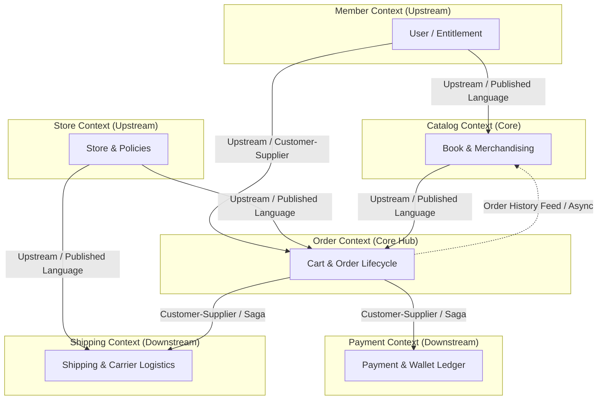
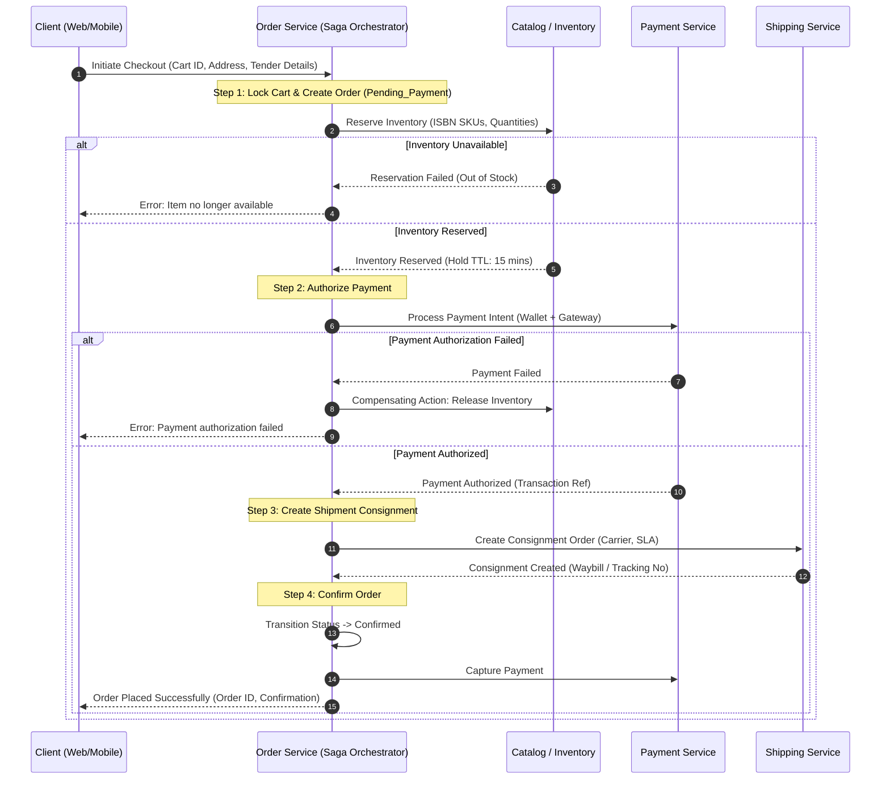

# Bookstore System ("Book Corner") – Backend Architecture & Reverse-Engineered Requirements Specification

## Executive Summary & Source Artifact Reference

This specification is reverse-engineered from the provided **Bookstore Architecture and Wireframe User Journey Diagram** (`wireframe_architecture.png` / `IMG_6669.HEIC`).

The source diagram delineates:
1. **User Actors**: `Registered User` and `Guest User`.
2. **Wireframe Screen Progression**: `[User Login]` $\rightarrow$ `[Home Page]` $\rightarrow$ `[Browse (Search)]` $\rightarrow$ `[Add to Cart]` $\rightarrow$ `[Payment Processing]` $\rightarrow$ `[Shipment]`.
3. **Core Architectural Domains & Associated Capability Clouds**:
   - **Member**: Guest/Registered Users, Login & Logout, Role & Entitlement.
   - **Store**: Create Stores, Create Catalogs, Create Store Policies.
   - **Catalog**: Browse Catalog by Entitlement, Browse Products by Category & Brand, Recommended Products based on Order History, Show Up-Sell & Cross-Sell Products.
   - **Order**: Create/Modify Order, Order Checkout, Confirm Order / Cancel Order / Return Order, Order History, Redeem Gift Points & Coupons.
   - **Payment**: Payment Processing using Gateway, Refund Processing, Payment Confirmation, Gift & Wallet.
   - **Shipping**: Shipping Rate Calculation, Approximate Delivery Time, Return Shipment.

In strict compliance with architectural guidelines, **no concrete API signatures or endpoints have been generated yet**. This document formalizes the backend requirements, business capabilities, domain models, data ownership, and boundaries necessary for subsequent engineering phases.

---

## 1. Functional Requirements (FRs)

The functional requirements are categorized by the architectural modules identified in the diagram and aligned with the end-to-end user screen flow.

```
+-------------------------------------------------------------------------------------------------------+
|                                  END-TO-END USER SCREEN FLOW                                          |
|                                                                                                       |
|  [Registered User] ---> [User Login] ---\                                                             |
|                                          +---> [Home Page] ---> [Browse] ---> [Cart] ---> [Payment] -> [Shipment]
|  [Guest User] --------------------------/                                                             |
+-------------------------------------------------------------------------------------------------------+
```

### 1.1 Member Module (Identity, Access & Entitlements)
*Associated Screens: User Login, Global Session Context*

- **FR-MEM-01: Guest Session Lifecycle**
  - The system shall issue an anonymous guest session identifier (secure cryptographically signed token) upon first interaction.
  - The system shall bind guest activities (cart additions, browsing session, store selection) to this anonymous session token.
  - The guest session shall have a configurable TTL (Time-To-Live, default: 30 days) and refresh automatically upon user activity.

- **FR-MEM-02: User Registration & Authentication**
  - The system shall support secure user registration and credential authentication (email/password with Argon2/bcrypt hashing, multi-factor authentication capability).
  - The system shall issue short-lived JWT access tokens and long-lived secure HttpOnly refresh tokens upon successful login.
  - The system shall provide secure logout functionality that immediately invalidates session tokens and revokes active refresh tokens in a centralized blacklist/distributed cache.

- **FR-MEM-03: Role & Entitlement Resolution**
  - The system shall maintain Role-Based Access Control (RBAC) and Attribute-Based Access Control (ABAC) defining user roles (e.g., `Guest`, `RegisteredCustomer`, `VIPMember`, `StoreAdmin`).
  - Upon authentication, the system shall resolve the user’s active entitlements (e.g., eligible discount clubs, regional purchasing privileges, institutional member licenses) and embed them in the security context.

- **FR-MEM-04: Profile & Address Book Management**
  - The system shall allow registered users to manage their personal profile, communication preferences, and multiple delivery/billing addresses with a designated default address.

---

### 1.2 Store Module (Multi-Tenant & Policy Governance)
*Associated Screens: Home Page, Global Catalog & Checkout Orchestration*

- **FR-STO-01: Store Creation & Tenant Configuration**
  - The system shall support multi-store configurations, allowing administrators to create and manage distinct stores (e.g., regional storefronts, physical branch pickup stores, online flagship).
  - Each store shall maintain configuration metadata, including primary currency, timezone, locale, tax settings, and operational statuses.

- **FR-STO-02: Store-Catalog Association**
  - The system shall support the assignment of one or more product catalogs to a specific store.
  - The system shall resolve the active catalog based on the selected store context.

- **FR-STO-03: Store Policy Definition & Enforcement**
  - The system shall allow store administrators to configure store-specific policies:
    - **Return Policy**: Allowed return window (e.g., 15/30 days post-delivery), non-returnable categories, restocking fee rules.
    - **Shipping Policy**: Free shipping threshold amounts, delivery zone restrictions, carrier priority rules.
    - **Cancellation Policy**: Permitted cancellation grace periods prior to fulfillment dispatch.
  - Downstream modules (`Order`, `Payment`, `Shipping`) shall evaluate and enforce these store policies during transaction processing.

---

### 1.3 Catalog Module (Products, Merchandising & Recommendations)
*Associated Screens: Home Page, Browse Screen (Search & Filtering)*

- **FR-CAT-01: Product & Book Information Management**
  - The system shall manage book product records with attributes including ISBN-10/13, Title, Subtitle, Author(s), Publisher/Brand, Language, Edition, Format (Hardcover, Paperback, E-book), Page Count, Synopsis, Weight, Dimensions, Base Price, and Tax Category.

- **FR-CAT-02: Taxonomy & Brand Browsing**
  - The system shall provide hierarchical category navigation (e.g., *Fiction $\rightarrow$ Science Fiction $\rightarrow$ Hard Sci-Fi*) and brand/publisher filtering.
  - The system shall support multi-faceted filtering allowing concurrent filtering by category, author/brand, format, price band, customer rating, and availability.

- **FR-CAT-03: Entitlement-Based Catalog Access**
  - The system shall dynamically filter catalog visibility and pricing based on user entitlements (e.g., institutional subscribers seeing specialized academic catalogs; VIP members unlocking exclusive prerelease titles).

- **FR-CAT-04: Personalized Recommendations (Order History Engine)**
  - The system shall ingest the user's historical order items to generate personalized book recommendations on the Home Page and Browse screens.
  - For guest users or users without history, the system shall gracefully fall back to trending, top-rated, or editorial curated selections.

- **FR-CAT-05: Up-Sell & Cross-Sell Engine**
  - The system shall maintain rule-based and ML-driven merchandising associations:
    - **Up-Sell**: Displaying premium editions (e.g., Hardcover, Illustrated Collector's Edition, Signed Copies) when a user views a paperback.
    - **Cross-Sell**: Recommending related companion titles, series sequels, reading guides, and accessories during Browse and Cart views.

---

### 1.4 Order Module (Cart, Checkout & Lifecycle Management)
*Associated Screens: Add to Cart, Payment Processing, Shipment / Confirmation*

- **FR-ORD-01: Cart Operations & Persistence**
  - The system shall enable users to add books to cart, adjust quantities, view real-time price totals (subtotal, applied discounts, estimated taxes), and remove items.
  - Guest carts shall be persisted via guest session tokens; registered user carts shall be synchronized to the backend user profile across devices.

- **FR-ORD-02: Guest Cart Merging**
  - Upon login or account creation, the system shall merge items from the anonymous guest cart into the registered user’s persistent cart, deduplicating identical SKUs and updating item quantities according to inventory caps.

- **FR-ORD-03: Coupon & Gift Point Redemption**
  - The system shall validate and apply discount coupons (percentage, fixed amount, min-order thresholds, single-use per customer).
  - The system shall allow redemption of loyalty/gift points against the payable order total based on store conversion rules.

- **FR-ORD-04: Order Checkout & State Machine**
  - The system shall transition an active cart into a formal checkout workflow, orchestrating address verification, inventory reservation locks, shipping selection, and payment authorization.
  - The system shall enforce a strict state machine:
    `Draft` $\rightarrow$ `Pending_Payment` $\rightarrow$ `Confirmed` $\rightarrow$ `Processing` $\rightarrow$ `Shipped` $\rightarrow$ `Delivered` $\rightarrow$ `Cancelled` / `Returned`.

- **FR-ORD-05: Order Cancellation**
  - The system shall permit users to cancel an order if it has not progressed beyond the policy-defined cancellation cut-off (e.g., before `Processing` / `Shipped`).
  - Upon cancellation, the system shall release reserved inventory and trigger automated refund processing.

- **FR-ORD-06: Order Return Workflow (RMA)**
  - The system shall allow customers to initiate a return request for delivered orders within the store's policy return window.
  - The system shall generate a Return Merchandise Authorization (RMA) record, link return line items, initiate reverse logistics, and withhold refund completion until warehouse return inspection.

- **FR-ORD-07: Order History & Audit Trail**
  - The system shall provide registered users with historical order listings, detailed order breakdowns, invoices, and shipment tracking links.

---

### 1.5 Payment Module (Gateway, Wallets, Gift & Refunds)
*Associated Screens: Payment Processing*

- **FR-PAY-01: Payment Gateway Integration**
  - The system shall interface with third-party payment gateways (supporting Credit/Debit cards, Net Banking, UPI, and digital wallets) using secure tokenization and 3-D Secure verification.

- **FR-PAY-02: Multi-Tender & Split Payments**
  - The system shall support split-tender payments allowing a customer to pay part of an order via Customer Digital Wallet balance or Gift Cards, and settle the remaining balance via Payment Gateway.

- **FR-PAY-03: Asynchronous Payment Confirmation & Idempotency**
  - The system shall process asynchronous webhook notifications from payment gateways with strict cryptographic signature verification and idempotent deduplication.
  - The system shall handle payment timeouts, drops, and failures by transitioning orders to `Payment_Failed` and releasing locks gracefully.

- **FR-PAY-04: Digital Wallet & Gift Card Ledger**
  - The system shall maintain an immutable, double-entry financial ledger for user digital wallet credits and gift card balances.
  - All balance movements (credits, debits, holds, releases) shall be recorded with transaction references.

- **FR-PAY-05: Refund Processing**
  - The system shall process full and partial refunds resulting from order cancellations or approved returns.
  - Refunds shall be credited back to the original payment source (e.g., returning wallet balance to wallet, gateway charges back to bank card).

---

### 1.6 Shipping Module (Rating, Delivery & Reverse Logistics)
*Associated Screens: Add to Cart (estimation), Shipment (tracking & returns)*

- **FR-SHP-01: Dynamic Shipping Rate Calculation**
  - The system shall calculate shipping rates dynamically based on package weight, total order dimensions, delivery destination postal code, selected shipping method (Standard, Express, Overnight), and applicable store policies (e.g., free shipping rules).

- **FR-SHP-02: Approximate Delivery Time (ETA)**
  - The system shall compute an estimated delivery date/time window based on origin fulfillment center cut-offs, destination distance, and logistics partner SLAs.

- **FR-SHP-03: Consignment & Tracking Management**
  - The system shall create a shipment consignment upon order fulfillment, generate carrier waybills/tracking numbers, and stream tracking milestone updates (`Dispatched`, `In Transit`, `Out for Delivery`, `Delivered`).

- **FR-SHP-04: Return Shipment Orchestration**
  - The system shall generate reverse shipping labels for approved customer returns, schedule carrier pickup, and track return consignments back to the fulfillment facility.

---

## 2. Non-Functional Requirements (NFRs)

```
+---------------------------------------------------------------------------------------------------+
|                               NON-FUNCTIONAL PILLARS                                              |
|                                                                                                   |
|  [Performance]       [Security & PCI]     [Reliability & Saga]   [Scalability & CQRS]             |
|  Browse < 150ms      Zero raw card data   Eventual Consistency   Horizontal auto-scaling          |
|  Checkout < 500ms    TLS 1.3 / AES-256    Distributed Saga       Redis Caching & Read Replicas    |
+---------------------------------------------------------------------------------------------------+
```

### 2.1 Performance & Latency
- **NFR-PERF-01**: The Catalog Browse and Search subsystems shall return responses with P95 latency $< 150\text{ ms}$ under baseline load.
- **NFR-PERF-02**: Complex checkout and payment orchestration operations shall complete with P99 latency $< 500\text{ ms}$ (excluding external gateway redirects).
- **NFR-PERF-03**: Recommendation engine queries on the Home Page shall be cached or precomputed to respond within $< 100\text{ ms}$; if the recommendation service experiences latency $> 200\text{ ms}$, the system shall degrade gracefully to cached global popular books.

### 2.2 Scalability & Elasticity
- **NFR-SCAL-01**: The system shall scale horizontally to support high-traffic book launches and holiday flash sales, handling a minimum of $5,000$ concurrent browsing requests per second and $500$ concurrent checkout transactions per second.
- **NFR-SCAL-02**: Read-heavy workloads (Catalog browsing, search) shall be isolated from write-heavy workloads (Orders, Payments) using Command Query Responsibility Segregation (CQRS) and read replicas.

### 2.3 Availability & Fault Tolerance
- **NFR-AVAL-01**: The core storefront and ordering capabilities shall maintain an availability SLA of $99.99\%$ (less than 52 minutes of unplanned downtime per year).
- **NFR-AVAL-02**: External dependencies (Payment Gateways, Shipping Carrier APIs) shall be isolated using the Circuit Breaker pattern (e.g., Resilience4j) and fallback queues to prevent cascading failures.

### 2.4 Security & Compliance
- **NFR-SEC-01 (PCI-DSS)**: No raw primary account numbers (PAN) or CVVs shall enter or be stored on the application backend. All card details must be tokenized directly at the client layer via the Payment Gateway SDK.
- **NFR-SEC-02 (Data Protection)**: All data in transit must enforce TLS 1.3 encryption. All PII and sensitive data at rest must be encrypted using AES-256.
- **NFR-SEC-03 (Authentication & Access)**: All backend API boundaries must authenticate requests using cryptographically signed JSON Web Tokens (RS256) and authorize access via fine-grained RBAC and entitlement claims.

### 2.5 Data Integrity & Consistency
- **NFR-DATA-01**: Financial transactions, wallet balances, and inventory allocation must exhibit strict ACID consistency within their local service database boundaries.
- **NFR-DATA-02**: Cross-service workflows (Cart $\rightarrow$ Payment $\rightarrow$ Order $\rightarrow$ Shipping) must utilize the **Saga Pattern** (orchestrated or choreographed) with idempotent compensation actions to guarantee eventual consistency.
- **NFR-DATA-03**: All mutating requests across Order and Payment domains must mandate an `Idempotency-Key` header to eliminate duplicate billing or duplicate order placement.

### 2.6 Auditability & Observability
- **NFR-OBS-01**: Every state change in the Order, Payment, and Shipping lifecycles must generate an immutable audit log entry including actor ID, timestamp (UTC), previous state, new state, and correlation ID.
- **NFR-OBS-02**: All microservices/modules shall emit distributed trace headers compliant with the W3C Trace Context standard, feeding into OpenTelemetry collectors.

---

## 3. User Roles & Permission Matrix

Based on the architecture diagram (which explicitly models `Guest User`, `Registered User`, and administrative store/catalog creation), the system defines the following roles:

| Role Name | Description | Key Entitlements & Permissions |
| :--- | :--- | :--- |
| **Guest User** | Unauthenticated anonymous visitor accessing the storefront. | • Browse public catalogs & categories.<br>• Perform keyword searches.<br>• Add items to temporary guest cart.<br>• View guest estimated shipping rates.<br>• Proceed to login/checkout. |
| **Registered User** | Authenticated consumer account. | • All Guest permissions.<br>• Access entitlement-specific catalogs & special pricing.<br>• Persistent cart across devices.<br>• Personalized recommendations based on order history.<br>• Multi-tender payment (Wallet, Gift points).<br>• View order history & tracking.<br>• Cancel & Return orders per policy. |
| **VIP / Loyalty Member** | High-tier registered customer with club status. | • All Registered User permissions.<br>• Access to exclusive VIP catalog releases & advanced pre-orders.<br>• Priority shipping rate discounts.<br>• Elevated gift/loyalty point accumulation & redemption caps. |
| **Store Administrator** | Business/franchise operator managing store operations. | • Create and configure stores.<br>• Associate catalogs with stores.<br>• Define store policies (Return, Shipping, Cancellation).<br>• Configure localized payment and shipping rules. |
| **Catalog Merchandiser** | Catalog administrator managing products & marketing. | • Create and update product/book metadata.<br>• Configure category hierarchies & brands.<br>• Set up Up-Sell and Cross-Sell product associations.<br>• Configure promotional discount coupons. |
| **Customer Support / Fulfillment Agent** | Internal operations handling orders and returns. | • View customer orders, payment status, and tracking.<br>• Approve or inspect Return Merchandise Authorizations (RMA).<br>• Process manual exception refunds or shipping overrides. |
| **System Administrator** | Platform technical administrator. | • Manage system configurations, API clients, and security roles.<br>• Monitor distributed logs, metrics, and dead-letter queues. |

---

## 4. User Stories & Acceptance Criteria

```
+---------------------------------------------------------------------------------------------------+
|                                 CORE USER JOURNEYS (GHERKIN)                                      |
|                                                                                                   |
|  [Browse by Entitlement] ---> [Upsell / Cross-sell] ---> [Cart with Points] ---> [Multi-Tender]   |
|  [Guest to Member Merge] ---> [Order Tracking]     ---> [Policy Cancellation / Return]            |
+---------------------------------------------------------------------------------------------------+
```

### User Story 1: Guest User Cart Carryover upon Authentication
- **As a** Guest User browsing the bookstore,
- **I want to** add books to my cart and have them automatically preserved when I log in,
- **So that** I do not lose my selected books and can complete checkout seamlessly.
- **Acceptance Criteria (Gherkin):**
  - **Given** an unauthenticated guest has added 2 copies of "Clean Architecture" to their cart,
  - **When** the guest navigates to `User Login` and authenticates successfully as a Registered User who already has 1 copy of "Domain-Driven Design" in their persistent cart,
  - **Then** the system merges both carts so the registered cart contains 2 copies of "Clean Architecture" and 1 copy of "Domain-Driven Design",
  - **And** the anonymous guest session token is retired and linked to the authenticated user ID.

---

### User Story 2: Entitlement-Driven Catalog Browsing & Search
- **As a** Registered User with special membership entitlements (e.g., Academic Club),
- **I want to** browse and search the catalog and see specialized books and member-discounted prices,
- **So that** I receive the exclusive pricing and catalog access I am entitled to.
- **Acceptance Criteria (Gherkin):**
  - **Given** an authenticated user with an `Academic_Member` entitlement,
  - **When** the user searches for "Computer Science" or browses the Tech category,
  - **Then** the search results include academic editions restricted from guest users,
  - **And** the displayed prices reflect the negotiated member entitlement discount.

---

### User Story 3: Order History-Based Book Recommendations
- **As a** Registered User returning to the bookstore `Home Page`,
- **I want to** see a "Recommended for You" section based on my past purchases,
- **So that** I can easily discover books matching my reading preferences.
- **Acceptance Criteria (Gherkin):**
  - **Given** a user has previously purchased books in the "Science Fiction" and "Distributed Systems" categories,
  - **When** the user loads the `Home Page`,
  - **Then** the system queries the recommendation engine using the user's order history,
  - **And** displays recommended books filtered to match those genres, excluding titles the user has already purchased.

---

### User Story 4: Merchandising Up-Sell and Cross-Sell Prompts
- **As a** Customer viewing a book on the `Browse` or `Cart` screen,
- **I want to** see relevant collector editions (Up-Sell) and complementary titles (Cross-Sell),
- **So that** I can upgrade my format or bundle related books.
- **Acceptance Criteria (Gherkin):**
  - **Given** a user has added the paperback edition of "The Fellowship of the Ring" to their cart,
  - **When** the cart screen renders,
  - **Then** the system displays an Up-Sell banner for the "Deluxe Hardcover Collector's Edition",
  - **And** displays Cross-Sell recommendations for "The Two Towers" and "The Silmarillion" with a one-click add button.

---

### User Story 5: Multi-Tender Payment (Wallet + Payment Gateway)
- **As a** Customer completing checkout on the `Payment Processing` screen,
- **I want to** apply my store Wallet balance and pay the remainder using my credit card,
- **So that** I can use my accrued store credit while settling the total balance.
- **Acceptance Criteria (Gherkin):**
  - **Given** an order with a total payable amount of $\$50.00$, and a user with a verified Wallet balance of $\$20.00$,
  - **When** the customer elects to use their wallet and enters payment gateway details for the remaining $\$30.00$,
  - **Then** the system places a $\$20.00$ hold on the wallet balance,
  - **And** requests payment gateway authorization for $\$30.00$,
  - **And** upon gateway success, debits the wallet permanently and marks the order as `Confirmed`.

---

### User Story 6: Dynamic Shipping Rate & Delivery Window Calculation
- **As a** Customer in the checkout flow,
- **I want to** see accurate shipping rates and estimated delivery dates based on my delivery address,
- **So that** I know when my books will arrive and what shipping option best suits my needs.
- **Acceptance Criteria (Gherkin):**
  - **Given** a cart containing books with a total weight of 1.8 kg destined for postal code "94103",
  - **When** the checkout process invokes shipping calculation,
  - **Then** the system evaluates store shipping policies (e.g., free standard shipping for orders over $\$35$),
  - **And** computes carrier rates for Standard (3-5 days) and Express (1-2 days),
  - **And** displays the precise estimated delivery arrival date range.

---

### User Story 7: Order Cancellation within Store Policy Window
- **As a** Customer who placed an order by mistake,
- **I want to** cancel my order directly from my `Order History`,
- **So that** I do not get charged or shipped items I do not want.
- **Acceptance Criteria (Gherkin):**
  - **Given** an order placed 15 minutes ago with status `Confirmed` (prior to shipment dispatch),
  - **When** the customer clicks "Cancel Order",
  - **Then** the system checks the store's cancellation policy,
  - **And** transitions the order to `Cancelled`,
  - **And** releases the inventory reservation,
  - **And** triggers an automated refund transaction back to the customer's payment methods.

---

### User Story 8: Order Return (RMA) Workflow
- **As a** Customer who received a damaged book,
- **I want to** initiate a return request within the store's return window,
- **So that** I can return the book and receive a refund.
- **Acceptance Criteria (Gherkin):**
  - **Given** an order delivered 5 days ago (within the store's 30-day return policy),
  - **When** the customer submits a return request for the book,
  - **Then** the system generates an RMA tracking number,
  - **And** requests the `Shipping` module to generate a prepaid reverse shipping label,
  - **And** flags the order line item as `Return_Initiated`.

---

### User Story 9: Store and Policy Governance by Store Administrator
- **As a** Store Administrator,
- **I want to** create a new regional store, assign a catalog, and set its return policy,
- **So that** customers in that region experience localized rules and offerings.
- **Acceptance Criteria (Gherkin):**
  - **Given** an authenticated user with `StoreAdmin` role,
  - **When** the admin creates store "Book Corner West", binds catalog `CAT-WEST-01`, and sets return window to 14 days,
  - **Then** the system persists the store entity,
  - **And** orders routed through "Book Corner West" strictly enforce the 14-day return limit.

---

## 5. Business Capabilities Map

```
+----------------------------------------------------------------------------------------------------+
|                                    BUSINESS CAPABILITIES HIERARCHY                                 |
+-----------------------------------+----------------------------------+-----------------------------+
| 1. Customer & Identity            | 2. Store & Governance            | 3. Catalog & Merchandising  |
|    • Customer Profile Mgt         |    • Multi-Store Hierarchy       |    • Product Data Mgt (ISBN)|
|    • Session & Auth Governance    |    • Catalog Assignment          |    • Taxonomy & Facets      |
|    • Entitlements & RBAC          |    • Policy Configuration        |    • Discovery & Search     |
|                                   |                                  |    • Recs & Merchandising   |
+-----------------------------------+----------------------------------+-----------------------------+
| 4. Order & Checkout               | 5. Payment & Financial           | 6. Logistics & Fulfillment  |
|    • Cart & Basket Orchestration  |    • Gateway Orchestration       |    • Shipping Rate Engine   |
|    • Checkout State Machine       |    • Multi-Tender & Ledger       |    • Delivery ETA Estimator |
|    • Promotions & Loyalty Engine  |    • Refunds & Reconciliation    |    • Consignment Tracking   |
|    • Post-Order Lifecycle (Cancel)|    • Wallet & Gift Operations    |    • Reverse Logistics(RMA) |
+-----------------------------------+----------------------------------+-----------------------------+
```

### Detailed Capability Decomposition

1. **Customer & Identity Management**
   - *Customer Identity*: Anonymous guest tracking, customer credential storage, multi-factor authentication, session lifecycle management.
   - *Entitlements & Privileges*: Dynamic role evaluation, corporate/club entitlement assignment, profile management.

2. **Store & Platform Governance**
   - *Store Hierarchy*: Multi-store creation, localized configuration (currency, language, tax zone).
   - *Policy Management*: Return policy engine, cancellation rule management, shipping eligibility thresholds.

3. **Catalog & Merchandising**
   - *Product Master Data*: Book metadata lifecycle, format mapping (print, digital, audio), brand/publisher governance.
   - *Merchandising & Discovery*: Faceted search, personalized recommendations (collaborative filtering over order history), up-sell/cross-sell associations.
   - *Entitlement Filtering*: Rules engine for tier-based and regional catalog gating.

4. **Order Management & Checkout**
   - *Cart Management*: Transient and persistent basket calculations, inventory soft-locking.
   - *Checkout Orchestration*: Checkout steps state machine, pricing and tax calculation, coupon validation.
   - *Lifecycle Servicing*: Order tracking, cancellation servicing, return merchandise authorization (RMA).

5. **Financial & Payment Operations**
   - *Payment Execution*: Third-party gateway routing, tokenization, 3DS authentication handling.
   - *Stored Value & Loyalty*: Digital wallet ledger, gift voucher issuance and redemption.
   - *Settlement & Refunds*: Asynchronous webhook reconciliation, automated refunds, payment auditing.

6. **Logistics & Fulfillment**
   - *Carrier Rating*: Real-time rate calculation based on volumetric weight and destination.
   - *Fulfillment Scheduling*: Transit time computation, SLA monitoring.
   - *Tracking & Reverse Logistics*: Carrier consignment tracking, return label generation, warehouse receipt status.

---

## 6. Domain Boundaries & Context Mapping (DDD)

Applying Strategic Domain-Driven Design (DDD), the bookstore backend is structured into six distinct **Bounded Contexts**.

### 6.1 Bounded Context Definitions

1. **Member Context (Supporting Domain)**
   - *Core Aggregates*: `User`, `GuestSession`, `Role`, `EntitlementProfile`, `CustomerAddress`.
   - *Ubiquitous Language*: Guest Session, Entitlement, Principal, Member Tier.

2. **Store Context (Supporting Domain)**
   - *Core Aggregates*: `Store`, `StorePolicy` (ReturnPolicy, ShippingPolicy, CancellationPolicy), `CatalogBinding`.
   - *Ubiquitous Language*: Store Instance, Policy Rule, Return Window, Restocking Term.

3. **Catalog Context (Core Domain)**
   - *Core Aggregates*: `BookProduct`, `Category`, `PublisherBrand`, `RecommendationRule`, `MerchandisingLink` (UpSell, CrossSell).
   - *Ubiquitous Language*: ISBN, SKU, Format, Category Facet, Entitlement Mask, Cross-Sell Companion.

4. **Order Context (Core Domain)**
   - *Core Aggregates*: `Cart`, `CartItem`, `Order`, `OrderLineItem`, `CouponRedemption`, `ReturnRequest (RMA)`.
   - *Ubiquitous Language*: Checkout, Line Item, Order Status, Inventory Reservation, RMA, Cancellation Window.

5. **Payment Context (Generic / Core Financial Subdomain)**
   - *Core Aggregates*: `PaymentTransaction`, `PaymentIntent`, `WalletLedger`, `GiftCard`, `RefundRecord`.
   - *Ubiquitous Language*: Tender, Authorization, Capture, Hold, Ledger Entry, Webhook Reconciliation.

6. **Shipping Context (Supporting Subdomain)**
   - *Core Aggregates*: `ShippingRateQuote`, `Consignment`, `TrackingMilestone`, `ReturnShipmentLabel`.
   - *Ubiquitous Language*: Volumetric Weight, Carrier SLA, Rate Card, Waybill, Reverse Consignment.

---

### 6.2 Context Map & Relationships



### Context Relationships Breakdown:
- **Member $\rightarrow$ Catalog**: *Upstream/Downstream (Published Language)*. Catalog queries the authenticated user's Entitlement Profile to filter available titles and discounts.
- **Member $\rightarrow$ Order**: *Customer-Supplier*. Order associates orders with User ID and requires authenticated credentials for checkout completion.
- **Store $\rightarrow$ Order & Shipping**: *Upstream/Downstream*. Order and Shipping consume Store Policies to apply return windows, cancellation rules, and free-shipping thresholds.
- **Catalog $\rightarrow$ Order**: *Published Language*. Order imports snapshot data (Title, ISBN, Unit Price) from Catalog into immutable `OrderLineItems`.
- **Order $\rightarrow$ Payment & Shipping**: *Customer-Supplier with Saga Orchestration*. Order acts as the transaction coordinator, triggering payment authorization/capture and shipping consignment generation.
- **Order $\rightarrow$ Catalog (Recommendation Loop)**: *Asynchronous Event Feed*. When an order is confirmed, the Order context emits `OrderPlacedEvent`, which the Catalog Recommendation engine ingests to refine future recommendations.

---

## 7. Backend Modules & Technical Architecture

```
+----------------------------------------------------------------------------------------------------+
|                                    BACKEND MODULE DECOMPOSITION                                    |
+-------------------+--------------------+-------------------+-------------------+-------------------+
|  Member Service   |   Store Service    |  Catalog Service  |   Order Service   |  Payment Service  |
|  • Auth & SSO     |   • Store Registry |  • Product Master |   • Cart Engine   |  • PSP Gateway    |
|  • Session Mgr    |   • Policy Engine  |  • Search Engine  |   • Checkout Saga |  • Wallet Ledger  |
|  • RBAC & Profile |   • Catalog Binder |  • Recs Engine    |   • Order State   |  • Refund Handler |
+-------------------+--------------------+-------------------+-------------------+-------------------+
|                                 Shipping & Logistics Service                                       |
|                                 • Rate Calculator  • Delivery ETA                                  |
|                                 • Carrier Gateway  • Return Logistics                              |
+----------------------------------------------------------------------------------------------------+
|                                   SHARED INFRASTRUCTURE BACKBONE                                   |
|   [Kafka / Event Bus] <---> [Redis Cache / Sessions] <---> [API Gateway & Ingress Security]         |
+----------------------------------------------------------------------------------------------------+
```

### 7.1 Module Architecture Specifications

#### Module 1: Member Subsystem
- **Internal Components**:
  - `AuthenticationManager`: Validates credentials, issues JWTs, verifies tokens.
  - `SessionRegistry`: Tracks active guest and registered user tokens in Redis.
  - `EntitlementEngine`: Evaluates user club/academic/regional eligibility flags.
  - `UserProfileService`: Manages customer addresses, phone numbers, and communication preferences.
- **Communication Protocol**: Synchronous REST/gRPC for authentication checks; emits `UserRegisteredEvent`, `UserLoggedInEvent`.

#### Module 2: Store & Policy Subsystem
- **Internal Components**:
  - `StoreRegistry`: Maintains multi-store instances, operational status, and locale.
  - `PolicyRuleEngine`: Evaluates return windows, cancellation eligibility, and tax rules.
  - `CatalogBindingManager`: Resolves catalog mapping per store.
- **Communication Protocol**: High-frequency read queries cached in Redis; emits `StorePolicyUpdatedEvent`.

#### Module 3: Catalog & Merchandising Subsystem
- **Internal Components**:
  - `ProductCatalogService`: Manages book entities, ISBN indexes, formats, and pricing.
  - `SearchAndFilterEngine`: Powered by Elasticsearch/OpenSearch for faceted filtering and typo-tolerant search.
  - `RecommendationService`: Precomputes recommendations using collaborative filtering over customer order history.
  - `MerchandisingRuleEngine`: Matches product SKUs against up-sell/cross-sell graph databases.
- **Communication Protocol**: High-throughput read APIs; listens to `OrderPlacedEvent` asynchronously to update recommendation models.

#### Module 4: Order & Cart Subsystem
- **Internal Components**:
  - `CartManager`: Manages cart additions, price recalculations, and guest-to-registered cart merging.
  - `CheckoutSagaOrchestrator`: Coordinates the distributed checkout transaction across Order, Payment, and Shipping.
  - `OrderLifecycleManager`: State machine controlling transitions (`Draft` $\rightarrow$ `Delivered` / `Cancelled` / `Returned`).
  - `PromotionEngine`: Validates coupon codes and calculates loyalty point redemptions.
  - `ReturnManager`: Generates RMAs and manages reverse lifecycle.
- **Communication Protocol**: Emits `OrderCreatedEvent`, `OrderConfirmedEvent`, `OrderCancelledEvent`, `ReturnRequestedEvent`.

#### Module 5: Payment Subsystem
- **Internal Components**:
  - `PaymentGatewayRouter`: Integrates with external payment gateways (Stripe, Razorpay, Adyen).
  - `WalletLedgerService`: Double-entry transaction bookkeeping for customer wallets.
  - `GiftCardService`: Balance tracking and redemption validation.
  - `WebhookReconciler`: Idempotent listener for external PSP payment confirmations.
  - `RefundManager`: Dispatches automated refunds upon order cancellation or return approval.
- **Communication Protocol**: Listens to `PaymentAuthorizeCommand`, `PaymentRefundCommand`; emits `PaymentAuthorizedEvent`, `PaymentFailedEvent`, `RefundCompletedEvent`.

#### Module 6: Shipping Subsystem
- **Internal Components**:
  - `ShippingRateEngine`: Matrix rate lookup and carrier API aggregator.
  - `DeliveryETACalculator`: Computes SLA-based expected arrival dates.
  - `CarrierDispatchService`: Generates waybills and initiates carrier tracking.
  - `ReverseLogisticsService`: Creates return labels and monitors return consignments.
- **Communication Protocol**: Listens to `ShipmentCreateCommand`, `ReturnShipmentCreateCommand`; emits `ShipmentDispatchedEvent`, `ShipmentDeliveredEvent`.

---

### 7.2 Distributed Saga Workflow: Checkout Orchestration



---

## 8. API Domains (Functional Groupings & Boundaries)

> **Architectural Notice**: In accordance with project instructions, **concrete API endpoints (e.g., URLs, HTTP methods, JSON payloads) are not generated here**. The table below defines the functional API groupings, boundary responsibilities, consumer actors, and contract specifications.

| API Domain | Domain Scope & Responsibility | Primary Consumer | Communication Style & Security |
| :--- | :--- | :--- | :--- |
| **Member & Identity Domain** | • Guest session provisioning and renewal.<br>• User authentication (login, logout, refresh).<br>• Profile and delivery address book management.<br>• Entitlement querying and token claims validation. | Web UI, Mobile App, Internal Services | Synchronous HTTPS; Public endpoints for login/session; Bearer JWT validation on profile endpoints. |
| **Store Governance Domain** | • Multi-store administrative configuration.<br>• Store-to-catalog assignment lookup.<br>• Store policy retrieval (Returns, Cancellations, Shipping thresholds). | Store Admin Portal, Storefront UI, Order Service | Synchronous HTTPS; Admin RBAC enforcement; CDN/Edge caching on public store policies. |
| **Catalog & Discovery Domain** | • Book product retrieval and ISBN resolution.<br>• Hierarchical taxonomy and brand filtering.<br>• Faceted search with entitlement filtering.<br>• Personalized recommendations retrieval.<br>• Up-sell and cross-sell candidate retrieval. | Storefront UI, Recommendation Pipeline | Synchronous HTTPS; Open search caching via Redis/Varnish; Entitlement headers evaluated for restricted views. |
| **Cart & Order Domain** | • Shopping cart CRUD operations and cart merging.<br>• Coupon code validation and loyalty point discount calculation.<br>• Checkout lifecycle initiation and state machine updates.<br>• Customer order history and line-item invoice retrieval.<br>• Order cancellation and return request (RMA) submission. | Storefront UI, Customer Support Portal | Synchronous HTTPS for mutations; Mandates `Idempotency-Key` header on checkout/cancellation requests. |
| **Payment & Wallet Domain** | • Payment intent creation and multi-tender split orchestration.<br>• External PSP payment gateway token verification.<br>• Digital wallet balance querying and ledger modification.<br>• Gift card verification and balance deduction.<br>• Asynchronous webhook ingestion and signature validation.<br>• Automated refund initiation and auditing. | Checkout Flow, Payment Gateways (Webhooks) | Synchronous HTTPS + Asynchronous Webhook callbacks; Mutual TLS (mTLS) or HMAC-SHA256 signature verification. |
| **Shipping & Logistics Domain** | • Real-time dynamic shipping rate calculation.<br>• Delivery ETA and arrival window estimation.<br>• Waybill and consignment tracking status updates.<br>• Return shipment label generation and pickup scheduling. | Checkout Flow, Carrier Webhooks, Internal Operations | Synchronous HTTPS for rate quotes; Asynchronous carrier webhook listeners for milestone tracking. |

---

## 9. Data Ownership & Entity Matrix

To maintain loose coupling and microservice autonomy, each business entity has a single authoritative **Owning Module**. No external module may write directly to another module's database.

| Entity | Primary Owning Module | Read Consumers | Write / Mutating Actors | Consistency Pattern | Recommended Persistence Engine |
| :--- | :--- | :--- | :--- | :--- | :--- |
| **User & Credentials** | Member Module | Member, Order, Support | User (Self), Member Service | Strong (ACID) | Relational (PostgreSQL) |
| **Guest Session** | Member Module | Member, Order (Cart) | Member Service | Eventual (TTL) | In-Memory Cache (Redis) |
| **Entitlement Profile** | Member Module | Catalog, Order | Admin, Member Service | Strong | Relational (PostgreSQL) |
| **Store & Configurations**| Store Module | Catalog, Order, Shipping | Store Admin | Strong | Relational (PostgreSQL) |
| **Store Policies** | Store Module | Order, Payment, Shipping | Store Admin | Strong (Cached) | Relational + Redis Cache |
| **Book / Product Master** | Catalog Module | Catalog, Order, Search | Merchandiser | Strong (Master) | Relational (PostgreSQL) |
| **Catalog Search Index** | Catalog Module | Storefront (Search) | Catalog Sync Worker | Eventual | Search Engine (Elasticsearch) |
| **Merchandising Rules** | Catalog Module | Catalog, Cart UI | Merchandiser | Eventual | Document / Graph DB |
| **Recommendations** | Catalog Module | Home Page, Browse UI | Rec Engine Worker | Eventual | Key-Value / Feature Store |
| **Shopping Cart & Items** | Order Module | Cart UI, Checkout | User, Order Service | Strong | Redis / Document Store |
| **Order & Line Items** | Order Module | Payment, Shipping, Member | Order Service | Strong (ACID) | Relational (PostgreSQL) |
| **RMA / Return Request** | Order Module | Shipping, Payment, Support | Customer, Support | Strong | Relational (PostgreSQL) |
| **Payment Transaction** | Payment Module | Order, Support, Audit | Payment Service | Strong (ACID) | Relational (PostgreSQL) |
| **Wallet & Gift Ledger** | Payment Module | Order, Customer | Payment Service | Strong (Double-Entry) | Relational (PostgreSQL) |
| **Shipment Consignment** | Shipping Module | Order, Customer, Support | Shipping Service | Strong | Relational (PostgreSQL) |
| **Tracking Milestones** | Shipping Module | Customer, Order | Carrier Webhooks | Eventual | Time-Series / Document DB |

---

## 10. Architectural Assumptions

1. **Multi-Tenancy & Multi-Store Design**: The platform operates as a multi-store system where a single organization can operate distinct physical or regional storefronts, each with customized catalogs and policies.
2. **Payment Gateway Tokenization (PCI-DSS Scope)**: Card payment capture relies entirely on modern client-side tokenization (e.g., Stripe Elements or payment provider frames). The bookstore backend never handles raw PANs or CVVs.
3. **Inventory Decoupling**: While inventory holds and reservations are mandated during checkout, physical inventory master data is assumed to reside within the Catalog and Order domains in this phase, with external Warehouse Management System (WMS) sync treated as integration hooks.
4. **Guest Session Longevity**: Anonymous guest carts are preserved via encrypted HTTP cookies/headers for up to 30 days, enabling frictionless return visits without forced account registration.
5. **Event-Driven Backbone**: Inter-module asynchronous notifications (e.g., `OrderPlaced`, `PaymentConfirmed`, `ShipmentDispatched`) assume the presence of a resilient event broker (Apache Kafka or AWS EventBridge) supporting at-least-once delivery with idempotent consumers.
6. **Currencies and Taxes**: Monetary calculations are stored as 64-bit integers (in smallest currency units, e.g., cents/paise) to prevent floating-point rounding errors across split payments and refunds.

---

## 11. Out Of Scope Items

The following functional and technical areas are deliberately excluded from this backend scope:

1. **Concrete API Endpoint Generation**: Specific REST/GraphQL endpoint definitions, request/response DTO schemas, and Swagger/OpenAPI specifications (deferred to the next architectural phase per prompt instructions).
2. **Physical POS Hardware Integration**: In-store barcode scanners, physical receipt printer drivers, and cash drawer hardware integrations.
3. **Digital E-Book DRM Reader Application**: Native mobile/desktop e-reader rendering engines, EPUB decryption runtimes, and digital rights management (DRM) licensing servers.
4. **Proprietary Courier Fleet Dispatch**: In-house driver dispatching algorithms, route optimization, and GPS vehicle tracking; all shipping relies on established third-party logistics APIs (e.g., FedEx, UPS, DHL, BlueDart).
5. **Print-on-Demand (POD) Production**: Custom typesetting, PDF pre-flight print checks, and binding factory automation.
6. **Social Commerce & Video Streaming**: Live video book tours, in-app author streaming, and community discussion message boards.
7. **Direct Accounting ERP**: Full General Ledger and balance-sheet tax reporting software (the backend will expose financial event webhooks for external ERP export such as SAP or NetSuite).

---
*End of Architectural Specification. Ready for transition to Phase 2: API Contract Design & Data Modeling.*
