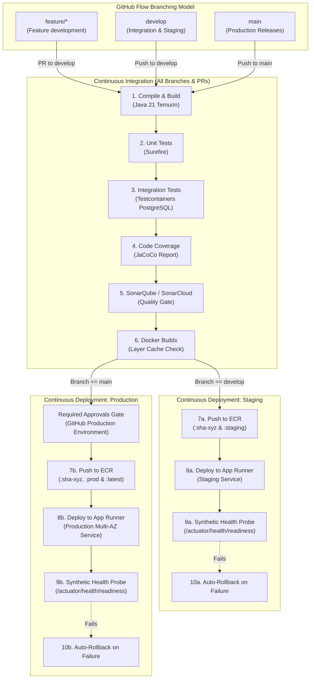
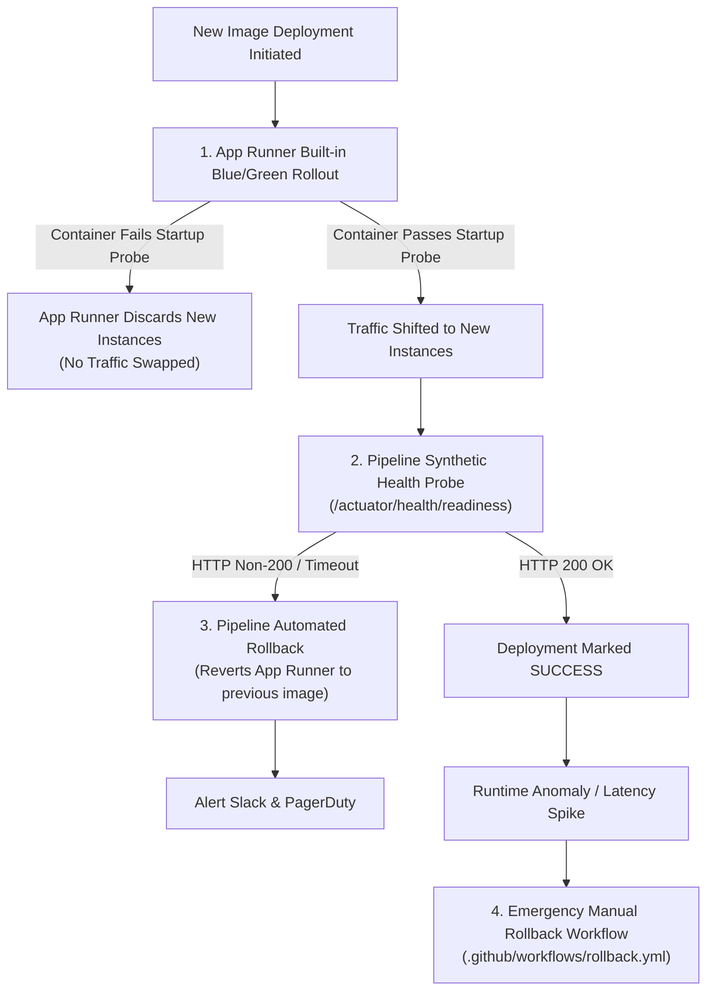

# CI/CD Pipeline Specification: Book Corner Platform

**Document ID:** CICD-BC-2026-001  
**Target Platform:** GitHub Actions & AWS App Runner / Amazon ECR  
**Application:** Spring Boot 3.3.4 / Java 21 LTS (`book-corner`)  
**Status:** APPROVED CI/CD SPECIFICATION  
**Companion Workflows:** [`.github/workflows/ci-cd-pipeline.yml`](./.github/workflows/ci-cd-pipeline.yml), [`.github/workflows/rollback.yml`](./.github/workflows/rollback.yml)

---

## 1. Executive Pipeline Architecture & GitHub Flow

The CI/CD pipeline implements strict **GitHub Flow** with multi-environment gating:



---

## 2. Environment Configuration Matrix

The deployment pipeline is partitioned into distinct environments managed within GitHub:

| Environment | Trigger Source | Target Service Sizing | Protection Rules & Approvals | Secrets Scoping |
| :--- | :--- | :--- | :--- | :--- |
| **Development** (`dev`) | `feature/*` branches & PRs | Local runner / Docker build test | None (Fast feedback loop) | `GITHUB_TOKEN`, `SONAR_TOKEN` |
| **Staging** (`staging`) | `develop` branch pushes | 1 App Runner instance (1 vCPU, 2 GB RAM) | Automatic deployment upon passing Sonar Quality Gate | `AWS_STAGING_DEPLOY_ROLE_ARN`, `APP_RUNNER_STAGING_SERVICE_ARN` |
| **Production** (`production`) | `main` branch pushes | Multi-AZ App Runner (2 to 10 instances, 2 vCPU, 4 GB RAM) | **Required Reviewers (2 Lead Engineers)**, 5-minute cooldown timer, restricted to `main` branch | `AWS_PRODUCTION_DEPLOY_ROLE_ARN`, `APP_RUNNER_PROD_SERVICE_ARN` |

### 2.1 Branch Protection Rules
1. **`main` Branch:**
   - Require a pull request before merging (minimum 1 peer approval).
   - Require status checks to pass before merging (`Build & Test`, `SonarQube Quality Gate`).
   - Require linear history; force pushes and deletions strictly prohibited.
2. **`develop` Branch:**
   - Require pull request for all incoming feature branches.
   - All unit and integration test suites must pass 100%.

---

## 3. Secrets & Identity Configuration (Zero Static Credentials)

The pipeline authenticates to AWS using **OpenID Connect (OIDC)** federated trust. No AWS Access Keys (`AKIA...`) are stored in GitHub Secrets.

### 3.1 GitHub Secrets Reference

| Secret Name | Scope | Description | Example / Format |
| :--- | :--- | :--- | :--- |
| `AWS_OIDC_ROLE_ARN` | Repository | General IAM role for Docker builds and ECR authentication. | `arn:aws:iam::123456789012:role/GitHubActionsECRRole` |
| `AWS_STAGING_DEPLOY_ROLE_ARN` | Environment: `staging` | Dedicated IAM role authorized to update the Staging App Runner service. | `arn:aws:iam::123456789012:role/GitHubActionsStagingDeployRole` |
| `AWS_PRODUCTION_DEPLOY_ROLE_ARN` | Environment: `production` | Highly privileged IAM role authorized to update the Production App Runner service. | `arn:aws:iam::123456789012:role/GitHubActionsProductionDeployRole` |
| `APP_RUNNER_STAGING_SERVICE_ARN` | Environment: `staging` | AWS App Runner service ARN for Staging. | `arn:aws:apprunner:us-east-1:123456789012:service/book-corner-staging-service/abc1234` |
| `APP_RUNNER_PROD_SERVICE_ARN` | Environment: `production` | AWS App Runner service ARN for Production. | `arn:aws:apprunner:us-east-1:123456789012:service/book-corner-prod-service/def5678` |
| `SONAR_TOKEN` | Repository | Authentication token for SonarCloud or private SonarQube instance. | `sqp_1234567890abcdef...` |
| `SONAR_HOST_URL` | Repository (Optional) | URL of SonarQube server (defaults to `https://sonarcloud.io`). | `https://sonar.internal.bookcorner.com` |
| `SONAR_PROJECT_KEY` | Repository | Project key registered in Sonar. | `book-corner` |
| `SONAR_ORGANIZATION` | Repository | Organization identifier in SonarCloud. | `book-corner` |

### 3.2 AWS IAM OIDC Trust Policy
Configure the following trust policy on the AWS deployment roles:

```json
{
  "Version": "2012-10-17",
  "Statement": [
    {
      "Effect": "Allow",
      "Principal": {
        "Federated": "arn:aws:iam::<ACCOUNT_ID>:oidc-provider/token.actions.githubusercontent.com"
      },
      "Action": "sts:AssumeRoleWithWebIdentity",
      "Condition": {
        "StringEquals": {
          "token.actions.githubusercontent.com:aud": "sts.amazonaws.com"
        },
        "StringLike": {
          "token.actions.githubusercontent.com:sub": "repo:<ORG_NAME>/book-corner:*"
        }
      }
    }
  ]
}
```

---

## 4. Multi-Tier Rollback Strategy

The Book Corner platform implements a three-layer rollback strategy to guarantee zero unexpected customer downtime.



### 4.1 Layer 1: App Runner Built-in Zero-Downtime Rolling Update
- AWS App Runner executes a rolling blue/green deployment strategy.
- When `start-deployment` is called with a new image tag:
  1. App Runner spins up new container instances alongside the currently active instances.
  2. The service executes the configured health check probe (`/actuator/health/liveness` on port 8080).
  3. If the Spring Boot application fails to bootstrap within the health check threshold (e.g. fatal Flyway migration or configuration error), App Runner automatically aborts the operation and terminates the new containers.
  4. Existing healthy container instances continue handling 100% of user traffic without interruption.

### 4.2 Layer 2: Pipeline Inline Automated Rollback
- Before updating the service, the pipeline captures the current stable image identifier:
  ```bash
  CURRENT_IMAGE=$(aws apprunner describe-service --service-arn "${SERVICE_ARN}" \
    --query "Service.SourceConfiguration.ImageRepository.ImageIdentifier" --output text)
  ```
- Following App Runner deployment, the workflow runs a synthetic readiness verification probe against the live public URL (`/actuator/health/readiness`).
- If the endpoint returns non-200 or times out, the `if: failure()` step immediately triggers an automatic rollback to the captured `previous_image`.

### 4.3 Layer 3: Emergency One-Click Rollback Workflow
- In the event of a latent functional defect discovered post-deployment (e.g. checkout calculation bug), operators can trigger [`.github/workflows/rollback.yml`](./.github/workflows/rollback.yml):
  - **Inputs:** Target environment (`production` or `staging`), desired image tag (e.g. `sha-38aee49` or `v1.0.0`), and reason.
  - **Execution:** Validates image existence in ECR, updates App Runner to the target image, awaits steady state, and performs post-rollback health checks.
  - **Mean Time to Recover (MTTR):** < 3 minutes.

### 4.4 Database Schema Migration Rollback Protocol
- Spring Boot Flyway migrations ([`db/migration/`](./src/main/resources/db/migration)) follow **forward-only, backward-compatible evolutionary database design**:
  - Columns and tables are expanded first (additive changes).
  - Old columns are deprecated before deletion in subsequent releases.
  - Avoid destructive changes (e.g., dropping columns) in the same release as code changes.
  - In the event of a rollback, the database schema remains fully compatible with the previous application container version.
