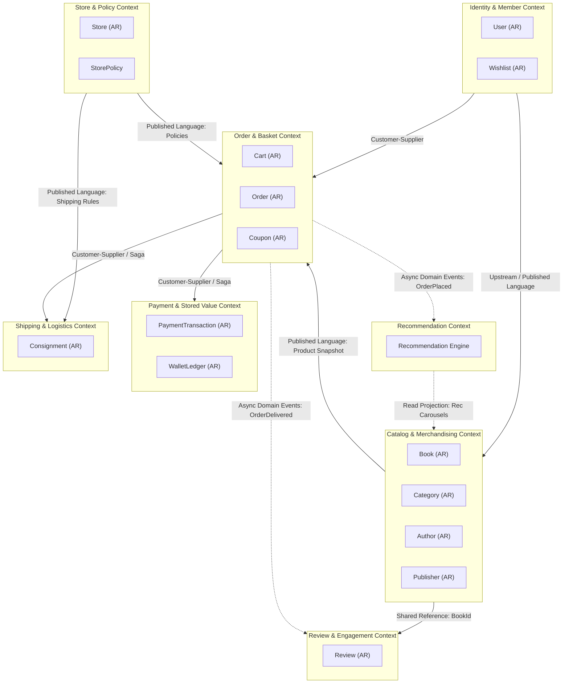
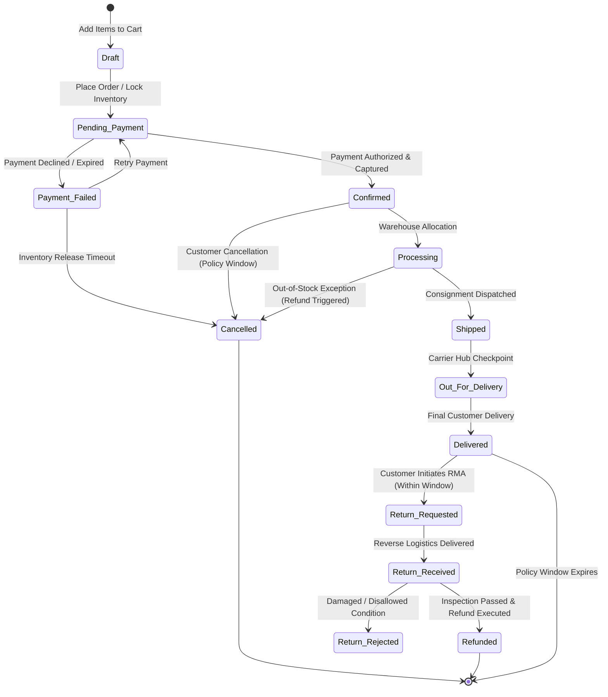
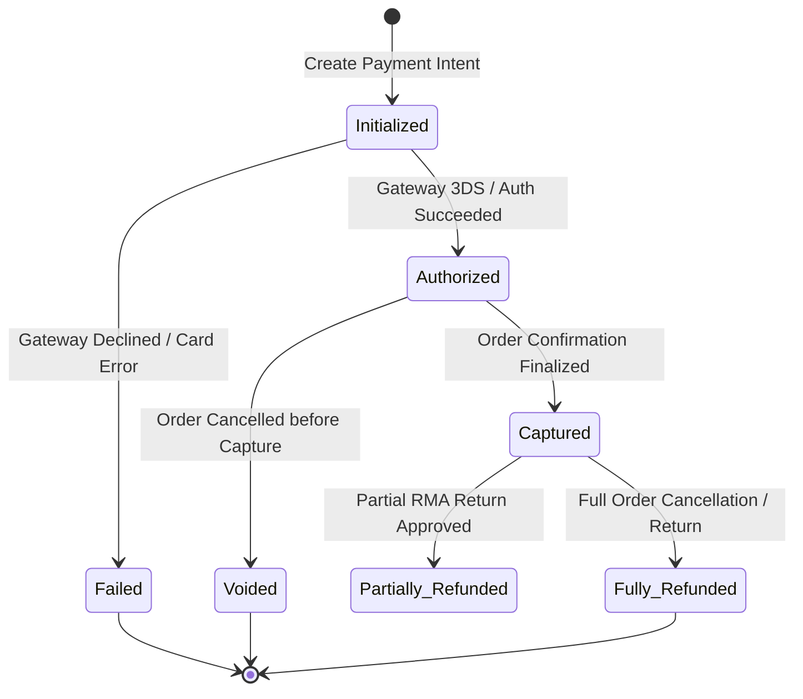
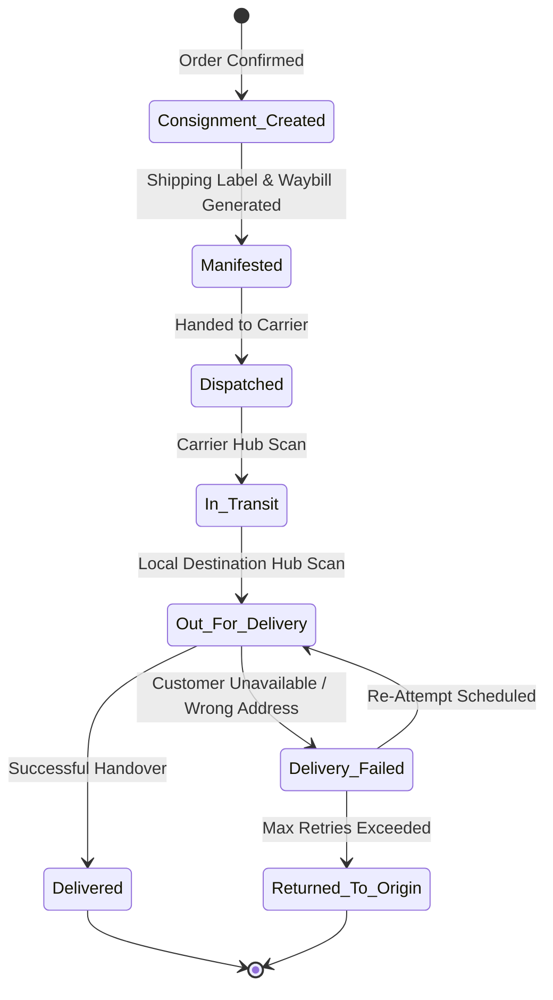
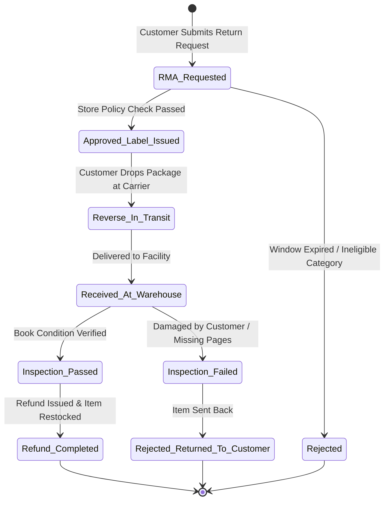

# Domain-Driven Design (DDD) Model & Event Storming Specification
## Online Bookstore Platform ("Book Corner")

---

## 1. Strategic Bounded Contexts

Based on the reverse-engineered requirements and core bookstore business capabilities, the domain is decomposed into **eight distinct Bounded Contexts**.

```
+----------------------------------------------------------------------------------------------------+
|                                    BOUNDED CONTEXT TAXONOMY                                        |
+------------------------------------+-----------------------------------+---------------------------+
| Core Subdomains                    | Supporting Subdomains             | Generic Subdomains        |
| (Competitive Advantage)            | (Business Enablers)               | (Off-The-Shelf / Standard)|
+------------------------------------+-----------------------------------+---------------------------+
| • Catalog & Merchandising Context  | • Identity & Member Context       | • Payment & Wallet Context|
| • Order & Basket Context           | • Store & Policy Context          |                           |
| • Recommendation Context           | • Review & Engagement Context     |                           |
|                                    | • Shipping & Logistics Context    |                           |
+------------------------------------+-----------------------------------+---------------------------+
```

### Bounded Context Descriptions & Classifications

| Bounded Context | Subdomain Type | Strategic Purpose & Responsibilities | Core Ubiquitous Language |
| :--- | :--- | :--- | :--- |
| **Identity & Member** | Supporting | Governs customer authentication, guest session tracking, customer profiles, delivery addresses, wishlists, and entitlement/role resolution. | Guest Session, Registered User, Principal, Entitlement, Address Book, Wishlist Item. |
| **Store & Policy** | Supporting | Manages multi-store instances, catalog-to-store bindings, and store-specific operational policies (returns, cancellations, free-shipping thresholds). | Store Instance, Store Policy, Return Window, Restocking Term, Cancellation Grace Period. |
| **Catalog & Merchandising**| Core | Manages product master data for books, formats, authors, publishers, category taxonomy, faceted search indexes, and up-sell/cross-sell associations. | ISBN, Book Title, Author, Publisher/Brand, Format, Category Slug, Up-Sell, Cross-Sell. |
| **Review & Engagement** | Supporting | Manages customer product reviews, numerical ratings, verified purchase status, moderation states, and aggregate book ratings. | Review, Rating, Verified Purchase, Helpful Vote, Moderation Status (Pending, Approved). |
| **Recommendation** | Core | Processes customer order history and browsing events to calculate category affinity, collaborative filtering recommendations, and personalized carousels. | Customer Affinity, Co-Purchase Matrix, Recommendation Carousel, Similar Items. |
| **Order & Basket** | Core | Manages shopping carts, guest-to-member cart merges, checkout orchestration, coupon validations, order lifecycle state transitions, cancellations, and RMAs. | Cart, Line Item, Order, Checkout Saga, Coupon Code, Order Status, RMA (Return Authorization). |
| **Payment & Wallet** | Generic | Manages third-party payment gateway interactions, multi-tender split calculations, double-entry digital wallet ledgers, gift vouchers, and refund operations. | Payment Intent, Authorization, Capture, Multi-Tender, Wallet Ledger, Gift Voucher, Refund. |
| **Shipping & Logistics** | Supporting | Computes dynamic shipping rates, calculates SLA-based delivery date ranges (ETA), tracks carrier consignments, and coordinates reverse logistics. | Volumetric Weight, Carrier Rate Card, Consignment, Delivery ETA, Tracking Milestone, Return Label. |

---

## 2. Aggregates & Invariants

An **Aggregate** is a cluster of domain objects (entities and value objects) that can be treated as a single unit for data changes, bounded by an **Aggregate Root (AR)** that strictly enforces all business invariants.

```
+----------------------------------------------------------------------------------------------------+
|                                    AGGREGATE ROOTS & BOUNDARIES                                    |
+----------------------+--------------------+--------------------+-----------------------------------+
| Member Context       | Catalog Context    | Order Context      | Payment & Shipping Context        |
| • User (AR)          | • Book (AR)        | • Cart (AR)        | • PaymentTransaction (AR)         |
| • Wishlist (AR)      | • Category (AR)    | • Order (AR)       | • WalletLedger (AR)               |
|                      | • Author (AR)      | • Coupon (AR)      | • Consignment (AR)                |
|                      | • Publisher (AR)   |                    |                                   |
+----------------------+--------------------+--------------------+-----------------------------------+
```

### Aggregate Specifications & Business Invariants

| Aggregate Root | Bounded Context | Internal Entities & Value Objects | Enforced Business Invariants |
| :--- | :--- | :--- | :--- |
| **User** | Identity & Member | Entities: `Address`<br>VOs: `UserId`, `Email`, `HashedPassword`, `Role`, `Entitlement`, `FullName`, `PhoneNumber` | 1. Email must be globally unique and conform to RFC 5322 format.<br>2. User must possess at least one role (`Guest` or `RegisteredCustomer`).<br>3. Exactly one address can be designated as the default shipping address. |
| **Wishlist** | Identity & Member | Entities: `WishlistItem`<br>VOs: `WishlistId`, `UserId`, `BookId`, `AddedAt` | 1. A wishlist belongs strictly to one customer.<br>2. Cannot contain duplicate `BookId` entries.<br>3. Cannot exceed maximum capacity of 200 items. |
| **Store** | Store & Policy | Entities: `StorePolicy`<br>VOs: `StoreId`, `StoreCode`, `Currency`, `Locale`, `ReturnWindowDays`, `FreeShippingThreshold` | 1. Store code must be unique.<br>2. Return window must be $\ge 0$ days.<br>3. Free shipping threshold cannot be negative. |
| **Book** | Catalog & Merchandising | Entities: `BookFormatItem`<br>VOs: `BookId`, `ISBN`, `BookTitle`, `AuthorId`, `PublisherId`, `CategoryId`, `Money`, `Dimensions`, `Weight` | 1. ISBN-10/13 must validate against standard check-digit checksums.<br>2. Every book must belong to at least one valid Category.<br>3. Base price must be strictly $> 0.00$.<br>4. Weight and physical dimensions must be $> 0$ for physical formats. |
| **Category** | Catalog & Merchandising | Entities: None<br>VOs: `CategoryId`, `CategoryName`, `CategorySlug`, `ParentCategoryId` | 1. Hierarchy must be an acyclic directed graph (no category can be an ancestor of itself).<br>2. Category slug must be unique across the same tree level. |
| **Author** | Catalog & Merchandising | Entities: None<br>VOs: `AuthorId`, `FullName`, `Biography`, `AuthorSlug` | 1. Author must have a non-empty name.<br>2. Slug must be URL-safe and unique. |
| **Publisher** | Catalog & Merchandising | Entities: None<br>VOs: `PublisherId`, `PublisherName`, `PublisherCode` | 1. Publisher code must be unique alphanumeric identifier. |
| **Review** | Review & Engagement | Entities: None<br>VOs: `ReviewId`, `BookId`, `UserId`, `Rating`, `ReviewTitle`, `ReviewBody`, `ModerationStatus`, `VerifiedPurchase` | 1. Rating must be an integer between 1 and 5 (inclusive).<br>2. Only one review per `(UserId, BookId)` pair is permitted.<br>3. Reviews with `VerifiedPurchase=true` require confirmed delivered order history. |
| **Cart** | Order & Basket | Entities: `CartItem`<br>VOs: `CartId`, `UserId`, `GuestSessionId`, `Money`, `Quantity`, `ExpiresAt` | 1. Cart item quantity must be $\ge 1$ and $\le 10$ per SKU.<br>2. Total price is the dynamic sum of line item quantities $\times$ current snapshot price.<br>3. Cart must be associated with either an active `UserId` or `GuestSessionId`. |
| **Coupon** | Order & Basket | Entities: None<br>VOs: `CouponId`, `CouponCode`, `DiscountType`, `DiscountValue`, `MinOrderValue`, `DateRange`, `UsageLimit` | 1. Coupon code must be unique uppercase alphanumeric string.<br>2. Percentage discount must be $0 < \text{val} \le 100\%$.<br>3. Cannot be redeemed outside its defined `DateRange` or after exhausting `UsageLimit`. |
| **Order** | Order & Basket | Entities: `OrderLineItem`, `ReturnRequest (RMA)`<br>VOs: `OrderId`, `UserId`, `StoreId`, `OrderStatus`, `OrderPricingSummary`, `ShippingAddress`, `TrackingNumber` | 1. Order total must equal: $\text{Subtotal} + \text{Shipping} - \text{Discounts} + \text{Taxes}$.<br>2. Order must have at least 1 line item.<br>3. Cannot transition to `Cancelled` once status reaches `Shipped` or `Delivered`.<br>4. RMA returns can only be requested if current date is within the Store's return policy window post-delivery. |
| **PaymentTransaction** | Payment & Stored Value | Entities: `TenderSplit`<br>VOs: `PaymentTransactionId`, `OrderId`, `Money`, `PaymentMethod`, `GatewayTransactionRef`, `PaymentStatus` | 1. Sum of all tender splits (Wallet + Gateway + Gift) must exactly equal total payable amount.<br>2. Every mutation requires a unique `IdempotencyKey`.<br>3. Refund amount cannot exceed original captured transaction amount. |
| **WalletLedger** | Payment & Stored Value | Entities: `LedgerEntry`<br>VOs: `WalletId`, `UserId`, `Money`, `TransactionType`, `BalanceSnapshot` | 1. Double-entry integrity: wallet balance cannot drop below $0.00$ (no overdraft).<br>2. All balance adjustments are append-only immutable entries. |
| **Consignment** | Shipping & Logistics | Entities: `TrackingMilestone`<br>VOs: `ConsignmentId`, `OrderId`, `CarrierCode`, `TrackingNumber`, `ShippingRate`, `DeliveryETA`, `ConsignmentStatus` | 1. Consignment must have a valid carrier waybill/tracking number before dispatch.<br>2. Tracking milestones must follow strict chronological progression (`Created` $\rightarrow$ `Dispatched` $\rightarrow$ `In_Transit` $\rightarrow$ `Delivered`). |

---

## 3. Entities

Entities are domain objects defined by their distinct identity rather than their attributes.

| Entity Name | Owning Aggregate Root | Unique Identifier | Core Attributes | Invariant / Domain Responsibilities |
| :--- | :--- | :--- | :--- | :--- |
| **Address** | `User` | `AddressId` (UUID) | `recipientName`, `streetLine1`, `streetLine2`, `city`, `state`, `postalCode`, `country`, `isDefault` | Enforces valid postal formatting; handles default address reassignment. |
| **WishlistItem** | `Wishlist` | `WishlistItemId` (UUID)| `bookId`, `addedAt`, `desiredPriceAlert` | Prevents duplicate book additions; tracks price alert triggers. |
| **BookFormatItem** | `Book` | `FormatSku` (String) | `formatType` (Paperback, Hardcover, Ebook), `isbn`, `unitPrice`, `stockQuantity`, `weightGrams` | Manages format-specific pricing, physical specifications, and stock limits. |
| **CartItem** | `Cart` | `CartItemId` (UUID) | `bookId`, `formatSku`, `quantity`, `unitPriceSnapshot`, `bookTitle` | Validates line quantity limits; recalculates line subtotal. |
| **OrderLineItem** | `Order` | `LineItemId` (UUID) | `bookId`, `formatSku`, `quantity`, `unitPrice`, `lineDiscount`, `lineTax`, `lineTotal` | Immutable record of purchased book item at point-in-time pricing. |
| **ReturnRequest (RMA)**| `Order` | `RmaId` (UUID) | `rmaNumber`, `reasonCode`, `returnQuantity`, `rmaStatus`, `returnTrackingNumber`, `inspectedAt` | Governs return eligibility, reverse shipping label attachment, and inspection outcome. |
| **TenderSplit** | `PaymentTransaction` | `TenderId` (UUID) | `tenderType` (Wallet, Card, UPI, Gift), `allocatedAmount`, `gatewayRef`, `tenderStatus` | Ensures multi-source funding components sum to the total payment obligation. |
| **LedgerEntry** | `WalletLedger` | `EntryId` (UUID) | `entryType` (Credit, Debit, Hold, Release), `amount`, `referenceOrderId`, `timestamp` | Append-only ledger record preserving verifiable financial history. |
| **TrackingMilestone**| `Consignment` | `MilestoneId` (UUID)| `milestoneStatus`, `location`, `eventTimestamp`, `carrierRemarks` | Records carrier checkpoint events received via tracking webhooks. |

---

## 4. Value Objects (VOs)

Value Objects are immutable, identity-less domain constructs defined purely by their attributes and validation rules.

| Value Object | Internal Properties | Validation Rules & Domain Invariants | Architectural Rationale |
| :--- | :--- | :--- | :--- |
| **ISBN** | `value: String`, `format: ISBN_10 \| ISBN_13` | Must pass modulo-11 (ISBN-10) or modulo-10 (ISBN-13) check-digit validation. Strips hyphens. | Prevents corrupted book identity data from entering catalog and inventory. |
| **Money** | `amount: Long` (in cents/paise), `currency: CurrencyCode` | Amount cannot be null; currency must match ISO-4217 code. Currency mismatch throws exception on arithmetic. | Completely prevents floating-point rounding errors across pricing, tax, and ledgering. |
| **AddressVO** | `street: String`, `city: String`, `postalCode: String`, `country: String` | Postal code must validate against destination country regex. All fields mandatory. | Shared value representation of physical locations across Member, Order, and Shipping. |
| **Rating** | `stars: Int` (1 to 5) | Strict integer $\in [1, 5]$. No fractions. | Preserves valid customer satisfaction metrics without database check constraint leaks. |
| **Dimensions** | `lengthCm: Decimal`, `widthCm: Decimal`, `heightCm: Decimal` | All dimensions $> 0.0$. Precision to 2 decimal places. | Used by Shipping context for volumetric weight rating calculations ($L \times W \times H / 5000$). |
| **Weight** | `grams: Int` | Weight $> 0$. Stored in standardized grams. | Prevents unit conversion discrepancies between inventory and carrier rate tables. |
| **Quantity** | `value: Int` | Must be an integer $\ge 1$. Maximum cart limit $= 10$. | Prevents zero or negative item ordering bugs. |
| **DateRange** | `validFrom: Instant`, `validTo: Instant` | `validTo` must be chronologically after `validFrom`. | Encapsulates coupon lifespans, promotional sales, and return policy windows. |
| **CouponCode** | `code: String` | 4–20 characters, alphanumeric, uppercase, no whitespace. | Guarantees clean, uniform coupon code lookups. |
| **TrackingNumber** | `carrier: CarrierType`, `trackingCode: String` | Non-empty, matches carrier-specific format (e.g., FedEx 12-digit, UPS 1Z...). | Prevents invalid carrier dispatch requests. |
| **Email** | `value: String` | RFC 5322 compliant regex; lowercased and trimmed. | Ensures reliable communication and unique login credential mapping. |
| **OrderStatus** | `status: Enum` | Transitions must adhere strictly to the Order State Machine. | Prevents invalid out-of-sequence order updates. |

---

## 5. Domain Events (Event Storming Results)

Domain Events represent facts that have already occurred within an aggregate, named in the **past tense**.

```
+----------------------------------------------------------------------------------------------------+
|                                      EVENT STORMING FLOW                                           |
|                                                                                                    |
|  [GuestSessionStarted] ---> [UserRegistered] ---> [BookAddedToCart] ---> [CouponApplied]           |
|                                                                               |                    |
|  [ShipmentDelivered] <--- [ShipmentDispatched] <--- [PaymentAuthorized] <--- [OrderPlaced]         |
|         |                                                                                          |
|  [ReviewSubmitted] & [RmaReturnInitiated] ---> [RefundIssued]                                      |
+----------------------------------------------------------------------------------------------------+
```

### Complete Domain Event Catalog

| Domain Event | Publishing Aggregate | Triggering Command | Event Payload Attributes | Downstream Subscribing Contexts & Reactions |
| :--- | :--- | :--- | :--- | :--- |
| `GuestSessionStarted` | `User` | `StartGuestSession` | `guestSessionId`, `ipAddress`, `startedAt` | **Order Context**: Initializes empty transient cart. |
| `UserRegistered` | `User` | `RegisterUser` | `userId`, `email`, `role`, `registeredAt` | **Identity**: Sends welcome email.<br>**Recommendation**: Creates user preference profile. |
| `UserLoggedIn` | `User` | `LoginUser` | `userId`, `guestSessionId`, `timestamp` | **Order Context**: Triggers `MergeGuestCartCommand`. |
| `BookCreated` | `Book` | `CreateBook` | `bookId`, `isbn`, `title`, `categoryId`, `price` | **Catalog Search**: Indexes book into Elasticsearch.<br>**Recommendation**: Adds book to catalog graph. |
| `BookAddedToWishlist` | `Wishlist` | `AddBookToWishlist` | `userId`, `bookId`, `addedAt` | **Catalog/Merchandising**: Monitors for price-drop notifications. |
| `BookAddedToCart` | `Cart` | `AddBookToCart` | `cartId`, `userId/guestId`, `bookId`, `sku`, `qty`| **Catalog**: Computes dynamic Cross-Sell companion recommendations. |
| `CartMerged` | `Cart` | `MergeGuestCart` | `targetCartId`, `userId`, `mergedItemCount` | **Order**: Recalculates cart subtotal and discounts. |
| `CouponApplied` | `Cart` | `ApplyCoupon` | `cartId`, `couponCode`, `discountAmount` | **Order**: Updates payable total on checkout screen. |
| `OrderPlaced` | `Order` | `PlaceOrder` | `orderId`, `userId`, `storeId`, `items[]`, `total` | **Order Saga**: Initiates inventory lock and triggers payment authorization.<br>**Recommendation**: Ingests order for collaborative filtering. |
| `InventoryReserved` | `Book` | `ReserveInventory` | `orderId`, `items[]`, `reservationTtl` | **Order Saga**: Advances checkout to payment processing. |
| `PaymentAuthorized` | `PaymentTransaction`| `AuthorizePayment` | `transactionId`, `orderId`, `tenderSplits[]`, `authCode` | **Order Saga**: Transitions order status to `Confirmed`.<br>**Payment**: Commits wallet ledger debit. |
| `PaymentFailed` | `PaymentTransaction`| `AuthorizePayment` | `transactionId`, `orderId`, `reasonCode` | **Order Saga**: Releases reserved inventory; notifies customer. |
| `OrderConfirmed` | `Order` | `ConfirmOrder` | `orderId`, `userId`, `storeId`, `confirmedAt` | **Shipping Context**: Triggers `CreateConsignmentCommand`.<br>**Member**: Awards loyalty gift points. |
| `ConsignmentCreated` | `Consignment` | `CreateConsignment` | `consignmentId`, `orderId`, `carrier`, `trackingNo` | **Order**: Updates order tracking info.<br>**Member**: Sends dispatch notification. |
| `ShipmentDispatched` | `Consignment` | `DispatchConsignment` | `consignmentId`, `orderId`, `dispatchedAt` | **Order**: Transitions order status to `Shipped`. |
| `ShipmentDelivered` | `Consignment` | `DeliverConsignment` | `consignmentId`, `orderId`, `deliveredAt` | **Order**: Transitions order status to `Delivered`; starts Store Return Policy countdown window. |
| `OrderCancelled` | `Order` | `CancelOrder` | `orderId`, `userId`, `reason`, `cancelledAt` | **Catalog**: Releases inventory.<br>**Payment**: Triggers `ProcessRefundCommand`. |
| `RmaReturnInitiated` | `Order` | `InitiateReturn` | `orderId`, `rmaId`, `returnedItems[]`, `reason` | **Shipping**: Issues prepaid reverse shipping label.<br>**Support**: Alerts returns warehouse. |
| `ReturnItemInspected`| `Order` | `InspectReturn` | `orderId`, `rmaId`, `isAccepted`, `restockFee`| **Payment**: If accepted, triggers `ProcessRefundCommand`.<br>**Catalog**: Restocks inventory. |
| `RefundIssued` | `PaymentTransaction`| `ProcessRefund` | `refundId`, `orderId`, `amount`, `tenderDestinations[]` | **Order**: Transitions order to `Refunded`.<br>**Member**: Updates wallet balance if refunded to wallet. |
| `ReviewSubmitted` | `Review` | `SubmitReview` | `reviewId`, `bookId`, `userId`, `rating`, `title` | **Review Context**: Recalculates book average rating.<br>**Catalog**: Updates aggregated rating on product card. |

---

## 6. Commands & Aggregates

Commands represent imperative intent to execute a state change, directed at a specific Aggregate Root.

| Command Name | Issuing Actor | Target Aggregate | Key Command Parameters | Invariants & Pre-Conditions Checked |
| :--- | :--- | :--- | :--- | :--- |
| `RegisterUser` | Guest User | `User` | `email`, `password`, `fullName` | Email must not already exist in identity repository. |
| `StartGuestSession` | Guest User | `User` | `ipAddress`, `userAgent` | Client has no existing valid session token. |
| `AddBookToWishlist`| Registered User | `Wishlist` | `userId`, `bookId` | Book must exist in catalog; item not already in wishlist. |
| `CreateBook` | Merchandiser | `Book` | `isbn`, `title`, `authorId`, `catId`, `price` | ISBN checksum valid; Category exists; price $> 0.00$. |
| `AddBookToCart` | Guest / Registered | `Cart` | `cartId`, `bookId`, `formatSku`, `quantity` | Book must be in stock; quantity between 1 and 10. |
| `MergeGuestCart` | System / Member | `Cart` | `guestCartId`, `registeredCartId` | Both carts must exist; target cart belongs to authenticated user. |
| `ApplyCoupon` | Customer | `Cart` | `cartId`, `couponCode` | Coupon exists, within valid date range, min-order value met. |
| `PlaceOrder` | Customer | `Order` | `cartId`, `userId`, `storeId`, `addressId`, `tenders` | Cart not empty; address valid; tender amounts match total. |
| `AuthorizePayment` | Order Saga | `PaymentTransaction` | `orderId`, `payableAmount`, `tenderSplits`, `idempotencyKey` | Idempotency key unused; wallet balance $\ge$ wallet tender allocation. |
| `CreateConsignment`| System / Order | `Consignment` | `orderId`, `shippingAddress`, `carrierCode`, `serviceLevel` | Order must be in `Confirmed` state; address deliverable. |
| `CancelOrder` | Customer | `Order` | `orderId`, `userId`, `cancellationReason` | Order status must be `Confirmed` or `Processing` (before dispatch). |
| `InitiateReturn` | Customer | `Order` | `orderId`, `lineItemIds[]`, `returnReason` | Order status is `Delivered`; current date $\le$ delivery date + store return window. |
| `ProcessRefund` | System / Support | `PaymentTransaction` | `orderId`, `refundAmount`, `refundReason` | Refund amount $\le$ original net captured transaction total. |
| `SubmitReview` | Registered User | `Review` | `bookId`, `userId`, `rating`, `title`, `body` | User has not previously reviewed this book; rating $\in [1, 5]$. |

---

## 7. Read Models (CQRS Projections)

To guarantee high performance and sub-150ms P95 query times, the system employs **Command Query Responsibility Segregation (CQRS)**. Read models are denormalized projections maintained asynchronously by event consumers.

| Read Model Name | Target Screen / UI View | Source Domain Events | Data Structure / Key Fields | Optimized Persistence Engine |
| :--- | :--- | :--- | :--- | :--- |
| `BookCatalogCardView` | Browse, Search, Category Listing | `BookCreated`, `BookPriceChanged`, `ReviewSubmitted` | `bookId`, `title`, `authorName`, `coverImageUrl`, `basePrice`, `discountPrice`, `avgRating`, `reviewCount`, `formatTypes[]` | Elasticsearch / OpenSearch Index |
| `BookDetailsPageView` | Book Detail Page | `BookCreated`, `ReviewSubmitted`, `InventoryUpdated` | `bookId`, `isbn`, `title`, `synopsis`, `authorBio`, `publisherName`, `dimensions`, `weight`, `stockStatus`, `reviews[]`, `crossSells[]` | Redis Document / Cache |
| `CartSummaryView` | Add to Cart / Cart Drawer | `BookAddedToCart`, `ItemRemoved`, `CouponApplied` | `cartId`, `items: [{sku, title, qty, unitPrice, lineTotal}]`, `subtotal`, `discountTotal`, `couponCode`, `estimatedShipping` | Redis Key-Value Store |
| `CheckoutReviewView` | Checkout / Payment Processing | `OrderPlaced`, `ShippingRateCalculated` | `orderId`, `items[]`, `shippingAddress`, `shippingMethod`, `taxSummary`, `totalPayable`, `walletBalanceAvailable` | Relational Read Replica |
| `CustomerOrderHistoryView`| Order History Dashboard | `OrderPlaced`, `OrderConfirmed`, `ShipmentDispatched`, `ShipmentDelivered` | `orderId`, `orderDate`, `orderStatus`, `itemCount`, `totalAmount`, `trackingNumber`, `carrier`, `isReturnEligible` | PostgreSQL Read Replica |
| `PersonalizedRecommendationsView`| Home Page ("Recommended for You") | `OrderPlaced`, `BookAddedToWishlist` | `userId`, `recommendedBooks: [{bookId, title, author, coverUrl, price, matchReason}]` | Redis Cache (Precomputed) |
| `MerchandisingBundleView` | Product Page / Cart (Up/Cross-Sell)| `BookCreated`, `CoPurchaseMatrixUpdated` | `bookId`, `upSellItem: {bookId, format, title, priceDiff}`, `crossSellItems: [{bookId, title, bundleDiscount}]` | Graph DB / Key-Value |
| `CustomerProfileDashboardView`| Account Dashboard | `UserRegistered`, `AddressAdded`, `WalletCredited` | `userId`, `fullName`, `email`, `role`, `entitlementTier`, `defaultAddress`, `walletBalance`, `activeOrdersCount` | Relational Read Replica |

---

## 8. Strategic Relationships & Context Map (DDD)



### Strategic Relationship Classification Matrix

| Upstream Context | Downstream Context | Relationship Pattern | Integration Mechanism & Governance |
| :--- | :--- | :--- | :--- |
| **Identity & Member** | **Catalog & Merchandising** | **Published Language (PL)** | Identity exports verified user entitlement claims (e.g., `VIP`, `Academic`) in signed JWTs. Catalog consumes claims to filter restricted books and apply discount rules. |
| **Identity & Member** | **Order & Basket** | **Customer-Supplier (CS)** | Order requires authenticated `UserId` and delivery `Address` entities to initiate and confirm orders. |
| **Store & Policy** | **Order & Basket** | **Published Language (PL)** | Store publishes immutable policy snapshots (return windows, cancellation rules). Order enforces these rules during checkout and return requests. |
| **Store & Policy** | **Shipping & Logistics** | **Published Language (PL)** | Shipping consumes store free-shipping thresholds and regional carrier rules. |
| **Catalog & Merchandising**| **Order & Basket** | **Published Language (PL) / ACL** | Order consumes snapshot data (ISBN, Title, Unit Price) via an Anti-Corruption Layer (ACL) into immutable `OrderLineItems`, isolating Order from future catalog edits. |
| **Catalog & Merchandising**| **Review & Engagement** | **Shared Reference** | Reviews bind strictly to external `BookId` without coupling to catalog internal hierarchies. |
| **Order & Basket** | **Payment & Stored Value** | **Customer-Supplier / Saga** | Order orchestrates the checkout saga, requesting payment intents, authorizations, and refunds. |
| **Order & Basket** | **Shipping & Logistics** | **Customer-Supplier / Saga** | Order initiates consignment creation upon confirmation and triggers reverse shipping labels upon return approval. |
| **Order & Basket** | **Recommendation** | **Event-Driven (Async Feed)** | Order emits `OrderPlacedEvent`. Recommendation engine ingests purchase history asynchronously to recalculate customer preference vectors. |
| **Order & Basket** | **Review & Engagement** | **Event-Driven (Async Feed)** | Order emits `ShipmentDeliveredEvent`, which Review uses to unlock the `VerifiedPurchase` badge for customer reviews. |

---

## 9. State Transitions & Lifecycle State Machines

### 9.1 Order Lifecycle State Machine



#### Order State Transition Rules

| From State | To State | Triggering Event / Condition | Compensating Actions / Invariants |
| :--- | :--- | :--- | :--- |
| `Draft` | `Pending_Payment` | `PlaceOrderCommand` | Inventory reserved with a 15-minute TTL lease. |
| `Pending_Payment` | `Confirmed` | `PaymentAuthorizedEvent` | Inventory hold permanently committed; order confirmation sent. |
| `Pending_Payment` | `Payment_Failed` | `PaymentFailedEvent` | Inventory hold retained for 15-minute retry grace period. |
| `Pending_Payment` | `Cancelled` | Lease Expiry Timeout | Inventory reservation automatically released back to stock. |
| `Confirmed` | `Cancelled` | `CancelOrderCommand` | Permitted only if store policy cancellation window has not elapsed; triggers full refund saga. |
| `Confirmed` | `Processing` | Warehouse Pick Batch Created | Line items locked from customer cancellation. |
| `Processing` | `Shipped` | `ShipmentDispatchedEvent` | Carrier tracking number attached; shipping confirmation email sent. |
| `Shipped` | `Delivered` | `ShipmentDeliveredEvent` | Delivery timestamp recorded; Store Return Policy window starts. |
| `Delivered` | `Return_Requested`| `InitiateReturnCommand` | Validated against Store Return Policy days ($T_{\text{curr}} \le T_{\text{deliv}} + \text{ReturnWindow}$); RMA issued. |
| `Return_Requested`| `Return_Received` | Carrier reverse delivery | Return package arrives at inspection warehouse. |
| `Return_Received` | `Refunded` | `InspectReturnCommand` (Accepted)| Restock fee deducted if policy dictates; refund credited to original tender. |

---

### 9.2 Payment Transaction State Machine



#### Payment State Transition Rules

| From State | To State | Trigger / Event | Financial Action |
| :--- | :--- | :--- | :--- |
| `Initialized` | `Authorized` | Gateway auth response OK | Funds held on customer card; hold placed on wallet ledger. |
| `Initialized` | `Failed` | Gateway declined / 3DS failure | No financial movement; order notified of payment failure. |
| `Authorized` | `Captured` | `OrderConfirmedEvent` | Gateway settlement captured; wallet funds permanently debited. |
| `Authorized` | `Voided` | Order creation abort | Authorization hold released immediately without card fees. |
| `Captured` | `Partially_Refunded`| Partial item return inspected | Pro-rated funds returned to original payment sources. |
| `Captured` | `Fully_Refunded` | Full cancellation or return | 100% of order value refunded to card/wallet. |

---

### 9.3 Shipment Consignment State Machine



---

### 9.4 Return Merchandise Authorization (RMA) State Machine



---

## 10. Summary of Architectural Deliverables

This DDD specification provides the complete foundational blueprints for "Book Corner":
1. **8 Bounded Contexts** with strict separation of concerns and strategic domain classifications.
2. **14 Aggregate Roots** with fully articulated invariants and internal entity structures.
3. **9 Internal Entities** and **12 Immutable Value Objects** eliminating primitive obsession and floating-point errors.
4. **21 Past-Tense Domain Events** mapped from the Event Storming user journeys.
5. **14 Core Commands** detailing validation pre-conditions and transactional targets.
6. **8 CQRS Read Models** optimized for $<150\text{ ms}$ query performance across all screens.
7. **Context Map & Strategic Relationships** detailing upstream/downstream integrations and ACLs.
8. **4 Comprehensive State Machines** with transition tables and Mermaid diagrams governing Orders, Payments, Consignments, and RMAs.
