# Physical Relational Data Model Specification (PostgreSQL 3NF)
## Online Bookstore Platform ("Book Corner")

---

## 1. Architectural Principles & Standard Conventions

This physical database specification is designed for **PostgreSQL 15+** in **Third Normal Form (3NF)**, adhering to enterprise data engineering standards:

1. **Surrogate Primary Keys**: All primary keys are 128-bit Universally Unique Identifiers (`UUIDv4`), providing cryptographically random distribution, preventing enumeration attacks, and decoupling identity generation from database locks.
2. **Audit & Provenance Tracking**: Every mutable table incorporates standardized audit columns:
   - `created_at TIMESTAMPTZ NOT NULL DEFAULT CURRENT_TIMESTAMP`
   - `created_by VARCHAR(64) NOT NULL DEFAULT 'SYSTEM'`
   - `updated_at TIMESTAMPTZ NOT NULL DEFAULT CURRENT_TIMESTAMP`
   - `updated_by VARCHAR(64) NOT NULL DEFAULT 'SYSTEM'`
3. **Soft-Delete Architecture**: Tables implement non-destructive logical deletion:
   - `deleted_at TIMESTAMPTZ NULL`
   - `is_deleted BOOLEAN NOT NULL DEFAULT FALSE`
   - Unique constraints on business keys are implemented as **Partial Unique Indexes** filtering `WHERE is_deleted = FALSE` to allow re-use of natural keys (e.g., email, coupon code) after deletion.
4. **Optimistic Concurrency Control (OCC)**: Every table subject to concurrent mutations includes:
   - `version BIGINT NOT NULL DEFAULT 0`
   - Incremented sequentially on every update (`WHERE id = ? AND version = ?`) to eliminate lost update anomalies without holding pessimistic row locks.
5. **Strict Monetary Precision**: All financial, pricing, and discount columns are typed as `BIGINT` representing currency in the lowest denominational unit (e.g., cents, paise) alongside an explicit `VARCHAR(3)` ISO-4217 currency code.
6. **Domain Schema Partitioning**: Tables are grouped logically into domain schemas:
   - `member`: Users, roles, entitlements, addresses, sessions, wishlists.
   - `store`: Stores, localized configurations, store policies.
   - `catalog`: Books, authors, publishers, categories, formats, merchandising rules.
   - `review`: Customer reviews, ratings, helpfulness votes.
   - `ordering`: Carts, cart items, coupons, orders, line items, status history, returns (RMA).
   - `payment`: Payment transactions, tender splits, wallet ledgers, gift cards, refunds.
   - `shipping`: Consignments, carrier rate cards, tracking milestones.

---

## 2. Entity Relationship Diagram (ERD)

```mermaid
erDiagram
    USERS ||--o{ USER_ROLES : "assigned"
    ROLES ||--o{ USER_ROLES : "belongs_to"
    USERS ||--o{ USER_ENTITLEMENTS : "granted"
    USERS ||--o{ USER_ADDRESSES : "maintains"
    USERS ||--o{ WISHLISTS : "owns"
    WISHLISTS ||--o{ WISHLIST_ITEMS : "contains"
    
    STORES ||--o{ STORE_POLICIES : "governs"
    STORES ||--o{ STORE_CATALOGS : "binds"
    
    PUBLISHERS ||--o{ BOOKS : "publishes"
    CATEGORIES ||--o{ CATEGORIES : "parent_of"
    CATEGORIES ||--o{ BOOKS : "categorizes"
    BOOKS ||--o{ BOOK_AUTHORS : "written_by"
    AUTHORS ||--o{ BOOK_AUTHORS : "participates_in"
    BOOKS ||--o{ BOOK_FORMATS : "available_in"
    BOOKS ||--o{ MERCHANDISING_RULES : "source_book"
    BOOKS ||--o{ MERCHANDISING_RULES : "target_book"
    
    USERS ||--o{ REVIEWS : "writes"
    BOOKS ||--o{ REVIEWS : "evaluated_by"
    REVIEWS ||--o{ REVIEW_HELPFUL_VOTES : "receives"
    
    USERS ||--o{ CARTS : "creates"
    CARTS ||--o{ CART_ITEMS : "holds"
    BOOK_FORMATS ||--o{ CART_ITEMS : "selected_sku"
    
    STORES ||--o{ ORDERS : "processed_in"
    USERS ||--o{ ORDERS : "places"
    COUPONS ||--o{ ORDERS : "applied_to"
    ORDERS ||--o{ ORDER_LINE_ITEMS : "contains"
    BOOK_FORMATS ||--o{ ORDER_LINE_ITEMS : "purchased_sku"
    ORDERS ||--o{ ORDER_STATUS_HISTORY : "tracks"
    ORDERS ||--o{ RETURN_REQUESTS : "initiates"
    RETURN_REQUESTS ||--o{ RETURN_REQUEST_ITEMS : "returns"
    
    ORDERS ||--o{ PAYMENT_TRANSACTIONS : "settles"
    PAYMENT_TRANSACTIONS ||--o{ TENDER_SPLITS : "splits"
    USERS ||--o{ CUSTOMER_WALLETS : "owns"
    CUSTOMER_WALLETS ||--o{ WALLET_LEDGER_ENTRIES : "records"
    ORDERS ||--o{ REFUND_RECORDS : "refunds"
    
    ORDERS ||--o{ SHIPPING_CONSIGNMENTS : "dispatched_via"
    SHIPPING_CONSIGNMENTS ||--o{ TRACKING_MILESTONES : "records"
```



---

## 3. Schema & Table Specifications

### 3.1 `member` Schema (Identity, Access & Customer Profile)

#### Table 1: `member.users`
*Represents authenticated customers, staff, and system actors.*

| Column Name | Data Type | Nullable | Default | Description | Constraints & Checks |
| :--- | :--- | :---: | :---: | :--- | :--- |
| `id` | `UUID` | No | `gen_random_uuid()` | Surrogate primary key. | **PK** |
| `email` | `VARCHAR(255)` | No | None | Normalized customer email address. | Lowercase, valid RFC 5322 regex. |
| `password_hash`| `VARCHAR(255)` | No | None | Argon2id/bcrypt cryptographically hashed password. | Non-empty. |
| `first_name` | `VARCHAR(100)` | No | None | Customer legal given name. | |
| `last_name` | `VARCHAR(100)` | No | None | Customer legal family name. | |
| `phone_number` | `VARCHAR(32)` | Yes | `NULL` | Contact phone in E.164 format. | |
| `account_status`| `VARCHAR(32)` | No | `'ACTIVE'` | Account state: `ACTIVE`, `SUSPENDED`, `LOCKED`. | `CHECK (account_status IN ('ACTIVE', 'SUSPENDED', 'LOCKED'))` |
| `failed_login_attempts`| `INT` | No | `0` | Consecutive failed attempts counter. | `CHECK (failed_login_attempts >= 0)` |
| `last_login_at`| `TIMESTAMPTZ` | Yes | `NULL` | Timestamp of most recent authentication. | |
| `version` | `BIGINT` | No | `0` | Optimistic locking concurrency token. | |
| `is_deleted` | `BOOLEAN` | No | `FALSE` | Soft delete flag. | |
| `deleted_at` | `TIMESTAMPTZ` | Yes | `NULL` | Soft delete timestamp. | |
| `created_at` | `TIMESTAMPTZ` | No | `CURRENT_TIMESTAMP`| Row audit creation timestamp. | |
| `created_by` | `VARCHAR(64)` | No | `'SYSTEM'` | Principal creating the record. | |
| `updated_at` | `TIMESTAMPTZ` | No | `CURRENT_TIMESTAMP`| Row audit modification timestamp. | |
| `updated_by` | `VARCHAR(64)` | No | `'SYSTEM'` | Principal updating the record. | |

- **Primary Key**: `id`
- **Unique Indexes**:
  - `idx_users_email_active`: `UNIQUE (email) WHERE is_deleted = FALSE`
- **Performance Indexes**:
  - `idx_users_account_status`: `BTREE (account_status) WHERE is_deleted = FALSE`

---

#### Table 2: `member.roles`
*Role definitions for Role-Based Access Control (RBAC).*

| Column Name | Data Type | Nullable | Default | Description | Constraints & Checks |
| :--- | :--- | :---: | :---: | :--- | :--- |
| `id` | `UUID` | No | `gen_random_uuid()` | Primary key. | **PK** |
| `role_code` | `VARCHAR(64)` | No | None | Unique machine code (e.g., `ROLE_CUSTOMER`, `ROLE_ADMIN`).| Uppercase alphanumeric. |
| `role_name` | `VARCHAR(128)` | No | None | Human-readable role title. | |
| `description` | `TEXT` | Yes | `NULL` | Role purpose and scope summary. | |
| `version` | `BIGINT` | No | `0` | Optimistic locking token. | |
| `is_deleted` | `BOOLEAN` | No | `FALSE` | Soft delete flag. | |
| `deleted_at` | `TIMESTAMPTZ` | Yes | `NULL` | Soft delete timestamp. | |
| `created_at` | `TIMESTAMPTZ` | No | `CURRENT_TIMESTAMP`| Audit created. | |
| `created_by` | `VARCHAR(64)` | No | `'SYSTEM'` | Audit actor. | |
| `updated_at` | `TIMESTAMPTZ` | No | `CURRENT_TIMESTAMP`| Audit updated. | |
| `updated_by` | `VARCHAR(64)` | No | `'SYSTEM'` | Audit actor. | |

- **Primary Key**: `id`
- **Unique Indexes**:
  - `idx_roles_code_active`: `UNIQUE (role_code) WHERE is_deleted = FALSE`

---

#### Table 3: `member.user_roles`
*M:N junction mapping users to security roles.*

| Column Name | Data Type | Nullable | Default | Description | Constraints & Checks |
| :--- | :--- | :---: | :---: | :--- | :--- |
| `user_id` | `UUID` | No | None | Reference to `member.users(id)`. | **PK, FK** ON DELETE CASCADE |
| `role_id` | `UUID` | No | None | Reference to `member.roles(id)`. | **PK, FK** ON DELETE RESTRICT |
| `assigned_at` | `TIMESTAMPTZ` | No | `CURRENT_TIMESTAMP`| Timestamp role was assigned. | |
| `assigned_by` | `VARCHAR(64)` | No | `'SYSTEM'` | Principal who assigned the role. | |

- **Primary Key**: `(user_id, role_id)`

---

#### Table 4: `member.user_entitlements`
*Attribute-based entitlements (VIP clubs, institutional licenses, member tiers).*

| Column Name | Data Type | Nullable | Default | Description | Constraints & Checks |
| :--- | :--- | :---: | :---: | :--- | :--- |
| `id` | `UUID` | No | `gen_random_uuid()` | Primary key. | **PK** |
| `user_id` | `UUID` | No | None | Reference to `member.users(id)`. | **FK** ON DELETE CASCADE |
| `entitlement_code`| `VARCHAR(64)` | No | None | Code (e.g., `VIP_CLUB`, `ACADEMIC_TIER`).| |
| `valid_from` | `TIMESTAMPTZ` | No | `CURRENT_TIMESTAMP`| Entitlement start date. | |
| `valid_to` | `TIMESTAMPTZ` | Yes | `NULL` | Entitlement expiration (`NULL` = permanent).| `CHECK (valid_to IS NULL OR valid_to > valid_from)` |
| `version` | `BIGINT` | No | `0` | Optimistic locking token. | |
| `is_deleted` | `BOOLEAN` | No | `FALSE` | Soft delete flag. | |
| `deleted_at` | `TIMESTAMPTZ` | Yes | `NULL` | Soft delete timestamp. | |
| `created_at` | `TIMESTAMPTZ` | No | `CURRENT_TIMESTAMP`| Audit created. | |
| `created_by` | `VARCHAR(64)` | No | `'SYSTEM'` | Audit actor. | |
| `updated_at` | `TIMESTAMPTZ` | No | `CURRENT_TIMESTAMP`| Audit updated. | |
| `updated_by` | `VARCHAR(64)` | No | `'SYSTEM'` | Audit actor. | |

- **Primary Key**: `id`
- **Foreign Keys**: `user_id` $\rightarrow$ `member.users(id)`
- **Unique Indexes**:
  - `idx_user_entitlements_active`: `UNIQUE (user_id, entitlement_code) WHERE is_deleted = FALSE`

---

#### Table 5: `member.user_addresses`
*Normalized delivery and billing physical address book.*

| Column Name | Data Type | Nullable | Default | Description | Constraints & Checks |
| :--- | :--- | :---: | :---: | :--- | :--- |
| `id` | `UUID` | No | `gen_random_uuid()` | Primary key. | **PK** |
| `user_id` | `UUID` | No | None | Reference to `member.users(id)`. | **FK** ON DELETE CASCADE |
| `address_type` | `VARCHAR(32)` | No | `'SHIPPING'` | Type: `SHIPPING`, `BILLING`, `BOTH`.| `CHECK (address_type IN ('SHIPPING', 'BILLING', 'BOTH'))` |
| `recipient_name`| `VARCHAR(150)`| No | None | Recipient contact name. | |
| `phone_number` | `VARCHAR(32)` | No | None | Contact phone for courier. | |
| `street_line1` | `VARCHAR(255)`| No | None | Street address / building details. | |
| `street_line2` | `VARCHAR(255)`| Yes | `NULL` | Apartment / suite / unit. | |
| `city` | `VARCHAR(100)`| No | None | City / Municipality. | |
| `state_province`| `VARCHAR(100)`| No | None | State / County / Province. | |
| `postal_code` | `VARCHAR(20)` | No | None | Postal / Zip code. | |
| `country_code` | `VARCHAR(2)` | No | None | ISO 3166-1 alpha-2 country code. | Length = 2 |
| `is_default` | `BOOLEAN` | No | `FALSE` | Flag for default delivery address. | |
| `version` | `BIGINT` | No | `0` | Optimistic locking token. | |
| `is_deleted` | `BOOLEAN` | No | `FALSE` | Soft delete flag. | |
| `deleted_at` | `TIMESTAMPTZ` | Yes | `NULL` | Soft delete timestamp. | |
| `created_at` | `TIMESTAMPTZ` | No | `CURRENT_TIMESTAMP`| Audit created. | |
| `created_by` | `VARCHAR(64)` | No | `'SYSTEM'` | Audit actor. | |
| `updated_at` | `TIMESTAMPTZ` | No | `CURRENT_TIMESTAMP`| Audit updated. | |
| `updated_by` | `VARCHAR(64)` | No | `'SYSTEM'` | Audit actor. | |

- **Primary Key**: `id`
- **Foreign Keys**: `user_id` $\rightarrow$ `member.users(id)`
- **Indexes**:
  - `idx_user_addresses_lookup`: `BTREE (user_id) WHERE is_deleted = FALSE`
  - `idx_user_addresses_default`: `BTREE (user_id, is_default) WHERE is_default = TRUE AND is_deleted = FALSE`

---

#### Table 6: `member.guest_sessions`
*Transient guest tracking tokens for cart carryover and analytics.*

| Column Name | Data Type | Nullable | Default | Description | Constraints & Checks |
| :--- | :--- | :---: | :---: | :--- | :--- |
| `id` | `UUID` | No | `gen_random_uuid()` | Primary key. | **PK** |
| `session_token`| `VARCHAR(128)` | No | None | Cryptographic session identifier. | |
| `ip_address` | `VARCHAR(45)` | Yes | `NULL` | Client IPv4 or IPv6 address. | |
| `user_agent` | `TEXT` | Yes | `NULL` | Client browser user agent string. | |
| `expires_at` | `TIMESTAMPTZ` | No | None | Session expiration timestamp. | |
| `converted_user_id`| `UUID` | Yes | `NULL` | User ID if guest converts to registered user. | **FK** ON DELETE SET NULL |
| `created_at` | `TIMESTAMPTZ` | No | `CURRENT_TIMESTAMP`| Creation timestamp. | |
| `updated_at` | `TIMESTAMPTZ` | No | `CURRENT_TIMESTAMP`| Last activity timestamp. | |

- **Primary Key**: `id`
- **Foreign Keys**: `converted_user_id` $\rightarrow$ `member.users(id)`
- **Unique Indexes**:
  - `idx_guest_sessions_token`: `UNIQUE (session_token)`
- **Indexes**:
  - `idx_guest_sessions_expires`: `BTREE (expires_at)`

---

#### Table 7: `member.wishlists`
*Customer book wishlists.*

| Column Name | Data Type | Nullable | Default | Description | Constraints & Checks |
| :--- | :--- | :---: | :---: | :--- | :--- |
| `id` | `UUID` | No | `gen_random_uuid()` | Primary key. | **PK** |
| `user_id` | `UUID` | No | None | Reference to `member.users(id)`. | **FK** ON DELETE CASCADE |
| `wishlist_name`| `VARCHAR(100)` | No | `'My Wishlist'`| Name of the wishlist collection. | |
| `is_public` | `BOOLEAN` | No | `FALSE` | Visibility flag for sharing. | |
| `version` | `BIGINT` | No | `0` | Optimistic locking token. | |
| `is_deleted` | `BOOLEAN` | No | `FALSE` | Soft delete flag. | |
| `deleted_at` | `TIMESTAMPTZ` | Yes | `NULL` | Soft delete timestamp. | |
| `created_at` | `TIMESTAMPTZ` | No | `CURRENT_TIMESTAMP`| Audit created. | |
| `created_by` | `VARCHAR(64)` | No | `'SYSTEM'` | Audit actor. | |
| `updated_at` | `TIMESTAMPTZ` | No | `CURRENT_TIMESTAMP`| Audit updated. | |
| `updated_by` | `VARCHAR(64)` | No | `'SYSTEM'` | Audit actor. | |

- **Primary Key**: `id`
- **Foreign Keys**: `user_id` $\rightarrow$ `member.users(id)`
- **Unique Indexes**:
  - `idx_wishlists_user_name`: `UNIQUE (user_id, wishlist_name) WHERE is_deleted = FALSE`

---

#### Table 8: `member.wishlist_items`
*Line items inside a customer wishlist.*

| Column Name | Data Type | Nullable | Default | Description | Constraints & Checks |
| :--- | :--- | :---: | :---: | :--- | :--- |
| `id` | `UUID` | No | `gen_random_uuid()` | Primary key. | **PK** |
| `wishlist_id` | `UUID` | No | None | Reference to `member.wishlists(id)`. | **FK** ON DELETE CASCADE |
| `book_id` | `UUID` | No | None | Reference to `catalog.books(id)`. | **FK** ON DELETE RESTRICT |
| `desired_price_alert`| `BIGINT`| Yes | `NULL` | Price threshold in cents for alerts. | `CHECK (desired_price_alert IS NULL OR desired_price_alert > 0)` |
| `added_at` | `TIMESTAMPTZ` | No | `CURRENT_TIMESTAMP`| Timestamp added. | |

- **Primary Key**: `id`
- **Foreign Keys**:
  - `wishlist_id` $\rightarrow$ `member.wishlists(id)`
  - `book_id` $\rightarrow$ `catalog.books(id)`
- **Unique Indexes**:
  - `idx_wishlist_items_unique`: `UNIQUE (wishlist_id, book_id)`

---

### 3.2 `store` Schema (Multi-Store & Policy Governance)

#### Table 9: `store.stores`
*Multi-tenant storefront configurations.*

| Column Name | Data Type | Nullable | Default | Description | Constraints & Checks |
| :--- | :--- | :---: | :---: | :--- | :--- |
| `id` | `UUID` | No | `gen_random_uuid()` | Primary key. | **PK** |
| `store_code` | `VARCHAR(64)` | No | None | Unique store code (e.g., `BK_MAIN_ONLINE`).| Uppercase alphanumeric. |
| `store_name` | `VARCHAR(150)` | No | None | Commercial display name. | |
| `currency_code`| `VARCHAR(3)` | No | `'USD'` | Default ISO 4217 currency. | Length = 3 |
| `locale` | `VARCHAR(16)` | No | `'en_US'` | Default IETF language tag. | |
| `timezone` | `VARCHAR(64)` | No | `'UTC'` | Store canonical operational timezone. | |
| `is_active` | `BOOLEAN` | No | `TRUE` | Store online status. | |
| `version` | `BIGINT` | No | `0` | Optimistic locking token. | |
| `is_deleted` | `BOOLEAN` | No | `FALSE` | Soft delete flag. | |
| `deleted_at` | `TIMESTAMPTZ` | Yes | `NULL` | Soft delete timestamp. | |
| `created_at` | `TIMESTAMPTZ` | No | `CURRENT_TIMESTAMP`| Audit created. | |
| `created_by` | `VARCHAR(64)` | No | `'SYSTEM'` | Audit actor. | |
| `updated_at` | `TIMESTAMPTZ` | No | `CURRENT_TIMESTAMP`| Audit updated. | |
| `updated_by` | `VARCHAR(64)` | No | `'SYSTEM'` | Audit actor. | |

- **Primary Key**: `id`
- **Unique Indexes**:
  - `idx_stores_code_active`: `UNIQUE (store_code) WHERE is_deleted = FALSE`

---

#### Table 10: `store.store_policies`
*Governs Return, Cancellation, and Shipping operational parameters.*

| Column Name | Data Type | Nullable | Default | Description | Constraints & Checks |
| :--- | :--- | :---: | :---: | :--- | :--- |
| `id` | `UUID` | No | `gen_random_uuid()` | Primary key. | **PK** |
| `store_id` | `UUID` | No | None | Reference to `store.stores(id)`. | **FK** ON DELETE CASCADE |
| `policy_type` | `VARCHAR(64)` | No | None | Type: `RETURN`, `CANCELLATION`, `SHIPPING`.| `CHECK (policy_type IN ('RETURN', 'CANCELLATION', 'SHIPPING'))` |
| `window_days` | `INT` | Yes | `NULL` | Elapsed days allowed (e.g., 30-day return).| `CHECK (window_days IS NULL OR window_days >= 0)` |
| `grace_period_hours`| `INT` | Yes | `NULL` | Cancellation grace period in hours. | `CHECK (grace_period_hours IS NULL OR grace_period_hours >= 0)` |
| `min_order_free_shipping`| `BIGINT`| Yes | `NULL` | Free shipping threshold in currency cents. | `CHECK (min_order_free_shipping IS NULL OR min_order_free_shipping >= 0)` |
| `restocking_fee_basis_points`| `INT`| Yes | `0` | Fee in basis points (100 bp = 1%). | `CHECK (restocking_fee_basis_points BETWEEN 0 AND 10000)` |
| `policy_terms_text`| `TEXT` | Yes | `NULL` | Full legal policy disclosure markdown. | |
| `version` | `BIGINT` | No | `0` | Optimistic locking token. | |
| `is_deleted` | `BOOLEAN` | No | `FALSE` | Soft delete flag. | |
| `deleted_at` | `TIMESTAMPTZ` | Yes | `NULL` | Soft delete timestamp. | |
| `created_at` | `TIMESTAMPTZ` | No | `CURRENT_TIMESTAMP`| Audit created. | |
| `created_by` | `VARCHAR(64)` | No | `'SYSTEM'` | Audit actor. | |
| `updated_at` | `TIMESTAMPTZ` | No | `CURRENT_TIMESTAMP`| Audit updated. | |
| `updated_by` | `VARCHAR(64)` | No | `'SYSTEM'` | Audit actor. | |

- **Primary Key**: `id`
- **Foreign Keys**: `store_id` $\rightarrow$ `store.stores(id)`
- **Unique Indexes**:
  - `idx_store_policies_unique`: `UNIQUE (store_id, policy_type) WHERE is_deleted = FALSE`

---

#### Table 11: `store.store_catalogs`
*Junction assigning product catalog partitions to stores.*

| Column Name | Data Type | Nullable | Default | Description | Constraints & Checks |
| :--- | :--- | :---: | :---: | :--- | :--- |
| `store_id` | `UUID` | No | None | Reference to `store.stores(id)`. | **PK, FK** ON DELETE CASCADE |
| `catalog_code` | `VARCHAR(64)` | No | None | Identifier for the assigned catalog. | **PK** |
| `is_primary` | `BOOLEAN` | No | `TRUE` | Indicates default catalog for the store. | |
| `assigned_at` | `TIMESTAMPTZ` | No | `CURRENT_TIMESTAMP`| Assignment timestamp. | |

- **Primary Key**: `(store_id, catalog_code)`
- **Foreign Keys**: `store_id` $\rightarrow$ `store.stores(id)`

---

### 3.3 `catalog` Schema (Books, Merchandising & Taxonomy)

#### Table 12: `catalog.publishers`
*Book publishers and brand imprints.*

| Column Name | Data Type | Nullable | Default | Description | Constraints & Checks |
| :--- | :--- | :---: | :---: | :--- | :--- |
| `id` | `UUID` | No | `gen_random_uuid()` | Primary key. | **PK** |
| `publisher_name`| `VARCHAR(200)` | No | None | Official publishing house name. | |
| `publisher_code`| `VARCHAR(64)` | No | None | Unique publisher identifier code. | Uppercase alphanumeric. |
| `contact_email`| `VARCHAR(255)` | Yes | `NULL` | Publisher support email. | |
| `website_url` | `VARCHAR(512)` | Yes | `NULL` | Corporate URL. | |
| `version` | `BIGINT` | No | `0` | Optimistic locking token. | |
| `is_deleted` | `BOOLEAN` | No | `FALSE` | Soft delete flag. | |
| `deleted_at` | `TIMESTAMPTZ` | Yes | `NULL` | Soft delete timestamp. | |
| `created_at` | `TIMESTAMPTZ` | No | `CURRENT_TIMESTAMP`| Audit created. | |
| `created_by` | `VARCHAR(64)` | No | `'SYSTEM'` | Audit actor. | |
| `updated_at` | `TIMESTAMPTZ` | No | `CURRENT_TIMESTAMP`| Audit updated. | |
| `updated_by` | `VARCHAR(64)` | No | `'SYSTEM'` | Audit actor. | |

- **Primary Key**: `id`
- **Unique Indexes**:
  - `idx_publishers_code_active`: `UNIQUE (publisher_code) WHERE is_deleted = FALSE`

---

#### Table 13: `catalog.authors`
*Book authors, editors, and contributors.*

| Column Name | Data Type | Nullable | Default | Description | Constraints & Checks |
| :--- | :--- | :---: | :---: | :--- | :--- |
| `id` | `UUID` | No | `gen_random_uuid()` | Primary key. | **PK** |
| `full_name` | `VARCHAR(200)` | No | None | Author legal/pen name. | |
| `author_slug` | `VARCHAR(200)` | No | None | URL-safe routing slug. | Lowercase slug format. |
| `biography` | `TEXT` | Yes | `NULL` | Author biographical profile. | |
| `avatar_url` | `VARCHAR(512)` | Yes | `NULL` | Image asset path. | |
| `version` | `BIGINT` | No | `0` | Optimistic locking token. | |
| `is_deleted` | `BOOLEAN` | No | `FALSE` | Soft delete flag. | |
| `deleted_at` | `TIMESTAMPTZ` | Yes | `NULL` | Soft delete timestamp. | |
| `created_at` | `TIMESTAMPTZ` | No | `CURRENT_TIMESTAMP`| Audit created. | |
| `created_by` | `VARCHAR(64)` | No | `'SYSTEM'` | Audit actor. | |
| `updated_at` | `TIMESTAMPTZ` | No | `CURRENT_TIMESTAMP`| Audit updated. | |
| `updated_by` | `VARCHAR(64)` | No | `'SYSTEM'` | Audit actor. | |

- **Primary Key**: `id`
- **Unique Indexes**:
  - `idx_authors_slug_active`: `UNIQUE (author_slug) WHERE is_deleted = FALSE`
- **Performance Indexes**:
  - `idx_authors_name`: `BTREE (full_name)`

---

#### Table 14: `catalog.categories`
*Hierarchical category tree (Self-referential adjacency list).*

| Column Name | Data Type | Nullable | Default | Description | Constraints & Checks |
| :--- | :--- | :---: | :---: | :--- | :--- |
| `id` | `UUID` | No | `gen_random_uuid()` | Primary key. | **PK** |
| `parent_category_id`| `UUID` | Yes | `NULL` | Reference to parent category (`NULL` = root).| **FK** ON DELETE RESTRICT |
| `category_name` | `VARCHAR(100)` | No | None | Name of the genre/category. | |
| `category_slug` | `VARCHAR(120)` | No | None | URL slug (e.g., `science-fiction`).| |
| `tree_level` | `INT` | No | `0` | Depth level (0 = Root, 1 = Sub, etc.).| `CHECK (tree_level >= 0)` |
| `display_order` | `INT` | No | `0` | Sorting order for navigation menus. | |
| `version` | `BIGINT` | No | `0` | Optimistic locking token. | |
| `is_deleted` | `BOOLEAN` | No | `FALSE` | Soft delete flag. | |
| `deleted_at` | `TIMESTAMPTZ` | Yes | `NULL` | Soft delete timestamp. | |
| `created_at` | `TIMESTAMPTZ` | No | `CURRENT_TIMESTAMP`| Audit created. | |
| `created_by` | `VARCHAR(64)` | No | `'SYSTEM'` | Audit actor. | |
| `updated_at` | `TIMESTAMPTZ` | No | `CURRENT_TIMESTAMP`| Audit updated. | |
| `updated_by` | `VARCHAR(64)` | No | `'SYSTEM'` | Audit actor. | |

- **Primary Key**: `id`
- **Foreign Keys**: `parent_category_id` $\rightarrow$ `catalog.categories(id)`
- **Unique Indexes**:
  - `idx_categories_slug_parent`: `UNIQUE (parent_category_id, category_slug) WHERE is_deleted = FALSE`
- **Indexes**:
  - `idx_categories_parent`: `BTREE (parent_category_id) WHERE is_deleted = FALSE`

---

#### Table 15: `catalog.books`
*Product Master entity for books.*

| Column Name | Data Type | Nullable | Default | Description | Constraints & Checks |
| :--- | :--- | :---: | :---: | :--- | :--- |
| `id` | `UUID` | No | `gen_random_uuid()` | Primary key. | **PK** |
| `isbn_13` | `VARCHAR(13)` | No | None | Standard ISBN-13 checksum. | Length = 13, numeric only. |
| `isbn_10` | `VARCHAR(10)` | Yes | `NULL` | Legacy ISBN-10 checksum. | Length = 10 |
| `title` | `VARCHAR(255)` | No | None | Book main title. | |
| `subtitle` | `VARCHAR(255)` | Yes | `NULL` | Secondary title. | |
| `publisher_id` | `UUID` | No | None | Reference to `catalog.publishers(id)`. | **FK** ON DELETE RESTRICT |
| `primary_category_id`| `UUID` | No | None | Reference to `catalog.categories(id)`.| **FK** ON DELETE RESTRICT |
| `language` | `VARCHAR(10)` | No | `'en'` | ISO 639-1 language code. | |
| `publication_date`| `DATE` | No | None | Official release date. | |
| `edition` | `VARCHAR(50)` | Yes | `NULL` | Edition notation (e.g., `2nd Revised`).| |
| `page_count` | `INT` | Yes | `NULL` | Total numbered pages. | `CHECK (page_count > 0)` |
| `synopsis` | `TEXT` | Yes | `NULL` | Editorial synopsis / description. | |
| `cover_image_url`| `VARCHAR(512)` | Yes | `NULL` | Primary CDN cover asset. | |
| `entitlement_required`| `VARCHAR(64)`| Yes | `NULL` | Gating entitlement code (if restricted).| |
| `version` | `BIGINT` | No | `0` | Optimistic locking token. | |
| `is_deleted` | `BOOLEAN` | No | `FALSE` | Soft delete flag. | |
| `deleted_at` | `TIMESTAMPTZ` | Yes | `NULL` | Soft delete timestamp. | |
| `created_at` | `TIMESTAMPTZ` | No | `CURRENT_TIMESTAMP`| Audit created. | |
| `created_by` | `VARCHAR(64)` | No | `'SYSTEM'` | Audit actor. | |
| `updated_at` | `TIMESTAMPTZ` | No | `CURRENT_TIMESTAMP`| Audit updated. | |
| `updated_by` | `VARCHAR(64)` | No | `'SYSTEM'` | Audit actor. | |

- **Primary Key**: `id`
- **Foreign Keys**:
  - `publisher_id` $\rightarrow$ `catalog.publishers(id)`
  - `primary_category_id` $\rightarrow$ `catalog.categories(id)`
- **Unique Indexes**:
  - `idx_books_isbn13_active`: `UNIQUE (isbn_13) WHERE is_deleted = FALSE`
- **Indexes**:
  - `idx_books_category`: `BTREE (primary_category_id) WHERE is_deleted = FALSE`
  - `idx_books_publisher`: `BTREE (publisher_id) WHERE is_deleted = FALSE`
  - `idx_books_title_trgm`: `GIN (title gin_trgm_ops)` (for typo-tolerant search)

---

#### Table 16: `catalog.book_authors`
*M:N junction mapping books to authors with contribution role.*

| Column Name | Data Type | Nullable | Default | Description | Constraints & Checks |
| :--- | :--- | :---: | :---: | :--- | :--- |
| `book_id` | `UUID` | No | None | Reference to `catalog.books(id)`. | **PK, FK** ON DELETE CASCADE |
| `author_id` | `UUID` | No | None | Reference to `catalog.authors(id)`. | **PK, FK** ON DELETE RESTRICT |
| `contribution_role`| `VARCHAR(50)`| No | `'AUTHOR'` | Role: `AUTHOR`, `CO_AUTHOR`, `EDITOR`, `TRANSLATOR`.| `CHECK (contribution_role IN ('AUTHOR', 'CO_AUTHOR', 'EDITOR', 'TRANSLATOR'))` |
| `author_sequence` | `INT` | No | `1` | Listing sequence (1 = Lead author). | `CHECK (author_sequence >= 1)` |

- **Primary Key**: `(book_id, author_id)`
- **Foreign Keys**:
  - `book_id` $\rightarrow$ `catalog.books(id)`
  - `author_id` $\rightarrow$ `catalog.authors(id)`

---

#### Table 17: `catalog.book_formats` (SKU Level)
*Format-specific variations (Paperback, Hardcover, E-Book) with distinct pricing and stock.*

| Column Name | Data Type | Nullable | Default | Description | Constraints & Checks |
| :--- | :--- | :---: | :---: | :--- | :--- |
| `id` | `UUID` | No | `gen_random_uuid()` | Primary key. | **PK** |
| `book_id` | `UUID` | No | None | Reference to `catalog.books(id)`. | **FK** ON DELETE CASCADE |
| `sku` | `VARCHAR(64)` | No | None | Unique merchant stock keeping unit. | Uppercase alphanumeric. |
| `format_type` | `VARCHAR(32)` | No | None | Format: `PAPERBACK`, `HARDCOVER`, `EBOOK`, `AUDIOBOOK`.| `CHECK (format_type IN ('PAPERBACK', 'HARDCOVER', 'EBOOK', 'AUDIOBOOK'))` |
| `base_price_amount`| `BIGINT`| No | None | Base price in smallest currency unit (cents).| `CHECK (base_price_amount > 0)` |
| `currency_code` | `VARCHAR(3)` | No | `'USD'` | ISO 4217 currency. | Length = 3 |
| `weight_grams` | `INT` | No | `0` | Physical weight in grams (0 for digital).| `CHECK (weight_grams >= 0)` |
| `length_mm` | `INT` | Yes | `NULL` | Length in millimeters. | |
| `width_mm` | `INT` | Yes | `NULL` | Width in millimeters. | |
| `thickness_mm` | `INT` | Yes | `NULL` | Thickness in millimeters. | |
| `stock_quantity` | `INT` | No | `0` | Inventory on-hand. | `CHECK (stock_quantity >= 0)` |
| `version` | `BIGINT` | No | `0` | Optimistic locking token. | |
| `is_deleted` | `BOOLEAN` | No | `FALSE` | Soft delete flag. | |
| `deleted_at` | `TIMESTAMPTZ` | Yes | `NULL` | Soft delete timestamp. | |
| `created_at` | `TIMESTAMPTZ` | No | `CURRENT_TIMESTAMP`| Audit created. | |
| `created_by` | `VARCHAR(64)` | No | `'SYSTEM'` | Audit actor. | |
| `updated_at` | `TIMESTAMPTZ` | No | `CURRENT_TIMESTAMP`| Audit updated. | |
| `updated_by` | `VARCHAR(64)` | No | `'SYSTEM'` | Audit actor. | |

- **Primary Key**: `id`
- **Foreign Keys**: `book_id` $\rightarrow$ `catalog.books(id)`
- **Unique Indexes**:
  - `idx_book_formats_sku_active`: `UNIQUE (sku) WHERE is_deleted = FALSE`
  - `idx_book_formats_book_type`: `UNIQUE (book_id, format_type) WHERE is_deleted = FALSE`

---

#### Table 18: `catalog.merchandising_rules`
*Governs Up-Sell (Collector/Hardcover editions) and Cross-Sell (Companion titles).*

| Column Name | Data Type | Nullable | Default | Description | Constraints & Checks |
| :--- | :--- | :---: | :---: | :--- | :--- |
| `id` | `UUID` | No | `gen_random_uuid()` | Primary key. | **PK** |
| `source_book_id`| `UUID` | No | None | Book customer is viewing/adding. | **FK** ON DELETE CASCADE |
| `target_book_id`| `UUID` | No | None | Book recommended to customer. | **FK** ON DELETE CASCADE |
| `rule_type` | `VARCHAR(32)` | No | None | Type: `UP_SELL`, `CROSS_SELL`, `BUNDLE`.| `CHECK (rule_type IN ('UP_SELL', 'CROSS_SELL', 'BUNDLE'))` |
| `priority_score`| `INT` | No | `100` | Higher score renders first. | |
| `discount_percentage`| `NUMERIC(5,2)`| Yes| `0.00` | Optional bundle discount (e.g. 10.00%).| `CHECK (discount_percentage BETWEEN 0.00 AND 100.00)` |
| `version` | `BIGINT` | No | `0` | Optimistic locking token. | |
| `is_deleted` | `BOOLEAN` | No | `FALSE` | Soft delete flag. | |
| `deleted_at` | `TIMESTAMPTZ` | Yes | `NULL` | Soft delete timestamp. | |
| `created_at` | `TIMESTAMPTZ` | No | `CURRENT_TIMESTAMP`| Audit created. | |
| `created_by` | `VARCHAR(64)` | No | `'SYSTEM'` | Audit actor. | |
| `updated_at` | `TIMESTAMPTZ` | No | `CURRENT_TIMESTAMP`| Audit updated. | |
| `updated_by` | `VARCHAR(64)` | No | `'SYSTEM'` | Audit actor. | |

- **Primary Key**: `id`
- **Foreign Keys**:
  - `source_book_id` $\rightarrow$ `catalog.books(id)`
  - `target_book_id` $\rightarrow$ `catalog.books(id)`
- **Unique Indexes**:
  - `idx_merch_rule_unique`: `UNIQUE (source_book_id, target_book_id, rule_type) WHERE is_deleted = FALSE`

---

### 3.4 `review` Schema (Ratings & Customer Reviews)

#### Table 19: `review.reviews`
*Customer book reviews and ratings.*

| Column Name | Data Type | Nullable | Default | Description | Constraints & Checks |
| :--- | :--- | :---: | :---: | :--- | :--- |
| `id` | `UUID` | No | `gen_random_uuid()` | Primary key. | **PK** |
| `book_id` | `UUID` | No | None | Reference to `catalog.books(id)`. | **FK** ON DELETE RESTRICT |
| `user_id` | `UUID` | No | None | Reference to `member.users(id)`. | **FK** ON DELETE RESTRICT |
| `rating` | `INT` | No | None | Customer score: 1 to 5 stars. | `CHECK (rating BETWEEN 1 AND 5)` |
| `review_title` | `VARCHAR(200)` | Yes | `NULL` | Review headline summary. | |
| `review_body` | `TEXT` | Yes | `NULL` | Detailed customer feedback. | |
| `is_verified_purchase`| `BOOLEAN`| No | `FALSE` | Linked to verified delivered order. | |
| `moderation_status`| `VARCHAR(32)`| No | `'APPROVED'` | Status: `PENDING`, `APPROVED`, `REJECTED`.| `CHECK (moderation_status IN ('PENDING', 'APPROVED', 'REJECTED'))` |
| `helpful_votes_count`| `INT` | No | `0` | Helpful count cache. | `CHECK (helpful_votes_count >= 0)` |
| `version` | `BIGINT` | No | `0` | Optimistic locking token. | |
| `is_deleted` | `BOOLEAN` | No | `FALSE` | Soft delete flag. | |
| `deleted_at` | `TIMESTAMPTZ` | Yes | `NULL` | Soft delete timestamp. | |
| `created_at` | `TIMESTAMPTZ` | No | `CURRENT_TIMESTAMP`| Audit created. | |
| `created_by` | `VARCHAR(64)` | No | `'SYSTEM'` | Audit actor. | |
| `updated_at` | `TIMESTAMPTZ` | No | `CURRENT_TIMESTAMP`| Audit updated. | |
| `updated_by` | `VARCHAR(64)` | No | `'SYSTEM'` | Audit actor. | |

- **Primary Key**: `id`
- **Foreign Keys**:
  - `book_id` $\rightarrow$ `catalog.books(id)`
  - `user_id` $\rightarrow$ `member.users(id)`
- **Unique Indexes**:
  - `idx_reviews_book_user`: `UNIQUE (book_id, user_id) WHERE is_deleted = FALSE`
- **Indexes**:
  - `idx_reviews_book_rating`: `BTREE (book_id, rating) WHERE moderation_status = 'APPROVED' AND is_deleted = FALSE`

---

#### Table 20: `review.review_helpful_votes`
*Tracks user votes on reviews to prevent ballot stuffing.*

| Column Name | Data Type | Nullable | Default | Description | Constraints & Checks |
| :--- | :--- | :---: | :---: | :--- | :--- |
| `review_id` | `UUID` | No | None | Reference to `review.reviews(id)`. | **PK, FK** ON DELETE CASCADE |
| `user_id` | `UUID` | No | None | Reference to `member.users(id)`. | **PK, FK** ON DELETE CASCADE |
| `is_helpful` | `BOOLEAN` | No | `TRUE` | Upvote (`TRUE`) or Downvote (`FALSE`).| |
| `created_at` | `TIMESTAMPTZ` | No | `CURRENT_TIMESTAMP`| Timestamp of vote. | |

- **Primary Key**: `(review_id, user_id)`

---

### 3.5 `ordering` Schema (Carts, Coupons, Orders & RMAs)

#### Table 21: `ordering.carts`
*Active shopping baskets for guests and registered users.*

| Column Name | Data Type | Nullable | Default | Description | Constraints & Checks |
| :--- | :--- | :---: | :---: | :--- | :--- |
| `id` | `UUID` | No | `gen_random_uuid()` | Primary key. | **PK** |
| `user_id` | `UUID` | Yes | `NULL` | Reference to `member.users(id)` (if logged in).| **FK** ON DELETE CASCADE |
| `guest_session_id`| `UUID`| Yes | `NULL` | Reference to `member.guest_sessions(id)`.| **FK** ON DELETE CASCADE |
| `store_id` | `UUID` | No | None | Reference to `store.stores(id)`. | **FK** ON DELETE RESTRICT |
| `coupon_code` | `VARCHAR(64)` | Yes | `NULL` | Applied coupon code. | |
| `currency_code` | `VARCHAR(3)` | No | `'USD'` | Basket currency. | Length = 3 |
| `expires_at` | `TIMESTAMPTZ` | No | None | Cart expiry threshold. | |
| `version` | `BIGINT` | No | `0` | Optimistic locking token. | |
| `is_deleted` | `BOOLEAN` | No | `FALSE` | Soft delete flag. | |
| `deleted_at` | `TIMESTAMPTZ` | Yes | `NULL` | Soft delete timestamp. | |
| `created_at` | `TIMESTAMPTZ` | No | `CURRENT_TIMESTAMP`| Audit created. | |
| `created_by` | `VARCHAR(64)` | No | `'SYSTEM'` | Audit actor. | |
| `updated_at` | `TIMESTAMPTZ` | No | `CURRENT_TIMESTAMP`| Audit updated. | |
| `updated_by` | `VARCHAR(64)` | No | `'SYSTEM'` | Audit actor. | |

- **Primary Key**: `id`
- **Foreign Keys**:
  - `user_id` $\rightarrow$ `member.users(id)`
  - `guest_session_id` $\rightarrow$ `member.guest_sessions(id)`
  - `store_id` $\rightarrow$ `store.stores(id)`
- **Checks**:
  - `CHECK (user_id IS NOT NULL OR guest_session_id IS NOT NULL)`
- **Unique Indexes**:
  - `idx_carts_user_active`: `UNIQUE (user_id) WHERE user_id IS NOT NULL AND is_deleted = FALSE`
  - `idx_carts_guest_active`: `UNIQUE (guest_session_id) WHERE guest_session_id IS NOT NULL AND is_deleted = FALSE`

---

#### Table 22: `ordering.cart_items`
*Line items inside shopping baskets.*

| Column Name | Data Type | Nullable | Default | Description | Constraints & Checks |
| :--- | :--- | :---: | :---: | :--- | :--- |
| `id` | `UUID` | No | `gen_random_uuid()` | Primary key. | **PK** |
| `cart_id` | `UUID` | No | None | Reference to `ordering.carts(id)`. | **FK** ON DELETE CASCADE |
| `format_id` | `UUID` | No | None | Reference to `catalog.book_formats(id)`.| **FK** ON DELETE RESTRICT |
| `quantity` | `INT` | No | `1` | Selected quantity. | `CHECK (quantity BETWEEN 1 AND 10)` |
| `added_at` | `TIMESTAMPTZ` | No | `CURRENT_TIMESTAMP`| Item addition timestamp. | |

- **Primary Key**: `id`
- **Foreign Keys**:
  - `cart_id` $\rightarrow$ `ordering.carts(id)`
  - `format_id` $\rightarrow$ `catalog.book_formats(id)`
- **Unique Indexes**:
  - `idx_cart_items_unique`: `UNIQUE (cart_id, format_id)`

---

#### Table 23: `ordering.coupons`
*Promotional discount coupons.*

| Column Name | Data Type | Nullable | Default | Description | Constraints & Checks |
| :--- | :--- | :---: | :---: | :--- | :--- |
| `id` | `UUID` | No | `gen_random_uuid()` | Primary key. | **PK** |
| `coupon_code` | `VARCHAR(64)` | No | None | Uppercase promo code string. | |
| `discount_type` | `VARCHAR(32)` | No | None | Type: `PERCENTAGE`, `FIXED_AMOUNT`.| `CHECK (discount_type IN ('PERCENTAGE', 'FIXED_AMOUNT'))` |
| `discount_value`| `BIGINT` | No | None | Value (Basis points for %, cents for fixed).| `CHECK (discount_value > 0)` |
| `min_order_amount`| `BIGINT`| No | `0` | Minimum order subtotal in cents. | `CHECK (min_order_amount >= 0)` |
| `max_discount_amount`| `BIGINT`| Yes| `NULL` | Maximum discount cap in cents. | |
| `valid_from` | `TIMESTAMPTZ` | No | None | Validity start timestamp. | |
| `valid_to` | `TIMESTAMPTZ` | No | None | Validity end timestamp. | `CHECK (valid_to > valid_from)` |
| `usage_limit_total`| `INT` | Yes | `NULL` | Global redemption cap (`NULL` = infinite).| `CHECK (usage_limit_total IS NULL OR usage_limit_total > 0)` |
| `usage_limit_per_user`| `INT` | No | `1` | Max times a single user can redeem. | `CHECK (usage_limit_per_user >= 1)` |
| `current_usage_count`| `INT` | No | `0` | Times redeemed globally. | `CHECK (current_usage_count >= 0)` |
| `version` | `BIGINT` | No | `0` | Optimistic locking token. | |
| `is_deleted` | `BOOLEAN` | No | `FALSE` | Soft delete flag. | |
| `deleted_at` | `TIMESTAMPTZ` | Yes | `NULL` | Soft delete timestamp. | |
| `created_at` | `TIMESTAMPTZ` | No | `CURRENT_TIMESTAMP`| Audit created. | |
| `created_by` | `VARCHAR(64)` | No | `'SYSTEM'` | Audit actor. | |
| `updated_at` | `TIMESTAMPTZ` | No | `CURRENT_TIMESTAMP`| Audit updated. | |
| `updated_by` | `VARCHAR(64)` | No | `'SYSTEM'` | Audit actor. | |

- **Primary Key**: `id`
- **Unique Indexes**:
  - `idx_coupons_code_active`: `UNIQUE (coupon_code) WHERE is_deleted = FALSE`

---

#### Table 24: `ordering.orders`
*Core Order Aggregate Root.*

| Column Name | Data Type | Nullable | Default | Description | Constraints & Checks |
| :--- | :--- | :---: | :---: | :--- | :--- |
| `id` | `UUID` | No | `gen_random_uuid()` | Primary key. | **PK** |
| `order_number` | `VARCHAR(64)` | No | None | Human-readable tracking number (e.g. `BK-2026-98124`).| |
| `user_id` | `UUID` | No | None | Reference to `member.users(id)`. | **FK** ON DELETE RESTRICT |
| `store_id` | `UUID` | No | None | Reference to `store.stores(id)`. | **FK** ON DELETE RESTRICT |
| `coupon_id` | `UUID` | Yes | `NULL` | Reference to applied `ordering.coupons(id)`.| **FK** ON DELETE SET NULL |
| `order_status` | `VARCHAR(32)` | No | `'DRAFT'` | State: `DRAFT`, `PENDING_PAYMENT`, `CONFIRMED`, `PROCESSING`, `SHIPPED`, `DELIVERED`, `CANCELLED`, `RETURNED`.| `CHECK (order_status IN ('DRAFT', 'PENDING_PAYMENT', 'CONFIRMED', 'PROCESSING', 'SHIPPED', 'DELIVERED', 'CANCELLED', 'RETURNED'))` |
| `subtotal_amount`| `BIGINT` | No | None | Sum of line items in cents. | `CHECK (subtotal_amount >= 0)` |
| `discount_amount`| `BIGINT` | No | `0` | Sum of applied discounts in cents. | `CHECK (discount_amount >= 0)` |
| `shipping_amount`| `BIGINT` | No | `0` | Shipping freight cost in cents. | `CHECK (shipping_amount >= 0)` |
| `tax_amount` | `BIGINT` | No | `0` | Tax liability in cents. | `CHECK (tax_amount >= 0)` |
| `total_amount` | `BIGINT` | No | None | Net payable amount: `subtotal - discount + shipping + tax`.| `CHECK (total_amount = subtotal_amount - discount_amount + shipping_amount + tax_amount)` |
| `currency_code` | `VARCHAR(3)` | No | `'USD'` | ISO 4217 currency. | Length = 3 |
| `shipping_address_snapshot`| `JSONB`| No | None | Point-in-time delivery address snapshot. | |
| `billing_address_snapshot` | `JSONB`| No | None | Point-in-time billing address snapshot. | |
| `placed_at` | `TIMESTAMPTZ` | Yes | `NULL` | Timestamp order was placed. | |
| `confirmed_at` | `TIMESTAMPTZ` | Yes | `NULL` | Timestamp payment confirmed. | |
| `cancelled_at` | `TIMESTAMPTZ` | Yes | `NULL` | Timestamp cancellation occurred. | |
| `cancellation_reason`| `VARCHAR(255)`| Yes| `NULL` | Cancellation reason remarks. | |
| `version` | `BIGINT` | No | `0` | Optimistic locking token. | |
| `is_deleted` | `BOOLEAN` | No | `FALSE` | Soft delete flag. | |
| `deleted_at` | `TIMESTAMPTZ` | Yes | `NULL` | Soft delete timestamp. | |
| `created_at` | `TIMESTAMPTZ` | No | `CURRENT_TIMESTAMP`| Audit created. | |
| `created_by` | `VARCHAR(64)` | No | `'SYSTEM'` | Audit actor. | |
| `updated_at` | `TIMESTAMPTZ` | No | `CURRENT_TIMESTAMP`| Audit updated. | |
| `updated_by` | `VARCHAR(64)` | No | `'SYSTEM'` | Audit actor. | |

- **Primary Key**: `id`
- **Foreign Keys**:
  - `user_id` $\rightarrow$ `member.users(id)`
  - `store_id` $\rightarrow$ `store.stores(id)`
  - `coupon_id` $\rightarrow$ `ordering.coupons(id)`
- **Unique Indexes**:
  - `idx_orders_number`: `UNIQUE (order_number)`
- **Indexes**:
  - `idx_orders_user_date`: `BTREE (user_id, created_at DESC)`
  - `idx_orders_status`: `BTREE (order_status)`

---

#### Table 25: `ordering.order_line_items`
*Immutable historical line items attached to an order.*

| Column Name | Data Type | Nullable | Default | Description | Constraints & Checks |
| :--- | :--- | :---: | :---: | :--- | :--- |
| `id` | `UUID` | No | `gen_random_uuid()` | Primary key. | **PK** |
| `order_id` | `UUID` | No | None | Reference to `ordering.orders(id)`. | **FK** ON DELETE CASCADE |
| `format_id` | `UUID` | No | None | Reference to `catalog.book_formats(id)`.| **FK** ON DELETE RESTRICT |
| `book_title_snapshot`| `VARCHAR(255)`| No | None | Point-in-time book title. | |
| `isbn_13_snapshot`| `VARCHAR(13)` | No | None | Point-in-time ISBN. | |
| `format_type_snapshot`| `VARCHAR(32)`| No | None | Format: `PAPERBACK`, `HARDCOVER`, etc.| |
| `unit_price_amount`| `BIGINT` | No | None | Price per unit at purchase in cents. | `CHECK (unit_price_amount > 0)` |
| `quantity` | `INT` | No | None | Purchased item count. | `CHECK (quantity >= 1)` |
| `line_discount_amount`| `BIGINT`| No | `0` | Discount applied to line in cents. | `CHECK (line_discount_amount >= 0)` |
| `line_tax_amount` | `BIGINT` | No | `0` | Tax applied to line in cents. | `CHECK (line_tax_amount >= 0)` |
| `line_total_amount`| `BIGINT` | No | None | Total line cost: `(unit_price * qty) - discount + tax`.| `CHECK (line_total_amount = (unit_price_amount * quantity) - line_discount_amount + line_tax_amount)` |
| `created_at` | `TIMESTAMPTZ` | No | `CURRENT_TIMESTAMP`| Audit created. | |

- **Primary Key**: `id`
- **Foreign Keys**:
  - `order_id` $\rightarrow$ `ordering.orders(id)`
  - `format_id` $\rightarrow$ `catalog.book_formats(id)`
- **Indexes**:
  - `idx_order_line_items_order`: `BTREE (order_id)`

---

#### Table 26: `ordering.order_status_history`
*Append-only state machine audit trail.*

| Column Name | Data Type | Nullable | Default | Description | Constraints & Checks |
| :--- | :--- | :---: | :---: | :--- | :--- |
| `id` | `UUID` | No | `gen_random_uuid()` | Primary key. | **PK** |
| `order_id` | `UUID` | No | None | Reference to `ordering.orders(id)`. | **FK** ON DELETE CASCADE |
| `from_status` | `VARCHAR(32)` | Yes | `NULL` | Previous order state. | |
| `to_status` | `VARCHAR(32)` | No | None | New order state. | |
| `remarks` | `VARCHAR(512)` | Yes | `NULL` | Transition reason / system remarks. | |
| `changed_by` | `VARCHAR(64)` | No | `'SYSTEM'` | Principal triggering state transition. | |
| `changed_at` | `TIMESTAMPTZ` | No | `CURRENT_TIMESTAMP`| Exact transition timestamp. | |

- **Primary Key**: `id`
- **Foreign Keys**: `order_id` $\rightarrow$ `ordering.orders(id)`
- **Indexes**:
  - `idx_order_status_history_order`: `BTREE (order_id, changed_at)`

---

#### Table 27: `ordering.return_requests` (RMA)
*Governs customer reverse logistics and returns.*

| Column Name | Data Type | Nullable | Default | Description | Constraints & Checks |
| :--- | :--- | :---: | :---: | :--- | :--- |
| `id` | `UUID` | No | `gen_random_uuid()` | Primary key. | **PK** |
| `rma_number` | `VARCHAR(64)` | No | None | Unique RMA authorization code (e.g. `RMA-2026-443`).| |
| `order_id` | `UUID` | No | None | Reference to `ordering.orders(id)`. | **FK** ON DELETE RESTRICT |
| `user_id` | `UUID` | No | None | Reference to `member.users(id)`. | **FK** ON DELETE RESTRICT |
| `rma_status` | `VARCHAR(32)` | No | `'REQUESTED'`| State: `REQUESTED`, `APPROVED`, `SHIPPED_BACK`, `INSPECTED_ACCEPTED`, `INSPECTED_REJECTED`, `REFUNDED`.| `CHECK (rma_status IN ('REQUESTED', 'APPROVED', 'SHIPPED_BACK', 'INSPECTED_ACCEPTED', 'INSPECTED_REJECTED', 'REFUNDED'))` |
| `return_reason_code`| `VARCHAR(64)`| No | None | Reason: `DAMAGED_ITEM`, `WRONG_ITEM`, `CHANGED_MIND`, `POOR_QUALITY`.| |
| `customer_remarks` | `TEXT` | Yes | `NULL` | Detailed customer explanation. | |
| `inspection_notes` | `TEXT` | Yes | `NULL` | Warehouse quality inspector comments. | |
| `return_tracking_number`| `VARCHAR(100)`| Yes| `NULL` | Reverse carrier tracking code. | |
| `restocking_fee_amount`| `BIGINT`| No | `0` | Deducted restocking fee in cents. | `CHECK (restocking_fee_amount >= 0)` |
| `refund_amount` | `BIGINT` | No | `0` | Final refund payable in cents. | `CHECK (refund_amount >= 0)` |
| `version` | `BIGINT` | No | `0` | Optimistic locking token. | |
| `is_deleted` | `BOOLEAN` | No | `FALSE` | Soft delete flag. | |
| `deleted_at` | `TIMESTAMPTZ` | Yes | `NULL` | Soft delete timestamp. | |
| `created_at` | `TIMESTAMPTZ` | No | `CURRENT_TIMESTAMP`| Audit created. | |
| `created_by` | `VARCHAR(64)` | No | `'SYSTEM'` | Audit actor. | |
| `updated_at` | `TIMESTAMPTZ` | No | `CURRENT_TIMESTAMP`| Audit updated. | |
| `updated_by` | `VARCHAR(64)` | No | `'SYSTEM'` | Audit actor. | |

- **Primary Key**: `id`
- **Foreign Keys**:
  - `order_id` $\rightarrow$ `ordering.orders(id)`
  - `user_id` $\rightarrow$ `member.users(id)`
- **Unique Indexes**:
  - `idx_returns_rma_number`: `UNIQUE (rma_number)`

---

#### Table 28: `ordering.return_request_items`
*Line item decomposition of an RMA return.*

| Column Name | Data Type | Nullable | Default | Description | Constraints & Checks |
| :--- | :--- | :---: | :---: | :--- | :--- |
| `id` | `UUID` | No | `gen_random_uuid()` | Primary key. | **PK** |
| `return_request_id`| `UUID` | No | None | Reference to `ordering.return_requests(id)`.| **FK** ON DELETE CASCADE |
| `order_line_item_id`| `UUID` | No | None | Reference to `ordering.order_line_items(id)`.| **FK** ON DELETE RESTRICT |
| `return_quantity` | `INT` | No | `1` | Number of copies returned. | `CHECK (return_quantity >= 1)` |

- **Primary Key**: `id`
- **Foreign Keys**:
  - `return_request_id` $\rightarrow$ `ordering.return_requests(id)`
  - `order_line_item_id` $\rightarrow$ `ordering.order_line_items(id)`
- **Unique Indexes**:
  - `idx_return_items_unique`: `UNIQUE (return_request_id, order_line_item_id)`

---

### 3.6 `payment` Schema (Transactions, Splits, Wallets & Refunds)

#### Table 29: `payment.payment_transactions`
*Payment Aggregate Root governing order financial settlements.*

| Column Name | Data Type | Nullable | Default | Description | Constraints & Checks |
| :--- | :--- | :---: | :---: | :--- | :--- |
| `id` | `UUID` | No | `gen_random_uuid()` | Primary key. | **PK** |
| `order_id` | `UUID` | No | None | Reference to `ordering.orders(id)`. | **FK** ON DELETE RESTRICT |
| `idempotency_key` | `VARCHAR(128)` | No | None | Client/system idempotency token. | Non-empty unique. |
| `transaction_status`| `VARCHAR(32)` | No | `'INITIALIZED'`| State: `INITIALIZED`, `AUTHORIZED`, `CAPTURED`, `FAILED`, `VOIDED`, `REFUNDED`.| `CHECK (transaction_status IN ('INITIALIZED', 'AUTHORIZED', 'CAPTURED', 'FAILED', 'VOIDED', 'REFUNDED'))` |
| `total_payable_amount`| `BIGINT` | No | None | Total transaction amount in cents. | `CHECK (total_payable_amount > 0)` |
| `currency_code` | `VARCHAR(3)` | No | `'USD'` | ISO 4217 currency. | Length = 3 |
| `gateway_provider` | `VARCHAR(64)` | Yes | `NULL` | Gateway (e.g., `STRIPE`, `RAZORPAY`, `ADYEN`).| |
| `gateway_transaction_id`| `VARCHAR(255)`| Yes| `NULL` | External PSP transaction reference. | |
| `error_code` | `VARCHAR(64)` | Yes | `NULL` | Gateway decline error code. | |
| `error_message` | `TEXT` | Yes | `NULL` | Gateway decline narrative. | |
| `authorized_at` | `TIMESTAMPTZ` | Yes | `NULL` | Authorization timestamp. | |
| `captured_at` | `TIMESTAMPTZ` | Yes | `NULL` | Settlement capture timestamp. | |
| `version` | `BIGINT` | No | `0` | Optimistic locking token. | |
| `is_deleted` | `BOOLEAN` | No | `FALSE` | Soft delete flag. | |
| `deleted_at` | `TIMESTAMPTZ` | Yes | `NULL` | Soft delete timestamp. | |
| `created_at` | `TIMESTAMPTZ` | No | `CURRENT_TIMESTAMP`| Audit created. | |
| `created_by` | `VARCHAR(64)` | No | `'SYSTEM'` | Audit actor. | |
| `updated_at` | `TIMESTAMPTZ` | No | `CURRENT_TIMESTAMP`| Audit updated. | |
| `updated_by` | `VARCHAR(64)` | No | `'SYSTEM'` | Audit actor. | |

- **Primary Key**: `id`
- **Foreign Keys**: `order_id` $\rightarrow$ `ordering.orders(id)`
- **Unique Indexes**:
  - `idx_payment_tx_idempotency`: `UNIQUE (idempotency_key)`
- **Indexes**:
  - `idx_payment_tx_order`: `BTREE (order_id)`

---

#### Table 30: `payment.tender_splits`
*Multi-tender payment breakdown (Wallet + Gateway Card + Gift Cards).*

| Column Name | Data Type | Nullable | Default | Description | Constraints & Checks |
| :--- | :--- | :---: | :---: | :--- | :--- |
| `id` | `UUID` | No | `gen_random_uuid()` | Primary key. | **PK** |
| `payment_transaction_id`| `UUID` | No | None | Reference to `payment.payment_transactions(id)`.| **FK** ON DELETE CASCADE |
| `tender_type` | `VARCHAR(32)` | No | None | Type: `DIGITAL_WALLET`, `CREDIT_CARD`, `DEBIT_CARD`, `UPI`, `GIFT_CARD`.| `CHECK (tender_type IN ('DIGITAL_WALLET', 'CREDIT_CARD', 'DEBIT_CARD', 'UPI', 'GIFT_CARD'))` |
| `amount` | `BIGINT` | No | None | Amount settled via this tender in cents. | `CHECK (amount > 0)` |
| `tender_reference` | `VARCHAR(255)` | Yes | `NULL` | Masked card (`*4242`), Gift card ID, or Wallet Tx ID.| |
| `tender_status` | `VARCHAR(32)` | No | `'AUTHORIZED'`| State: `PENDING`, `AUTHORIZED`, `CAPTURED`, `REVERSED`.| `CHECK (tender_status IN ('PENDING', 'AUTHORIZED', 'CAPTURED', 'REVERSED'))` |

- **Primary Key**: `id`
- **Foreign Keys**: `payment_transaction_id` $\rightarrow$ `payment.payment_transactions(id)`
- **Indexes**:
  - `idx_tender_splits_tx`: `BTREE (payment_transaction_id)`

---

#### Table 31: `payment.customer_wallets`
*Customer digital wallet accounts.*

| Column Name | Data Type | Nullable | Default | Description | Constraints & Checks |
| :--- | :--- | :---: | :---: | :--- | :--- |
| `id` | `UUID` | No | `gen_random_uuid()` | Primary key. | **PK** |
| `user_id` | `UUID` | No | None | Reference to `member.users(id)`. | **FK** ON DELETE RESTRICT |
| `currency_code` | `VARCHAR(3)` | No | `'USD'` | ISO 4217 currency. | Length = 3 |
| `current_balance` | `BIGINT` | No | `0` | Verified on-hand balance in cents. | `CHECK (current_balance >= 0)` |
| `held_balance` | `BIGINT` | No | `0` | Funds locked under authorization in cents.| `CHECK (held_balance >= 0)` |
| `is_active` | `BOOLEAN` | No | `TRUE` | Wallet state. | |
| `version` | `BIGINT` | No | `0` | Optimistic locking token. | |
| `is_deleted` | `BOOLEAN` | No | `FALSE` | Soft delete flag. | |
| `deleted_at` | `TIMESTAMPTZ` | Yes | `NULL` | Soft delete timestamp. | |
| `created_at` | `TIMESTAMPTZ` | No | `CURRENT_TIMESTAMP`| Audit created. | |
| `created_by` | `VARCHAR(64)` | No | `'SYSTEM'` | Audit actor. | |
| `updated_at` | `TIMESTAMPTZ` | No | `CURRENT_TIMESTAMP`| Audit updated. | |
| `updated_by` | `VARCHAR(64)` | No | `'SYSTEM'` | Audit actor. | |

- **Primary Key**: `id`
- **Foreign Keys**: `user_id` $\rightarrow$ `member.users(id)`
- **Unique Indexes**:
  - `idx_customer_wallets_user`: `UNIQUE (user_id) WHERE is_deleted = FALSE`

---

#### Table 32: `payment.wallet_ledger_entries`
*Double-entry append-only transaction ledger for wallets.*

| Column Name | Data Type | Nullable | Default | Description | Constraints & Checks |
| :--- | :--- | :---: | :---: | :--- | :--- |
| `id` | `UUID` | No | `gen_random_uuid()` | Primary key. | **PK** |
| `wallet_id` | `UUID` | No | None | Reference to `payment.customer_wallets(id)`.| **FK** ON DELETE RESTRICT |
| `entry_type` | `VARCHAR(32)` | No | None | Type: `CREDIT_TOPUP`, `DEBIT_PURCHASE`, `HOLD_AUTHORIZATION`, `HOLD_RELEASE`, `REFUND_CREDIT`.| `CHECK (entry_type IN ('CREDIT_TOPUP', 'DEBIT_PURCHASE', 'HOLD_AUTHORIZATION', 'HOLD_RELEASE', 'REFUND_CREDIT'))` |
| `amount` | `BIGINT` | No | None | Monetary increment/decrement in cents. | `CHECK (amount <> 0)` |
| `balance_after` | `BIGINT` | No | None | Exact running balance snapshot in cents. | `CHECK (balance_after >= 0)` |
| `reference_order_id`| `UUID` | Yes | `NULL` | Associated Order ID (if applicable). | |
| `idempotency_key` | `VARCHAR(128)` | No | None | Idempotency verification token. | |
| `remarks` | `VARCHAR(255)` | Yes | `NULL` | Narrative description of transaction. | |
| `created_at` | `TIMESTAMPTZ` | No | `CURRENT_TIMESTAMP`| Immutable timestamp. | |

- **Primary Key**: `id`
- **Foreign Keys**: `wallet_id` $\rightarrow$ `payment.customer_wallets(id)`
- **Unique Indexes**:
  - `idx_wallet_ledger_idempotency`: `UNIQUE (idempotency_key)`
- **Indexes**:
  - `idx_wallet_ledger_wallet_date`: `BTREE (wallet_id, created_at DESC)`

---

#### Table 33: `payment.gift_cards`
*Stored value vouchers and gift certificates.*

| Column Name | Data Type | Nullable | Default | Description | Constraints & Checks |
| :--- | :--- | :---: | :---: | :--- | :--- |
| `id` | `UUID` | No | `gen_random_uuid()` | Primary key. | **PK** |
| `card_code_hash` | `VARCHAR(255)` | No | None | Cryptographic hash of gift voucher code. | Non-empty unique. |
| `initial_balance` | `BIGINT` | No | None | Original voucher amount in cents. | `CHECK (initial_balance > 0)` |
| `current_balance` | `BIGINT` | No | None | Remaining unspent balance in cents. | `CHECK (current_balance >= 0 AND current_balance <= initial_balance)` |
| `currency_code` | `VARCHAR(3)` | No | `'USD'` | ISO 4217 currency. | Length = 3 |
| `expires_at` | `TIMESTAMPTZ` | No | None | Expiry timestamp. | |
| `is_active` | `BOOLEAN` | No | `TRUE` | Voucher operational status. | |
| `version` | `BIGINT` | No | `0` | Optimistic locking token. | |
| `is_deleted` | `BOOLEAN` | No | `FALSE` | Soft delete flag. | |
| `deleted_at` | `TIMESTAMPTZ` | Yes | `NULL` | Soft delete timestamp. | |
| `created_at` | `TIMESTAMPTZ` | No | `CURRENT_TIMESTAMP`| Audit created. | |
| `created_by` | `VARCHAR(64)` | No | `'SYSTEM'` | Audit actor. | |
| `updated_at` | `TIMESTAMPTZ` | No | `CURRENT_TIMESTAMP`| Audit updated. | |
| `updated_by` | `VARCHAR(64)` | No | `'SYSTEM'` | Audit actor. | |

- **Primary Key**: `id`
- **Unique Indexes**:
  - `idx_gift_cards_code_hash`: `UNIQUE (card_code_hash) WHERE is_deleted = FALSE`

---

#### Table 34: `payment.refund_records`
*Tracks reverse financial flows for cancellations and RMAs.*

| Column Name | Data Type | Nullable | Default | Description | Constraints & Checks |
| :--- | :--- | :---: | :---: | :--- | :--- |
| `id` | `UUID` | No | `gen_random_uuid()` | Primary key. | **PK** |
| `order_id` | `UUID` | No | None | Reference to `ordering.orders(id)`. | **FK** ON DELETE RESTRICT |
| `payment_transaction_id`| `UUID` | No | None | Reference to `payment.payment_transactions(id)`.| **FK** ON DELETE RESTRICT |
| `return_request_id` | `UUID` | Yes | `NULL` | Reference to `ordering.return_requests(id)`.| **FK** ON DELETE SET NULL |
| `refund_amount` | `BIGINT` | No | None | Refunded amount in cents. | `CHECK (refund_amount > 0)` |
| `currency_code` | `VARCHAR(3)` | No | `'USD'` | ISO 4217 currency. | Length = 3 |
| `refund_reason` | `VARCHAR(255)` | No | None | Reason: `ORDER_CANCELLED`, `RMA_RETURN`, `OVERCHARGE_CORRECTION`.| |
| `destination_tender_type`| `VARCHAR(32)`| No | None | Tender receiving funds: `ORIGINAL_GATEWAY`, `WALLET_CREDIT`.| `CHECK (destination_tender_type IN ('ORIGINAL_GATEWAY', 'WALLET_CREDIT'))` |
| `gateway_refund_id`| `VARCHAR(255)` | Yes | `NULL` | External PSP refund identifier. | |
| `refund_status` | `VARCHAR(32)` | No | `'PENDING'` | State: `PENDING`, `COMPLETED`, `FAILED`.| `CHECK (refund_status IN ('PENDING', 'COMPLETED', 'FAILED'))` |
| `processed_at` | `TIMESTAMPTZ` | Yes | `NULL` | Completion timestamp. | |
| `created_at` | `TIMESTAMPTZ` | No | `CURRENT_TIMESTAMP`| Audit created. | |
| `created_by` | `VARCHAR(64)` | No | `'SYSTEM'` | Audit actor. | |

- **Primary Key**: `id`
- **Foreign Keys**:
  - `order_id` $\rightarrow$ `ordering.orders(id)`
  - `payment_transaction_id` $\rightarrow$ `payment.payment_transactions(id)`
  - `return_request_id` $\rightarrow$ `ordering.return_requests(id)`
- **Indexes**:
  - `idx_refund_records_order`: `BTREE (order_id)`

---

### 3.7 `shipping` Schema (Consignments, Rates & Tracking)

#### Table 35: `shipping.carrier_rate_cards`
*Logistics matrix for dynamic shipping price calculations.*

| Column Name | Data Type | Nullable | Default | Description | Constraints & Checks |
| :--- | :--- | :---: | :---: | :--- | :--- |
| `id` | `UUID` | No | `gen_random_uuid()` | Primary key. | **PK** |
| `carrier_code` | `VARCHAR(64)` | No | None | Carrier: `FEDEX`, `UPS`, `DHL`, `BLUEDART`.| |
| `service_level` | `VARCHAR(64)` | No | None | Service: `STANDARD`, `EXPRESS`, `OVERNIGHT`.| |
| `origin_zone` | `VARCHAR(32)` | No | None | Origin dispatch warehouse zone code. | |
| `destination_postal_prefix`| `VARCHAR(10)`| No| None| Target postal zone prefix pattern. | |
| `max_weight_grams`| `INT` | No | None | Tier maximum weight in grams. | `CHECK (max_weight_grams > 0)` |
| `base_rate_amount`| `BIGINT` | No | None | Base carrier charge in cents. | `CHECK (base_rate_amount >= 0)` |
| `per_kg_rate_amount`| `BIGINT` | No | None | Incremental charge per kg in cents. | `CHECK (per_kg_rate_amount >= 0)` |
| `estimated_transit_days_min`| `INT` | No | `1` | Minimum SLA transit business days. | `CHECK (estimated_transit_days_min >= 1)` |
| `estimated_transit_days_max`| `INT` | No | `5` | Maximum SLA transit business days. | `CHECK (estimated_transit_days_max >= estimated_transit_days_min)` |
| `is_active` | `BOOLEAN` | No | `TRUE` | Active rate card status. | |
| `version` | `BIGINT` | No | `0` | Optimistic locking token. | |
| `is_deleted` | `BOOLEAN` | No | `FALSE` | Soft delete flag. | |
| `deleted_at` | `TIMESTAMPTZ` | Yes | `NULL` | Soft delete timestamp. | |
| `created_at` | `TIMESTAMPTZ` | No | `CURRENT_TIMESTAMP`| Audit created. | |
| `created_by` | `VARCHAR(64)` | No | `'SYSTEM'` | Audit actor. | |
| `updated_at` | `TIMESTAMPTZ` | No | `CURRENT_TIMESTAMP`| Audit updated. | |
| `updated_by` | `VARCHAR(64)` | No | `'SYSTEM'` | Audit actor. | |

- **Primary Key**: `id`
- **Unique Indexes**:
  - `idx_carrier_rates_lookup`: `UNIQUE (carrier_code, service_level, origin_zone, destination_postal_prefix, max_weight_grams) WHERE is_deleted = FALSE`

---

#### Table 36: `shipping.shipping_consignments`
*Shipping Consignment Aggregate Root.*

| Column Name | Data Type | Nullable | Default | Description | Constraints & Checks |
| :--- | :--- | :---: | :---: | :--- | :--- |
| `id` | `UUID` | No | `gen_random_uuid()` | Primary key. | **PK** |
| `order_id` | `UUID` | No | None | Reference to `ordering.orders(id)`. | **FK** ON DELETE RESTRICT |
| `carrier_code` | `VARCHAR(64)` | No | None | Carrier: `FEDEX`, `UPS`, `DHL`, etc. | |
| `tracking_number` | `VARCHAR(128)` | No | None | Carrier waybill / tracking code. | Non-empty unique. |
| `service_level` | `VARCHAR(64)` | No | `'STANDARD'` | Service level class. | |
| `consignment_status`| `VARCHAR(32)` | No | `'CREATED'` | State: `CREATED`, `MANIFESTED`, `DISPATCHED`, `IN_TRANSIT`, `OUT_FOR_DELIVERY`, `DELIVERED`, `FAILED`, `RETURNED_TO_ORIGIN`.| `CHECK (consignment_status IN ('CREATED', 'MANIFESTED', 'DISPATCHED', 'IN_TRANSIT', 'OUT_FOR_DELIVERY', 'DELIVERED', 'FAILED', 'RETURNED_TO_ORIGIN'))` |
| `total_weight_grams`| `INT` | No | None | Package physical scale weight in grams. | `CHECK (total_weight_grams > 0)` |
| `shipping_label_url`| `VARCHAR(512)` | Yes | `NULL` | S3/Blob URL of printable shipping label. | |
| `estimated_delivery_min_at`| `TIMESTAMPTZ`| No | None | Minimum ETA window. | |
| `estimated_delivery_max_at`| `TIMESTAMPTZ`| No | None | Maximum ETA window. | `CHECK (estimated_delivery_max_at >= estimated_delivery_min_at)` |
| `dispatched_at` | `TIMESTAMPTZ` | Yes | `NULL` | Handover timestamp to carrier. | |
| `delivered_at` | `TIMESTAMPTZ` | Yes | `NULL` | Final recipient handover timestamp. | |
| `version` | `BIGINT` | No | `0` | Optimistic locking token. | |
| `is_deleted` | `BOOLEAN` | No | `FALSE` | Soft delete flag. | |
| `deleted_at` | `TIMESTAMPTZ` | Yes | `NULL` | Soft delete timestamp. | |
| `created_at` | `TIMESTAMPTZ` | No | `CURRENT_TIMESTAMP`| Audit created. | |
| `created_by` | `VARCHAR(64)` | No | `'SYSTEM'` | Audit actor. | |
| `updated_at` | `TIMESTAMPTZ` | No | `CURRENT_TIMESTAMP`| Audit updated. | |
| `updated_by` | `VARCHAR(64)` | No | `'SYSTEM'` | Audit actor. | |

- **Primary Key**: `id`
- **Foreign Keys**: `order_id` $\rightarrow$ `ordering.orders(id)`
- **Unique Indexes**:
  - `idx_consignments_tracking`: `UNIQUE (tracking_number)`
- **Indexes**:
  - `idx_consignments_order`: `BTREE (order_id)`

---

#### Table 37: `shipping.tracking_milestones`
*Chronological carrier checkpoint scans.*

| Column Name | Data Type | Nullable | Default | Description | Constraints & Checks |
| :--- | :--- | :---: | :---: | :--- | :--- |
| `id` | `UUID` | No | `gen_random_uuid()` | Primary key. | **PK** |
| `consignment_id`| `UUID` | No | None | Reference to `shipping.shipping_consignments(id)`.| **FK** ON DELETE CASCADE |
| `milestone_status`| `VARCHAR(64)`| No | None | Status: `PICKED_UP`, `DEPARTED_FACILITY`, `ARRIVED_HUB`, `CUSTOMS_CLEARED`, `OUT_FOR_DELIVERY`, `DELIVERED`.| |
| `location_city` | `VARCHAR(100)`| Yes | `NULL` | Scanned facility city. | |
| `location_country`| `VARCHAR(2)` | Yes | `NULL` | ISO country code. | |
| `carrier_timestamp`| `TIMESTAMPTZ`| No | None | Timestamp recorded by carrier scanner. | |
| `carrier_remarks`| `VARCHAR(512)`| Yes | `NULL` | Raw carrier scan remarks. | |
| `created_at` | `TIMESTAMPTZ` | No | `CURRENT_TIMESTAMP`| Database ingestion timestamp. | |

- **Primary Key**: `id`
- **Foreign Keys**: `consignment_id` $\rightarrow$ `shipping.shipping_consignments(id)`
- **Indexes**:
  - `idx_tracking_milestones_consignment`: `BTREE (consignment_id, carrier_timestamp DESC)`

---

## 4. Master Referential Integrity (Foreign Keys Summary)

| Source Table (Child) | Source Column | Target Table (Parent) | Target Column | Delete Action | Update Action | Business Rationale |
| :--- | :--- | :--- | :--- | :--- | :--- | :--- |
| `member.user_roles` | `user_id` | `member.users` | `id` | `CASCADE` | `CASCADE` | User deletion cleans up junction records. |
| `member.user_roles` | `role_id` | `member.roles` | `id` | `RESTRICT`| `CASCADE` | Active roles cannot be deleted if assigned. |
| `member.user_entitlements`| `user_id` | `member.users` | `id` | `CASCADE` | `CASCADE` | Entitlements cascade with user. |
| `member.user_addresses` | `user_id` | `member.users` | `id` | `CASCADE` | `CASCADE` | Address book cascades with user. |
| `member.wishlists` | `user_id` | `member.users` | `id` | `CASCADE` | `CASCADE` | Wishlist cascades with user. |
| `member.wishlist_items` | `wishlist_id`| `member.wishlists` | `id` | `CASCADE` | `CASCADE` | Wishlist items cascade with parent wishlist. |
| `member.wishlist_items` | `book_id` | `catalog.books` | `id` | `RESTRICT`| `CASCADE` | Prevent deletion of catalog books active in wishlists. |
| `store.store_policies` | `store_id` | `store.stores` | `id` | `CASCADE` | `CASCADE` | Store policies cascade with store. |
| `store.store_catalogs` | `store_id` | `store.stores` | `id` | `CASCADE` | `CASCADE` | Store catalog bindings cascade with store. |
| `catalog.categories` | `parent_category_id`| `catalog.categories`| `id` | `RESTRICT`| `CASCADE` | Cannot delete parent category with child subcategories. |
| `catalog.books` | `publisher_id`| `catalog.publishers` | `id` | `RESTRICT`| `CASCADE` | Publishers with published books cannot be deleted. |
| `catalog.books` | `primary_category_id`| `catalog.categories`| `id` | `RESTRICT`| `CASCADE` | Categories with assigned books cannot be deleted. |
| `catalog.book_authors` | `book_id` | `catalog.books` | `id` | `CASCADE` | `CASCADE` | Book-author junction cascades with book. |
| `catalog.book_authors` | `author_id` | `catalog.authors` | `id` | `RESTRICT`| `CASCADE` | Authors with catalog books cannot be deleted. |
| `catalog.book_formats` | `book_id` | `catalog.books` | `id` | `CASCADE` | `CASCADE` | Format SKUs cascade with book. |
| `catalog.merchandising_rules`| `source_book_id`| `catalog.books`| `id` | `CASCADE` | `CASCADE` | Merchandising rules cascade if source book removed. |
| `catalog.merchandising_rules`| `target_book_id`| `catalog.books`| `id` | `CASCADE` | `CASCADE` | Merchandising rules cascade if target book removed. |
| `review.reviews` | `book_id` | `catalog.books` | `id` | `RESTRICT`| `CASCADE` | Historical reviews prevent hard book deletion. |
| `review.reviews` | `user_id` | `member.users` | `id` | `RESTRICT`| `CASCADE` | Reviews preserved for auditability. |
| `review.review_helpful_votes`| `review_id`| `review.reviews` | `id` | `CASCADE` | `CASCADE` | Votes cascade with review. |
| `ordering.carts` | `user_id` | `member.users` | `id` | `CASCADE` | `CASCADE` | Transient cart cascades with user. |
| `ordering.cart_items` | `cart_id` | `ordering.carts` | `id` | `CASCADE` | `CASCADE` | Line items cascade with cart. |
| `ordering.cart_items` | `format_id` | `catalog.book_formats`| `id` | `RESTRICT`| `CASCADE` | Active cart formats cannot be purged. |
| `ordering.orders` | `user_id` | `member.users` | `id` | `RESTRICT`| `CASCADE` | User with orders cannot be deleted (preserves audit). |
| `ordering.orders` | `store_id` | `store.stores` | `id` | `RESTRICT`| `CASCADE` | Stores with historical orders cannot be purged. |
| `ordering.order_line_items`| `order_id` | `ordering.orders` | `id` | `CASCADE` | `CASCADE` | Line items cascade with parent order. |
| `ordering.order_line_items`| `format_id` | `catalog.book_formats`| `id` | `RESTRICT`| `CASCADE` | Purchased SKUs preserved for fulfillment. |
| `ordering.order_status_history`| `order_id`| `ordering.orders` | `id` | `CASCADE` | `CASCADE` | Status logs cascade with order. |
| `ordering.return_requests` | `order_id` | `ordering.orders` | `id` | `RESTRICT`| `CASCADE` | Orders with active RMAs cannot be deleted. |
| `payment.payment_transactions`| `order_id`| `ordering.orders` | `id` | `RESTRICT`| `CASCADE` | Financial transactions must preserve order link. |
| `payment.tender_splits` | `payment_transaction_id`| `payment.payment_transactions`| `id`| `CASCADE`| `CASCADE`| Splits cascade with parent transaction. |
| `payment.customer_wallets` | `user_id` | `member.users` | `id` | `RESTRICT`| `CASCADE` | Financial wallet prevents hard user purge. |
| `payment.wallet_ledger_entries`| `wallet_id`| `payment.customer_wallets`| `id`| `RESTRICT`| `CASCADE`| Immutable ledger records cannot be deleted. |
| `shipping.shipping_consignments`| `order_id`| `ordering.orders` | `id` | `RESTRICT`| `CASCADE` | Shipping records preserved for legal courier audit. |
| `shipping.tracking_milestones`| `consignment_id`| `shipping.shipping_consignments`| `id`| `CASCADE`| `CASCADE`| Milestones cascade with consignment. |

---

## 5. Indexing Strategy & Performance Engineering

To meet the sub-150ms P95 query SLA and prevent full table scans under high concurrency, indexes are organized into three tiers:

```
+----------------------------------------------------------------------------------------------------+
|                                    PHYSICAL INDEXING ARCHITECTURE                                  |
+------------------------------------+-----------------------------------+---------------------------+
| 1. Partial Unique Indexes          | 2. Composite Performance Indexes  | 3. Trigram Search Indexes |
| (Enforces 3NF on active records)   | (Optimizes join & range filters)  | (Typo-tolerant searches)  |
+------------------------------------+-----------------------------------+---------------------------+
```

### 5.1 Soft-Delete Partial Unique Indexes
PostgreSQL supports indexed partial expressions. By qualifying uniqueness with `WHERE is_deleted = FALSE`, businesses can re-register emails or re-issue coupons after prior records are soft-deleted:
- `member.users`: `CREATE UNIQUE INDEX idx_users_email_active ON member.users (email) WHERE is_deleted = FALSE;`
- `store.stores`: `CREATE UNIQUE INDEX idx_stores_code_active ON store.stores (store_code) WHERE is_deleted = FALSE;`
- `catalog.books`: `CREATE UNIQUE INDEX idx_books_isbn13_active ON catalog.books (isbn_13) WHERE is_deleted = FALSE;`
- `catalog.book_formats`: `CREATE UNIQUE INDEX idx_book_formats_sku_active ON catalog.book_formats (sku) WHERE is_deleted = FALSE;`
- `ordering.coupons`: `CREATE UNIQUE INDEX idx_coupons_code_active ON ordering.coupons (coupon_code) WHERE is_deleted = FALSE;`

### 5.2 Composite & High-Concurrency Covering Indexes
- **Customer Order History Lookup**:
  - `CREATE INDEX idx_orders_user_created ON ordering.orders (user_id, created_at DESC) INCLUDE (order_number, total_amount, order_status);`
  - *Rationale*: Powers the `Order History` screen directly via Index-Only Scans.
- **Cart Retrieval by Active User**:
  - `CREATE INDEX idx_cart_lookup_active ON ordering.carts (user_id, store_id) WHERE is_deleted = FALSE;`
- **Dynamic Shipping Rate Lookup**:
  - `CREATE INDEX idx_carrier_rate_match ON shipping.carrier_rate_cards (carrier_code, service_level, destination_postal_prefix, max_weight_grams) WHERE is_active = TRUE AND is_deleted = FALSE;`
- **Review Moderation & Star Score Agility**:
  - `CREATE INDEX idx_reviews_book_approved ON review.reviews (book_id, rating) INCLUDE (user_id, helpful_votes_count) WHERE moderation_status = 'APPROVED' AND is_deleted = FALSE;`

### 5.3 Full-Text & Trigram Search Indexes
- **Book Title & Synopsis Fuzzy Search**:
  - `CREATE EXTENSION IF NOT EXISTS pg_trgm;`
  - `CREATE INDEX idx_books_title_trgm ON catalog.books USING gin (title gin_trgm_ops);`
  - *Rationale*: Accelerates `LIKE '%query%'` and similarity matching on book titles during browse search.

---

## 6. Third Normal Form (3NF) Compliance Justification

1. **First Normal Form (1NF)**:
   - All columns hold strictly atomic values (no delimited lists or multivalued columns).
   - Every table possesses a definitive surrogate UUID primary key.
   - Repeating groups (e.g., author lists, formats, cart items) are decomposed into independent child entities (`catalog.book_authors`, `catalog.book_formats`, `ordering.cart_items`).
2. **Second Normal Form (2NF)**:
   - Meets all 1NF criteria.
   - In all junction tables with composite primary keys (e.g., `member.user_roles(user_id, role_id)`, `catalog.book_authors(book_id, author_id)`), every non-key attribute is fully functionally dependent on the entire composite key.
3. **Third Normal Form (3NF)**:
   - Meets all 2NF criteria.
   - No non-key attribute is transitively dependent on the primary key:
     - `publisher_name` is isolated in `catalog.publishers`, not replicated in `catalog.books`.
     - `author_name` is isolated in `catalog.authors`.
     - `category_name` is isolated in `catalog.categories`.
     - Customer addresses are separated into `member.user_addresses`.
   - **Architectural Exception for Point-in-Time Historical Snapshots**:
     - Columns such as `ordering.order_line_items.unit_price_amount`, `ordering.order_line_items.book_title_snapshot`, and `ordering.orders.shipping_address_snapshot` represent immutable historical facts of the transaction at the time of purchase. They do not constitute transitive dependencies on current catalog or user tables.

---
*End of Physical Relational Data Model Specification. Ready for transition to Phase 4: Production DDL Migration Generation & ORM Entity Mapping.*
