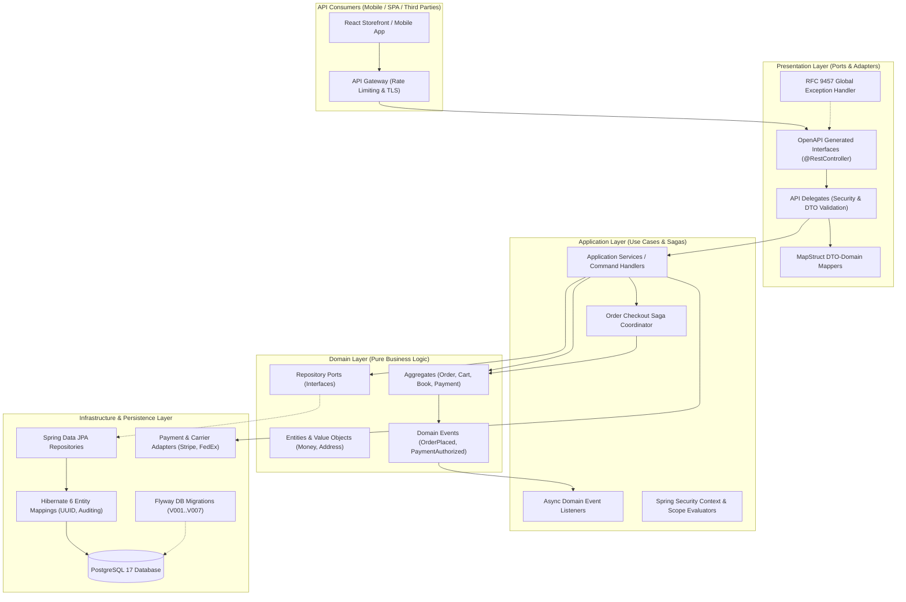
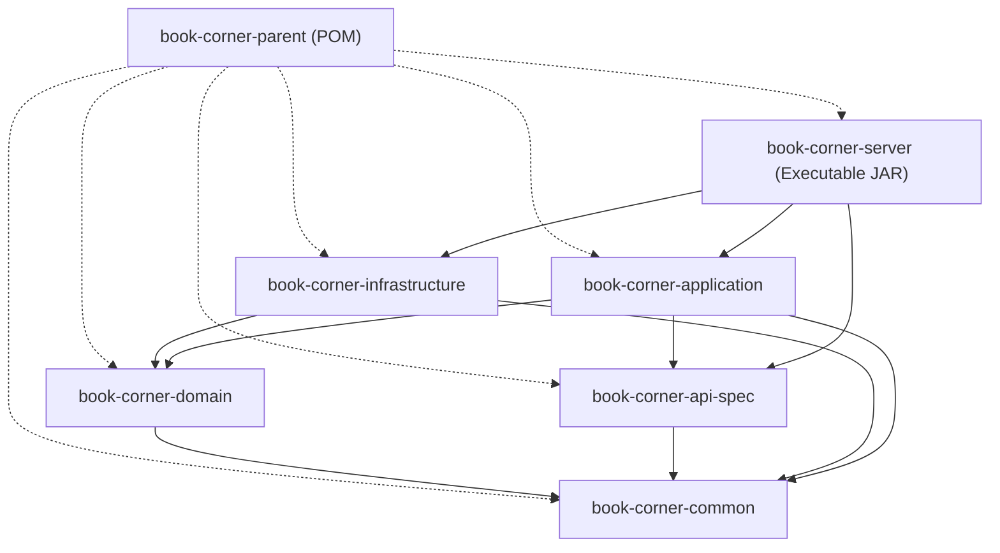
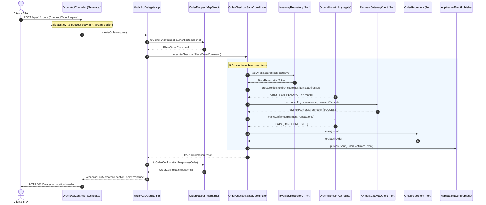

# Book Corner: Spring Boot 3 Enterprise Architecture Specification
**Document ID:** ARCH-BC-2026-002  
**Target Release:** Production Spring Boot 3.3.x / Java 21 LTS  
**Baseline Inputs:** [`openapi.yaml`](file:///Users/omkarsingh/workplace/book-corner/openapi.yaml), [`physical_data_model.md`](file:///Users/omkarsingh/workplace/book-corner/physical_data_model.md), [`domain_model_and_event_storming.md`](file:///Users/omkarsingh/workplace/book-corner/domain_model_and_event_storming.md), [`sql/`](file:///Users/omkarsingh/workplace/book-corner/sql/)  
**Status:** APPROVED ARCHITECTURAL BLUEPRINT  

---

## 1. Executive Architectural Blueprint

The **Book Corner** backend is structured as an **Enterprise Modular Monolith** utilizing **Domain-Driven Design (DDD)** and **Clean Architecture (Hexagonal / Ports & Adapters)** principles. It is engineered with **Java 21 LTS** and **Spring Boot 3.3.x**, taking full advantage of **Virtual Threads (Project Loom)**, **API-First Contract Generation**, compile-time **MapStruct** mappers, **Spring Data JPA 3.3 (Hibernate 6.5)**, **Flyway schema migrations**, and **RFC 9457 Problem Details**.



---

## 2. Module Structure (Maven Multi-Module)

### 2.1 Multi-Module Decomposition Rationale
A Maven multi-module architecture is enforced to guarantee **strict boundary isolation**, **eliminate circular dependencies**, accelerate **build and compile times**, and provide a clean transition path to microservices if individual domains scale independently in the future.

```
book-corner-parent (Root aggregator & dependency management)
├── book-corner-api-spec      (OpenAPI 3.1 contract, code generation, models & delegates)
├── book-corner-common        (Cross-cutting VO, RFC 9457 error models, audit, base types)
├── book-corner-domain        (Pure business logic, aggregates, domain events, repository ports)
├── book-corner-infrastructure(JPA entities, Flyway migrations, adapters for Stripe, FedEx, Redis)
├── book-corner-application   (Use cases, application services, saga orchestration, event handlers)
└── book-corner-server        (Web controllers, Spring Security JWT config, bootstrap main app)
```

### 2.2 Module Dependency Graph



### 2.3 Module Responsibility Matrix

| Maven Module | Primary Responsibilities | Allowed Dependencies | Prohibited Dependencies |
| :--- | :--- | :--- | :--- |
| **`book-corner-common`** | Custom annotations, base Value Objects (`Money`, `AuditMetadata`), RFC 9457 Problem Details schemas, W3C trace constants. | Jackson, Jakarta Validation, SLF4J | Spring Web, Spring Data, Database drivers |
| **`book-corner-api-spec`** | Holds `openapi.yaml`. Executes `openapi-generator-maven-plugin`. Generates API interfaces, DTOs, and API Delegate contracts. | `book-corner-common`, Spring Web annotations, Swagger Annotations | Spring Data JPA, Hibernate, Database drivers |
| **`book-corner-domain`** | Aggregates, Entities, Value Objects, Domain Events, Domain Services, Repository Ports (interfaces). Zero framework lock-in. | `book-corner-common`, Lombok, Jakarta Persistence API (annotations only) | Spring MVC, Database Drivers, External SDKs (Stripe/FedEx) |
| **`book-corner-infrastructure`**| Spring Data JPA repositories, Hibernate entities, Flyway migrations, Stripe/Razorpay client adapters, carrier freight client adapters, Redis caches. | `book-corner-domain`, `book-corner-common`, Spring Data JPA, Flyway, PostgreSQL, Redis | Spring MVC Controllers, OpenAPI Generator |
| **`book-corner-application`** | Application services, Use Case handlers, Saga orchestrators (Order Checkout Saga), Domain Event listeners, MapStruct mappers. | `book-corner-domain`, `book-corner-api-spec`, `book-corner-common`, Spring Tx | HTTP Servlet APIs, Database drivers |
| **`book-corner-server`** | API Delegate implementations, Spring Security 6 JWT filter chains, Actuator, Global Exception Handlers, Main Application Runner, integration tests. | `book-corner-application`, `book-corner-infrastructure`, `book-corner-api-spec`, Testcontainers | Pure domain business rules |

---

## 3. Package Structure (Domain-Driven Package-by-Feature)

The application adheres to a **Domain-Driven, Feature-Grouped** package structure under `com.bookcorner`. Code symbols are partitioned cleanly between domain logic, application orchestration, presentation delegates, and persistence infrastructure.

```
com.bookcorner
│
├── BookCornerApplication.java                  # Spring Boot @SpringBootApplication entrypoint
│
├── common                                      # Cross-cutting library module
│   ├── annotation
│   │   ├── DomainAggregateRoot.java            # DDD semantic marker
│   │   ├── DomainEntity.java
│   │   ├── DomainValueObject.java
│   │   └── UseCase.java
│   ├── exception
│   │   ├── ApplicationException.java           # Base checked application exception
│   │   ├── BusinessRuleViolationException.java
│   │   ├── DomainException.java                # Base unchecked domain exception
│   │   ├── EntityNotFoundException.java
│   │   ├── InsufficientStockException.java
│   │   ├── InvalidCredentialsException.java
│   │   ├── OptimisticLockingFailureException.java
│   │   └── UnauthorizedOperationException.java
│   ├── model
│   │   ├── CurrencyCode.java                   # ISO-4217 enum (USD, EUR, GBP)
│   │   ├── Money.java                          # Atomic integer cents + Currency Value Object
│   │   └── ProblemDetailBuilder.java           # RFC 9457 Problem Details builder
│   └── persistence
│       └── BaseAuditEntity.java                # MappedSuperclass: id, createdAt, updatedAt, version
│
├── config                                      # Server-level Spring configurations
│   ├── async
│   │   └── AsyncConfiguration.java             # Virtual Thread Executor configuration
│   ├── audit
│   │   ├── AuditorAwareImpl.java               # Extracts current JWT subject for createdBy/updatedBy
│   │   └── JpaAuditConfiguration.java          # @EnableJpaAuditing
│   ├── openapi
│   │   └── OpenApiDocumentationConfig.java     # SpringDoc OpenAPI runtime swagger-ui config
│   ├── security
│   │   ├── CustomAuthenticationEntryPoint.java # RFC 9457 401 Unauthorized emitter
│   │   ├── CustomAccessDeniedHandler.java      # RFC 9457 403 Forbidden emitter
│   │   ├── JwtAuthenticationFilter.java        # Validates RS256 Bearer JWT tokens
│   │   ├── JwtProperties.java                  # Secret, expiration, public/private keys
│   │   ├── JwtTokenProvider.java               # Token parser, generator, and claim extractor
│   │   ├── SecurityConfiguration.java          # SecurityFilterChain with OAuth2/Stateless policy
│   │   └── SecurityUtils.java                  # Helper to retrieve active authenticated UserPrincipal
│   └── web
│       ├── CorrelationIdFilter.java            # Injects X-Correlation-Id / W3C TraceContext
│       ├── GlobalExceptionHandler.java         # @RestControllerAdvice handling RFC 9457
│       └── WebMvcConfiguration.java            # CORS, content negotiation, formatters
│
├── core                                        # Core Bounded Contexts (Modular Monolith)
│   │
│   ├── auth                                    # Bounded Context: Authentication & Session
│   │   ├── application
│   │   │   ├── AuthService.java                # Login, register, token rotation, guest init
│   │   │   └── dto                             # Internal DTOs (TokenPair, SessionContext)
│   │   ├── domain
│   │   │   ├── entity
│   │   │   │   ├── GuestSession.java
│   │   │   │   └── RefreshToken.java
│   │   │   ├── event
│   │   │   │   ├── UserLoggedInEvent.java
│   │   │   │   └── UserRegisteredEvent.java
│   │   │   └── repository
│   │   │       ├── GuestSessionRepository.java
│   │   │       └── RefreshTokenRepository.java
│   │   ├── infrastructure
│   │   │   ├── entity
│   │   │   │   ├── GuestSessionJpaEntity.java
│   │   │   │   └── RefreshTokenJpaEntity.java
│   │   │   └── repository
│   │   │       ├── SpringDataGuestSessionRepository.java
│   │   │       └── SpringDataRefreshTokenRepository.java
│   │   └── web
│   │       ├── AuthApiDelegateImpl.java        # Implements OpenAPI generated AuthApiDelegate
│   │       └── mapper
│   │           └── AuthMapper.java             # MapStruct: Auth DTOs <-> Domain models
│   │
│   ├── user                                    # Bounded Context: User Profiles & Addresses
│   │   ├── application
│   │   │   ├── UserService.java
│   │   │   └── UserAddressService.java
│   │   ├── domain
│   │   │   ├── entity
│   │   │   │   ├── User.java                   # User Aggregate Root
│   │   │   │   ├── UserAddress.java
│   │   │   │   └── UserRole.java
│   │   │   ├── event
│   │   │   │   └── UserProfileUpdatedEvent.java
│   │   │   └── repository
│   │   │       ├── UserRepository.java
│   │   │       └── UserAddressRepository.java
│   │   ├── infrastructure
│   │   │   ├── entity
│   │   │   │   ├── UserJpaEntity.java
│   │   │   │   └── UserAddressJpaEntity.java
│   │   │   └── repository
│   │   │       ├── SpringDataUserRepository.java
│   │   │       └── SpringDataUserAddressRepository.java
│   │   └── web
│   │       ├── UserApiDelegateImpl.java        # Implements UserApiDelegate
│   │       └── mapper
│   │           └── UserMapper.java
│   │
│   ├── catalog                                 # Bounded Context: Products, Authors, Categories
│   │   ├── application
│   │   │   ├── BookCatalogService.java         # Catalog query, detail projection, formatting
│   │   │   ├── AuthorService.java
│   │   │   ├── CategoryService.java
│   │   │   └── PublisherService.java
│   │   ├── domain
│   │   │   ├── entity
│   │   │   │   ├── Author.java
│   │   │   │   ├── Book.java                   # Book Aggregate Root
│   │   │   │   ├── BookFormat.java             # Format SKU Entity (Paperback, Hardcover)
│   │   │   │   ├── Category.java               # Self-referencing hierarchical category tree
│   │   │   │   ├── Inventory.java              # Inventory & stock reservation aggregate
│   │   │   │   └── Publisher.java
│   │   │   ├── event
│   │   │   │   ├── BookStockLowEvent.java
│   │   │   │   └── PriceChangedEvent.java
│   │   │   └── repository
│   │   │       ├── AuthorRepository.java
│   │   │       ├── BookRepository.java
│   │   │       ├── CategoryRepository.java
│   │   │       └── InventoryRepository.java
│   │   ├── infrastructure
│   │   │   ├── entity
│   │   │   │   ├── AuthorJpaEntity.java
│   │   │   │   ├── BookJpaEntity.java
│   │   │   │   ├── BookFormatJpaEntity.java
│   │   │   │   ├── CategoryJpaEntity.java
│   │   │   │   └── InventoryJpaEntity.java
│   │   │   └── repository
│   │   │       ├── SpringDataAuthorRepository.java
│   │   │       ├── SpringDataBookRepository.java
│   │   │       ├── SpringDataCategoryRepository.java
│   │   │       └── SpringDataInventoryRepository.java
│   │   └── web
│   │       ├── CatalogApiDelegateImpl.java     # Implements CatalogApiDelegate
│   │       └── mapper
│   │           └── CatalogMapper.java
│   │
│   ├── search                                  # Bounded Context: Search & Autocomplete
│   │   ├── application
│   │   │   ├── CatalogSearchService.java       # Faceted search, filters, relevance scoring
│   │   │   └── AutoCompleteService.java        # Trie / Prefix suggestions
│   │   ├── domain
│   │   │   └── model
│   │   │       ├── SearchFilterCriteria.java
│   │   │       └── SearchResultItem.java
│   │   ├── infrastructure
│   │   │   └── persistence
│   │   │       └── PostgreSqlFtsSearchAdapter.java # PostgreSQL Full-Text Search (tsvector)
│   │   └── web
│   │       ├── SearchApiDelegateImpl.java
│   │       └── mapper
│   │           └── SearchMapper.java
│   │
│   ├── cart                                    # Bounded Context: Shopping Cart & Basket
│   │   ├── application
│   │   │   ├── CartService.java                # Add item, mutate qty, merge, apply coupon
│   │   │   └── CartPriceCalculator.java        # Calculates subtotal, discounts, lines
│   │   ├── domain
│   │   │   ├── entity
│   │   │   │   ├── ShoppingCart.java           # ShoppingCart Aggregate Root
│   │   │   │   └── CartItem.java               # Line Item Entity
│   │   │   ├── event
│   │   │   │   ├── CartAbandonedEvent.java
│   │   │   │   ├── CartClearedEvent.java
│   │   │   │   └── CartItemAddedEvent.java
│   │   │   └── repository
│   │   │       └── ShoppingCartRepository.java
│   │   ├── infrastructure
│   │   │   ├── entity
│   │   │   │   ├── ShoppingCartJpaEntity.java
│   │   │   │   └── CartItemJpaEntity.java
│   │   │   └── repository
│   │   │       └── SpringDataShoppingCartRepository.java
│   │   └── web
│   │       ├── CartApiDelegateImpl.java
│   │       └── mapper
│   │           └── CartMapper.java
│   │
│   ├── order                                   # Bounded Context: Order Orchestration & Checkout
│   │   ├── application
│   │   │   ├── OrderCheckoutSagaCoordinator.java # Orchestrates lock, reserve, charge, confirm
│   │   │   ├── OrderQueryService.java          # Order history, detail invoice projection
│   │   │   ├── OrderCancellationService.java   # Grace period check & refund trigger
│   │   │   └── OrderReturnService.java         # RMA validation and label generation
│   │   ├── domain
│   │   │   ├── entity
│   │   │   │   ├── Order.java                  # Order Aggregate Root
│   │   │   │   ├── OrderItem.java
│   │   │   │   ├── OrderStatusHistory.java
│   │   │   │   ├── OrderCancellation.java
│   │   │   │   └── OrderReturn.java
│   │   │   ├── event
│   │   │   │   ├── OrderCancelledEvent.java
│   │   │   │   ├── OrderConfirmedEvent.java
│   │   │   │   └── OrderShippedEvent.java
│   │   │   ├── state
│   │   │   │   └── OrderStateMachine.java      # Validates legal order state transitions
│   │   │   └── repository
│   │   │       └── OrderRepository.java
│   │   ├── infrastructure
│   │   │   ├── entity
│   │   │   │   ├── OrderJpaEntity.java
│   │   │   │   ├── OrderItemJpaEntity.java
│   │   │   │   ├── OrderCancellationJpaEntity.java
│   │   │   │   └── OrderReturnJpaEntity.java
│   │   │   └── repository
│   │   │       └── SpringDataOrderRepository.java
│   │   └── web
│   │       ├── OrderApiDelegateImpl.java
│   │       └── mapper
│   │           └── OrderMapper.java
│   │
│   ├── payment                                 # Bounded Context: Payment Gateway & Wallet
│   │   ├── application
│   │   │   ├── PaymentIntentService.java       # Coordinates multi-tender split calculations
│   │   │   ├── CustomerWalletService.java      # Store credit ledger adjustments
│   │   │   └── WebhookProcessingService.java   # Verifies signatures and handles payment callbacks
│   │   ├── domain
│   │   │   ├── entity
│   │   │   │   ├── PaymentTransaction.java     # Payment Aggregate Root
│   │   │   │   ├── PaymentSplit.java
│   │   │   │   ├── CustomerWallet.java
│   │   │   │   └── WalletLedgerEntry.java
│   │   │   ├── event
│   │   │   │   ├── PaymentCapturedEvent.java
│   │   │   │   ├── PaymentFailedEvent.java
│   │   │   │   └── RefundIssuedEvent.java
│   │   │   ├── port
│   │   │   │   └── PaymentGatewayClient.java   # Port for Stripe/Razorpay/Adyen
│   │   │   └── repository
│   │   │       ├── PaymentTransactionRepository.java
│   │   │       └── CustomerWalletRepository.java
│   │   ├── infrastructure
│   │   │   ├── adapter
│   │   │   │   ├── StripePaymentGatewayAdapter.java
│   │   │   │   └── RazorpayPaymentGatewayAdapter.java
│   │   │   ├── entity
│   │   │   │   ├── PaymentTransactionJpaEntity.java
│   │   │   │   ├── CustomerWalletJpaEntity.java
│   │   │   │   └── WebhookAuditLogJpaEntity.java
│   │   │   └── repository
│   │   │       ├── SpringDataPaymentRepository.java
│   │   │       └── SpringDataWalletRepository.java
│   │   └── web
│   │       ├── PaymentApiDelegateImpl.java
│   │       └── mapper
│   │           └── PaymentMapper.java
│   │
│   ├── shipping                                # Bounded Context: Carrier Freight & Tracking
│   │   ├── application
│   │   │   ├── ShippingRateCalculationService.java
│   │   │   └── ConsignmentTrackingService.java
│   │   ├── domain
│   │   │   ├── entity
│   │   │   │   ├── ShippingConsignment.java    # Consignment Aggregate Root
│   │   │   │   └── TrackingCheckpoint.java
│   │   │   ├── port
│   │   │   │   └── CarrierTrackingClient.java  # Port for FedEx / UPS APIs
│   │   │   └── repository
│   │   │       └── ShippingConsignmentRepository.java
│   │   ├── infrastructure
│   │   │   ├── adapter
│   │   │   │   └── FedExCarrierAdapter.java
│   │   │   ├── entity
│   │   │   │   └── ShippingConsignmentJpaEntity.java
│   │   │   └── repository
│   │   │       └── SpringDataShippingRepository.java
│   │   └── web
│   │       ├── ShippingApiDelegateImpl.java
│   │       └── mapper
│   │           └── ShippingMapper.java
│   │
│   ├── review                                  # Bounded Context: Reviews, Ratings & Votes
│   │   ├── application
│   │   │   ├── BookReviewService.java          # Submit review, verify purchase, calculate avg
│   │   │   └── ReviewVotingService.java        # Helpful / unhelpful votes with idempotency
│   │   ├── domain
│   │   │   ├── entity
│   │   │   │   ├── BookReview.java             # Review Aggregate Root
│   │   │   │   ├── ReviewVote.java
│   │   │   │   └── BookRatingAggregate.java
│   │   │   ├── event
│   │   │   │   └── ReviewSubmittedEvent.java
│   │   │   └── repository
│   │   │       └── BookReviewRepository.java
│   │   ├── infrastructure
│   │   │   ├── entity
│   │   │   │   ├── BookReviewJpaEntity.java
│   │   │   │   └── ReviewVoteJpaEntity.java
│   │   │   └── repository
│   │   │       └── SpringDataReviewRepository.java
│   │   └── web
│   │       ├── ReviewApiDelegateImpl.java
│   │       └── mapper
│   │           └── ReviewMapper.java
│   │
│   ├── coupon                                  # Bounded Context: Discounts & Coupons
│   │   ├── application
│   │   │   └── CouponValidationService.java    # Expiry, min order value, max usage validation
│   │   ├── domain
│   │   │   ├── entity
│   │   │   │   ├── Coupon.java
│   │   │   │   └── CouponRedemption.java
│   │   │   └── repository
│   │   │       └── CouponRepository.java
│   │   ├── infrastructure
│   │   │   ├── entity
│   │   │   │   └── CouponJpaEntity.java
│   │   │   └── repository
│   │   │       └── SpringDataCouponRepository.java
│   │   └── web
│   │       └── mapper
│   │           └── CouponMapper.java
│   │
│   └── wishlist                                # Bounded Context: Customer Wishlists & Alerts
│       ├── application
│       │   └── WishlistService.java            # Add book, remove, trigger price-drop alerts
│       ├── domain
│       │   ├── entity
│       │   │   ├── Wishlist.java               # Wishlist Aggregate Root
│       │   │   └── WishlistItem.java
│       │   └── repository
│       │       └── WishlistRepository.java
│       ├── infrastructure
│       │   ├── entity
│       │   │   ├── WishlistJpaEntity.java
│       │   │   └── WishlistItemJpaEntity.java
│       │   └── repository
│       │       └── SpringDataWishlistRepository.java
│       └── web
│           ├── WishlistApiDelegateImpl.java
│           └── mapper
│               └── WishlistMapper.java
│
└── resources
    ├── application.yml                         # Main application configuration
    ├── application-local.yml                   # Local development profile
    ├── application-prod.yml                    # Production container profile
    └── db
        └── migration                           # Flyway Versioned Migration Scripts
            ├── V001__create_users_schema.sql
            ├── V002__create_catalog_schema.sql
            ├── V003__create_orders_schema.sql
            ├── V004__create_payments_schema.sql
            ├── V005__create_shipping_schema.sql
            ├── V006__create_reviews_schema.sql
            └── V007__create_coupons_and_cart_schema.sql
```

---

## 4. Layered Architecture (Clean Architecture / Hexagonal)

### 4.1 Layer Responsibilities and Constraints

```
┌────────────────────────────────────────────────────────────────────────┐
│                        1. PRESENTATION LAYER                           │
│  - Generated OpenAPI RestController interfaces (Contract Enforcers)    │
│  - ApiDelegate Implementations (Parameter Sanitization & Security)    │
│  - MapStruct DTO <-> Domain Object Translators                        │
│  - RFC 9457 Global Exception Translation Advice                        │
└───────────────────────────────────┬────────────────────────────────────┘
                                    │ (Calls Application Use Cases)
                                    ▼
┌────────────────────────────────────────────────────────────────────────┐
│                        2. APPLICATION LAYER                            │
│  - Application Services / Command & Query Handlers                     │
│  - Transaction Boundary Definition (@Transactional)                    │
│  - Saga Orchestration (Checkout, Returns, Cancellations)               │
│  - Cross-Aggregate Event Publishing (ApplicationEventPublisher)        │
│  - Security Context Claim Extraction                                   │
└───────────────────────────────────┬────────────────────────────────────┘
                                    │ (Drives Domain Aggregates)
                                    ▼
┌────────────────────────────────────────────────────────────────────────┐
│                          3. DOMAIN LAYER                               │
│  - Pure Domain Aggregates, Entities, and Value Objects                 │
│  - Invariant Enforcement & State Machine Lifecycle Transitions         │
│  - Domain Events (OrderConfirmedEvent, PriceChangedEvent)              │
│  - Outbound Ports (Repository & Gateway Interfaces)                    │
│  * ZERO Framework or Infrastructure Dependencies                       │
└───────────────────────────────────▲────────────────────────────────────┘
                                    │ (Implements Outbound Ports)
┌───────────────────────────────────┴────────────────────────────────────┐
│                      4. INFRASTRUCTURE LAYER                           │
│  - Spring Data JPA Repository Implementations                          │
│  - Hibernate 6 ORM Mappings, Partial Indexes & Soft Delete Filters    │
│  - Third-Party Adapters (Stripe SDK, Razorpay SDK, FedEx REST Client) │
│  - Flyway Database Migration Runner                                    │
│  - Distributed Cache Adapters (Redis)                                  │
└────────────────────────────────────────────────────────────────────────┘
```

### 4.2 Sequence Interaction: Order Checkout Saga Flow

The following sequence diagram illustrates how clean layering and dependency inversion govern a checkout execution:



---

## 5. Maven Dependencies & Build Configuration

The project utilizes a parent POM configuration enforcing dependency convergence, annotation processor ordering, and reproducible builds.

### 5.1 Root `pom.xml`

```xml
<?xml version="1.0" encoding="UTF-8"?>
<project xmlns="http://maven.apache.org/POM/4.0.0"
         xmlns:xsi="http://www.w3.org/2001/XMLSchema-instance"
         xsi:schemaLocation="http://maven.apache.org/POM/4.0.0 
                             https://maven.apache.org/xsd/maven-4.0.0.xsd">
    <modelVersion>4.0.0</modelVersion>

    <parent>
        <groupId>org.springframework.boot</groupId>
        <artifactId>spring-boot-starter-parent</artifactId>
        <version>3.3.4</version>
        <relativePath/>
    </parent>

    <groupId>com.bookcorner</groupId>
    <artifactId>book-corner-parent</artifactId>
    <version>1.0.0-SNAPSHOT</version>
    <packaging>pom</packaging>
    <name>Book Corner :: Platform Parent</name>
    <description>Enterprise Online Bookstore - Modular Monolith</description>

    <modules>
        <module>book-corner-common</module>
        <module>book-corner-api-spec</module>
        <module>book-corner-domain</module>
        <module>book-corner-infrastructure</module>
        <module>book-corner-application</module>
        <module>book-corner-server</module>
    </modules>

    <properties>
        <!-- Java & Encoding -->
        <java.version>21</java.version>
        <maven.compiler.source>21</maven.compiler.source>
        <maven.compiler.target>21</maven.compiler.target>
        <project.build.sourceEncoding>UTF-8</project.build.sourceEncoding>
        <project.reporting.outputEncoding>UTF-8</project.reporting.outputEncoding>

        <!-- Framework & Tooling Versions -->
        <spring-boot.version>3.3.4</spring-boot.version>
        <mapstruct.version>1.6.2</mapstruct.version>
        <lombok.version>1.18.34</lombok.version>
        <lombok-mapstruct-binding.version>0.2.0</lombok-mapstruct-binding.version>
        <openapi-generator-maven-plugin.version>7.8.0</openapi-generator-maven-plugin.version>
        <springdoc-openapi.version>2.6.0</springdoc-openapi.version>
        <jjwt.version>0.12.6</jjwt.version>
        <flyway.version>10.18.0</flyway.version>
        <testcontainers.version>1.20.2</testcontainers.version>
        <jackson-databind-nullable.version>0.2.6</jackson-databind-nullable.version>
    </properties>

    <dependencyManagement>
        <dependencies>
            <!-- Internal Modules -->
            <dependency>
                <groupId>com.bookcorner</groupId>
                <artifactId>book-corner-common</artifactId>
                <version>${project.version}</version>
            </dependency>
            <dependency>
                <groupId>com.bookcorner</groupId>
                <artifactId>book-corner-api-spec</artifactId>
                <version>${project.version}</version>
            </dependency>
            <dependency>
                <groupId>com.bookcorner</groupId>
                <artifactId>book-corner-domain</artifactId>
                <version>${project.version}</version>
            </dependency>
            <dependency>
                <groupId>com.bookcorner</groupId>
                <artifactId>book-corner-infrastructure</artifactId>
                <version>${project.version}</version>
            </dependency>
            <dependency>
                <groupId>com.bookcorner</groupId>
                <artifactId>book-corner-application</artifactId>
                <version>${project.version}</version>
            </dependency>

            <!-- JWT Security (JJWT) -->
            <dependency>
                <groupId>io.jsonwebtoken</groupId>
                <artifactId>jjwt-api</artifactId>
                <version>${jjwt.version}</version>
            </dependency>
            <dependency>
                <groupId>io.jsonwebtoken</groupId>
                <artifactId>jjwt-impl</artifactId>
                <version>${jjwt.version}</version>
                <scope>runtime</scope>
            </dependency>
            <dependency>
                <groupId>io.jsonwebtoken</groupId>
                <artifactId>jjwt-jackson</artifactId>
                <version>${jjwt.version}</version>
                <scope>runtime</scope>
            </dependency>

            <!-- MapStruct & OpenAPI Support -->
            <dependency>
                <groupId>org.mapstruct</groupId>
                <artifactId>mapstruct</artifactId>
                <version>${mapstruct.version}</version>
            </dependency>
            <dependency>
                <groupId>org.openapitools</groupId>
                <artifactId>jackson-databind-nullable</artifactId>
                <version>${jackson-databind-nullable.version}</version>
            </dependency>
            <dependency>
                <groupId>org.springdoc</groupId>
                <artifactId>springdoc-openapi-starter-webmvc-ui</artifactId>
                <version>${springdoc-openapi.version}</version>
            </dependency>

            <!-- Testcontainers -->
            <dependency>
                <groupId>org.testcontainers</groupId>
                <artifactId>testcontainers-bom</artifactId>
                <version>${testcontainers.version}</version>
                <type>pom</type>
                <scope>import</scope>
            </dependency>
        </dependencies>
    </dependencyManagement>

    <build>
        <pluginManagement>
            <plugins>
                <!-- Compiler Plugin: Configures Annotation Processors (Lombok before MapStruct) -->
                <plugin>
                    <groupId>org.apache.maven.plugins</groupId>
                    <artifactId>maven-compiler-plugin</artifactId>
                    <version>3.13.0</version>
                    <configuration>
                        <source>${java.version}</source>
                        <target>${java.version}</target>
                        <parameters>true</parameters>
                        <annotationProcessorPaths>
                            <path>
                                <groupId>org.projectlombok</groupId>
                                <artifactId>lombok</artifactId>
                                <version>${lombok.version}</version>
                            </path>
                            <path>
                                <groupId>org.projectlombok</groupId>
                                <artifactId>lombok-mapstruct-binding</artifactId>
                                <version>${lombok-mapstruct-binding.version}</version>
                            </path>
                            <path>
                                <groupId>org.mapstruct</groupId>
                                <artifactId>mapstruct-processor</artifactId>
                                <version>${mapstruct.version}</version>
                            </path>
                        </annotationProcessorPaths>
                        <compilerArgs>
                            <arg>-Amapstruct.suppressGeneratorTimestamp=true</arg>
                            <arg>-Amapstruct.defaultComponentModel=spring</arg>
                            <arg>-Amapstruct.unmappedTargetPolicy=ERROR</arg>
                        </compilerArgs>
                    </configuration>
                </plugin>

                <!-- OpenAPI Generator Plugin Definition -->
                <plugin>
                    <groupId>org.openapitools</groupId>
                    <artifactId>openapi-generator-maven-plugin</artifactId>
                    <version>${openapi-generator-maven-plugin.version}</version>
                </plugin>
            </plugins>
        </pluginManagement>
    </build>
</project>
```

---

### 5.2 API Specification Module `pom.xml` (`book-corner-api-spec`)

```xml
<?xml version="1.0" encoding="UTF-8"?>
<project xmlns="http://maven.apache.org/POM/4.0.0"
         xmlns:xsi="http://www.w3.org/2001/XMLSchema-instance"
         xsi:schemaLocation="http://maven.apache.org/POM/4.0.0 
                             https://maven.apache.org/xsd/maven-4.0.0.xsd">
    <modelVersion>4.0.0</modelVersion>
    <parent>
        <groupId>com.bookcorner</groupId>
        <artifactId>book-corner-parent</artifactId>
        <version>1.0.0-SNAPSHOT</version>
    </parent>

    <artifactId>book-corner-api-spec</artifactId>
    <name>Book Corner :: API Contract &amp; Generator</name>

    <dependencies>
        <dependency>
            <groupId>com.bookcorner</groupId>
            <artifactId>book-corner-common</artifactId>
        </dependency>
        <dependency>
            <groupId>org.springframework.boot</groupId>
            <artifactId>spring-boot-starter-web</artifactId>
        </dependency>
        <dependency>
            <groupId>org.springframework.boot</groupId>
            <artifactId>spring-boot-starter-validation</artifactId>
        </dependency>
        <dependency>
            <groupId>org.openapitools</groupId>
            <artifactId>jackson-databind-nullable</artifactId>
        </dependency>
        <dependency>
            <groupId>org.springdoc</groupId>
            <artifactId>springdoc-openapi-starter-webmvc-ui</artifactId>
        </dependency>
    </dependencies>

    <build>
        <plugins>
            <plugin>
                <groupId>org.openapitools</groupId>
                <artifactId>openapi-generator-maven-plugin</artifactId>
                <executions>
                    <execution>
                        <id>generate-spring-mvc-interfaces</id>
                        <goals>
                            <goal>generate</goal>
                        </goals>
                        <configuration>
                            <inputSpec>${project.basedir}/src/main/resources/openapi.yaml</inputSpec>
                            <generatorName>spring</generatorName>
                            <apiPackage>com.bookcorner.api</apiPackage>
                            <modelPackage>com.bookcorner.api.model</modelPackage>
                            <configOptions>
                                <interfaceOnly>false</interfaceOnly>
                                <delegatePattern>true</delegatePattern>
                                <useSpringBoot3>true</useSpringBoot3>
                                <useTags>true</useTags>
                                <dateLibrary>java8-localdatetime</dateLibrary>
                                <openApiNullable>false</openApiNullable>
                                <skipDefaultInterface>true</skipDefaultInterface>
                                <useBeanValidation>true</useBeanValidation>
                                <performBeanValidation>true</performBeanValidation>
                                <documentationProvider>springdoc</documentationProvider>
                                <unhandledException>true</unhandledException>
                            </configOptions>
                        </configuration>
                    </execution>
                </executions>
            </plugin>
        </plugins>
    </build>
</project>
```

---

## 6. Key Design Decisions & Architectural Rationale

### 6.1 API-First Contract Generation & Delegate Pattern
* **Decision:** Enforce **API-First Development** via `openapi-generator-maven-plugin` using the **Delegate Pattern** (`delegatePattern=true`).
* **Rationale:**
  1. Prevents specification drift. The `openapi.yaml` contract is the single source of truth for both frontend and backend teams.
  2. The generator creates `@RestController` classes annotated with standard Spring MVC mappings, Swagger annotations, and JSR-380 Bean Validation constraints (`@Valid`, `@NotNull`, `@Size`).
  3. Developers **never edit generated controllers**. Instead, developers implement the typed `*ApiDelegate` interface (e.g., `OrdersApiDelegateImpl`), keeping presentation code cleanly decoupled from the HTTP routing plumbing.

### 6.2 Java 21 LTS & Virtual Threads (Project Loom)
* **Decision:** Enable Spring Boot 3 native virtual threads globally:
  ```yaml
  spring:
    threads:
      virtual:
        enabled: true
  ```
* **Rationale:**
  1. E-commerce platforms are heavily I/O-bound (database lookups, third-party payment gateway calls, Redis caching, freight calculation APIs).
  2. With Virtual Threads enabled, each inbound HTTP request is executed on a lightweight virtual thread. Blocking I/O operations (such as JDBC socket reads and HTTP client calls) park the virtual thread without pinning the underlying OS carrier thread.
  3. Achieves high concurrency and throughput under flash-sale checkout spikes without complex reactive (WebFlux) programming models.
  4. *Rule:* Ensure database connection pool sizes (`HikariCP`) are calibrated appropriately, and avoid `synchronized` blocks in hot paths (use `ReentrantLock` to prevent thread pinning).

### 6.3 RFC 9457 Problem Details for HTTP APIs
* **Decision:** Standardize all API error responses on **RFC 9457 (`application/problem+json`)** utilizing Spring 6's native `org.springframework.http.ProblemDetail`.
* **Rationale:**
  1. Replaces custom, non-standard `{success: false, error: {...}}` envelopes.
  2. Provides standard machine-readable fields: `type`, `title`, `status`, `detail`, `instance`.
  3. Enriches error responses with custom extensions: `code` (internal domain code), `timestamp`, `traceId` (W3C trace correlation UUID), and `invalidParams` (field-level validation issues).
  4. Implemented via a centralized `@RestControllerAdvice` extending `ResponseEntityExceptionHandler`.

### 6.4 Concurrency, Optimistic Locking & Soft Deletion
* **Decision:** Standardize all mutable domain entities on UUID primary keys, optimistic locking (`@Version`), and soft deletion partial indexing.
* **Rationale:**
  1. **UUIDv4 Surrogate Keys:** Generated on the client or server without requiring a database sequence round-trip. Protects against enumeration attacks.
  2. **Optimistic Locking:** Every mutable aggregate entity (`Order`, `Book`, `ShoppingCart`, `CustomerWallet`) inherits `version BIGINT NOT NULL`. Hibernate automatically appends `WHERE version = :version` to SQL UPDATEs, throwing `OptimisticLockException` on concurrent edits (e.g., two users modifying cart items or checking out the last copy of a book).
  3. **Soft Delete Isolation:** In Hibernate 6.5, soft deletes are declared using `@SQLDelete(sql = "UPDATE ... SET is_deleted = true WHERE id = ? AND version = ?")` paired with `@SQLRestriction("is_deleted = false")`. This ensures standard JPA queries automatically filter out soft-deleted records without manual query pollution.

### 6.5 Flyway Database Migration Governance
* **Decision:** Database schema evolution is managed strictly via **Flyway** migration scripts, mapping 1:1 to the 7 logical schemas created in our SQL design.
* **Rationale:**
  1. Hibernate `ddl-auto` is set to `validate` in production, strictly prohibiting automated schema alterations at runtime.
  2. Versioned scripts (`V001__create_users_schema.sql` through `V007__create_coupons_and_cart_schema.sql`) are executed during application bootstrap or via a pre-deployment Kubernetes init container.
  3. Enforces repeatable, idempotent database state across local Docker, staging, and production environments.

### 6.6 MapStruct + Lombok Compiler Ordering
* **Decision:** Enforce strict processor ordering in the `maven-compiler-plugin`:
  1. `lombok`
  2. `lombok-mapstruct-binding`
  3. `mapstruct-processor`
* **Rationale:**
  1. MapStruct inspects the AST (Abstract Syntax Tree) to locate getters, setters, and builders on DTOs and domain entities.
  2. If MapStruct runs before Lombok, the getters/setters have not yet been generated, causing compile-time errors (`"Unknown property in type..."`).
  3. Adding `lombok-mapstruct-binding` guarantees that Lombok finishes bytecode embellishment before MapStruct analyzes mapping interfaces.

### 6.7 Stateless Spring Security 6 & Dual-Token JWT Architecture
* **Decision:** Implement stateless authentication using RS256-signed JSON Web Tokens (JWT) with fine-grained OAuth2 scopes.
* **Rationale:**
  1. **Session Policy:** `SessionCreationPolicy.STATELESS` ensures zero HTTP session memory overhead on application nodes.
  2. **Dual-Token Flow:**
     - **Access Token:** Short-lived (15 minutes), signed with an asymmetric RS256 private key. Contains user claims (`sub`, `roles`, `email`, `scp`). Validated locally by any service node using the public key.
     - **Refresh Token:** Long-lived (7 days), stored in the database (`refresh_tokens` table) with cryptographic hash, IP address, and user-agent tracking. Supports one-time use token rotation and explicit revocation on logout.
  3. **Method Security:** Enabled via `@EnableMethodSecurity`. Endpoints are protected with fine-grained scope assertions:
     ```java
     @PreAuthorize("hasAuthority('SCOPE_write:orders')")
     ```

### 6.8 Transaction Boundaries & Checkout Saga Orchestration
* **Decision:** Isolate transaction boundaries at the Application Service level (`@Transactional`), orchestrating multi-aggregate checkout operations via a local **Saga Coordinator**.
* **Rationale:**
  1. Direct database foreign keys across bounded context boundaries (e.g., from `orders` table directly into `shopping_carts` table) are forbidden in DDD.
  2. The `OrderCheckoutSagaCoordinator` coordinates the checkout steps across bounded contexts:
     - Step 1: Validate cart state & lock stock reservation (`catalog.inventory`).
     - Step 2: Calculate final pricing & split tender (`payment.customer_wallets`).
     - Step 3: Authorize external payment via payment gateway port (`payment.payment_transactions`).
     - Step 4: Persist confirmed order (`orders.orders`).
     - Step 5: Clear cart (`cart.shopping_carts`) and publish `OrderConfirmedEvent`.
  3. Asynchronous side effects (sending customer confirmation emails, updating search indexes, feeding recommendation graphs) are decoupled via Spring's `@TransactionalEventListener(phase = TransactionPhase.AFTER_COMMIT)` to guarantee they only run after the database transaction has successfully committed.

---

## 7. Architectural Sign-Off & Verification

This architecture specification provides the complete technical foundation for the **Book Corner** platform. It aligns 100% with:
- The reverse-engineered business requirements ([`backend_requirements_spec.md`](file:///Users/omkarsingh/workplace/book-corner/backend_requirements_spec.md))
- The DDD domain model ([`domain_model_and_event_storming.md`](file:///Users/omkarsingh/workplace/book-corner/domain_model_and_event_storming.md))
- The 3NF relational PostgreSQL model ([`physical_data_model.md`](file:///Users/omkarsingh/workplace/book-corner/physical_data_model.md))
- The executable Flyway SQL scripts ([`sql/`](file:///Users/omkarsingh/workplace/book-corner/sql/))
- The governed OpenAPI 3.1.0 specification ([`openapi.yaml`](file:///Users/omkarsingh/workplace/book-corner/openapi.yaml))
- The API governance standards ([`api_governance_report.md`](file:///Users/omkarsingh/workplace/book-corner/api_governance_report.md))

The specification has been persisted to [`/Users/omkarsingh/workplace/book-corner/spring_boot_architecture_spec.md`](file:///Users/omkarsingh/workplace/book-corner/spring_boot_architecture_spec.md).
